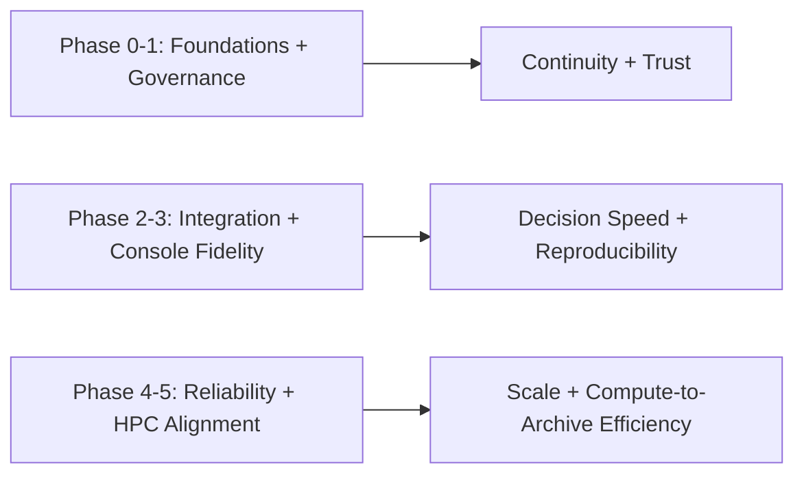

# Cosmic Horizon Roadmap (2026)

This roadmap is the working plan for moving the repository from "strong architecture docs + partial scaffolds" to an executable hybrid platform with enforceable quality gates.

> NOTE: MVP-FIRST FOCUS
>
> During the current development cycle we are deferring CI automation, dependency/Dependabot configuration, and team-onboarding work until after the MVP exit criteria are met. The roadmap below is adjusted to prioritize delivering the Java and Go server functionality, completing the operator UI pages, and producing a minimal demo/playground that demonstrates submit -> observe -> recover flows locally. CI and security automation will be reintroduced post-MVP to harden and automate quality gates.

Testing architecture references:

- [docuentation/TESTING_FRAMEWORK_ARCHITECTURE.md](docuentation/TESTING_FRAMEWORK_ARCHITECTURE.md)
- [docuentation/TESTING_REQUIREMENTS.md](docuentation/TESTING_REQUIREMENTS.md)

Mission alignment references:

- [docuentation/NGVLA_MISSION_ALIGNMENT.md](docuentation/NGVLA_MISSION_ALIGNMENT.md)
- [docuentation/MISSION_TO_CAPABILITY_TRACE.md](docuentation/MISSION_TO_CAPABILITY_TRACE.md)
- [docuentation/MISSION_GATES.md](docuentation/MISSION_GATES.md)

## Roadmap item policy (required)

Each new phase deliverable and exit criterion must carry explicit mission linkage:

- `Mission outcome:` one canonical outcome from the mission alignment doc.
- `Operator/science impact:` expected observable improvement.
- `Validation evidence:` gate or artifact proving delivery.

Canonical mission outcomes:

1. Observatory continuity
2. Reproducible science
3. Compute-to-archive efficiency
4. Institutional trust and audit
5. Human decision speed

## Current baseline (as of 2026-02-28)

- Frontend: Angular telemetry/topology/diagnostics plus baseline `Jobs` and `Datasets` routes with SSR Nest shim.
- Streaming side: Go data generator + local Kafka/Prometheus/Grafana compose stack.
- Governance side: Java Spring Boot API with baseline jobs and datasets contracts backed by Redis in local dev.
- Contracts: initial `openapi/governance.yaml` and schema fixtures checked in.
- CI: quality workflow gates for lint, formatting, unit tests, OpenAPI validation, and e2e smoke.
- Known test gaps:
  - Java Maven workflow still packages with `-DskipTests`.
  - `tools/java-ingest` test suite is not yet established.
  - Docker `test-runner` currently focuses on Nx `test` targets and does not enforce full integration/e2e/stress lanes.

## Guiding principles

- Keep architecture and runtime synchronized; no "paper-only" claims.
- Favor contract-first integration (OpenAPI + fixtures + compatibility checks).
- Treat reliability and observability as first-class, not post-MVP add-ons.
- Preserve migration safety by running transitional components in parallel when needed.

## Mission communication model

The roadmap is consumed by mixed audiences. Each phase must answer:

1. What mission outcome improves?
2. What operators/scientists can do better afterward?
3. What evidence proves it?

## Phase 0: Foundation hardening (Week 1-2)

Goals:

- Remove drift between docs, code, compose, and CI.
- Ensure every documented critical interface exists and is testable.

Deliverables:

- Stable quality gate in CI with no tolerated failures.
- Updated documentation index with valid links and rendering.
- Baseline API tests passing in CI for Java governance module.
- OpenAPI validation script and fixture checks integrated into CI.
- Required Java CI lane update:
  - replace package-only `-DskipTests` workflow with required `verify` workflow (`test`, coverage, surefire reports)
  - keep packaging/image workflows separate from correctness gates
- CI will run the full test matrix (unit + integration + e2e + coverage) and publish verbose test artifacts (JUnit XML, HTML coverage) so failures are discoverable.
- Add a separate CI stress/stability job that runs the verbose e2e/stress harness using synthetic data (configurable scale). This job is scheduled (nightly/weekly) for long-run reliability checks.
- Developer environment fixes: corrected Docker compose mounts for Loki/Grafana/Alertmanager and aligned SSR port/proxy (`FRONTEND_PORT=4000` default).

Exit criteria:

- PRs fail on contract/test drift.
- Team can run one command (`pnpm run quality:ci`) and get deterministic results locally.
- Developer environment reproducibility: `sh ./scripts/start-all.sh` reliably boots compose stack and local SSR (dev proxy points at SSR).
- Java modules are test-verified in CI before packaging and no required workflow uses silent skip flags.

Mission linkage:

- Mission outcome: Institutional trust and audit
- Operator/science impact: Teams can trust CI and contracts as a reliable baseline for all later science workflows.
- Validation evidence: Required quality gates pass and fail deterministically on drift.

## Phase 1: Governance API maturity (Week 3-6)

Goals:

- Move from in-memory stub behavior to a durable, operationally meaningful control plane.

Deliverables:

- Durable job manifest store (Redis dev baseline completed; production durability strategy next).
- Explicit job state machine: `QUEUED -> RUNNING -> COMPLETED|FAILED|CANCELED|TIMED_OUT`.
- Request validation and error model aligned with OpenAPI.
- `/api/v1/jobs` pagination and filtering support.
- Auth baseline (dev permissive mode + production policy hooks).

Exit criteria:

- Jobs survive service restarts.
- Job lifecycle and errors are queryable and auditable.

Mission linkage:

- Mission outcome: Reproducible science
- Operator/science impact: Workflow state and outcomes are durable, inspectable, and restart-safe.
- Validation evidence: Lifecycle contract tests, restart durability checks, and API error taxonomy coverage.

## Phase 1B: Frontend orchestration baseline (Week 4-7, parallel)

Goals:

- Establish operator-grade orchestration workflows in frontend while governance durability work progresses.

Deliverables:

- `Jobs` route with submit/status flows wired to governance API. (baseline complete)
- Shared page-state UX primitives (`loading`, `stale`, `error`, `empty`, `recovered`).
- App-level status/freshness band.
- `Datasets` route scaffold with baseline create/list/detail flow. (baseline complete)

Exit criteria:

- Operator can complete a full job submit-and-monitor loop in UI.
- UI clearly differentiates live vs stale vs unavailable data.

Mission linkage:

- Mission outcome: Human decision speed
- Operator/science impact: Operators can submit and monitor jobs without leaving the console.
- Validation evidence: e2e journeys for submit/status/error/recovery paths.

## Phase 1C: NGVLA reference fidelity and demo automation (Week 6-8, parallel)

Goals:

- Prevent drift between NGVLA reference documentation, platform constants, fixtures, and demo messaging.
- Convert MVP/demo validation from manual checklist-only flow to partially automated and auditable execution.

Deliverables:

- `docuentation/NGVLA_REFERENCES.md` canonical reference/citation index.
- NGVLA array fixtures for `main`, `long-baseline`, and `sba` modeling.
- Contract/domain additions for `arraySegment`, `antennaClass`, and `frequencyBandGHz`.
- Drift-regression tests for approved NGVLA constants.
- `scripts/demo-verify.sh` to execute demo checks and print pass/fail status.
- CI docs validation for broken links and required citations in MVP/demo docs.
- `Topology` copy/tooltips normalized to `Main`, `Long Baseline`, and `SBA`.
- UI modeling disclaimer language added for demo-facing pages.
- `Datasets` provenance linkage panel for workflow/job traceability.
- `demo-notes/` evidence bundle convention (terminal output, screenshots, deviation log).

Exit criteria:

- NGVLA facts are centralized and referenced consistently by MVP/demo docs and fixtures.
- Automated demo verification script passes on a developer workstation.
- Drift tests fail when NGVLA constants are modified without approved reference updates.

Mission linkage:

- Mission outcome: Reproducible science
- Operator/science impact: Domain-accurate metadata and provenance signals improve trust in workflow interpretation and demo evidence.
- Validation evidence: reference doc + fixtures + contract tests + demo verification artifacts.

## Phase 2: Streaming-to-governance integration (Week 6-10)

Goals:

- Make curated event handoff real, observable, and replay-safe.

Deliverables:

- Kafka consumer path in governance service (or dedicated bridge) with idempotent ingest writes.
- Contract versioning for telemetry-to-governance event payloads.
- Dead-letter and replay runbook for failed payloads.
- Trace correlation IDs propagated from generator to governance records.

Exit criteria:

- End-to-end ingest flow validated in integration tests with broker downtime scenarios.

Mission linkage:

- Mission outcome: Observatory continuity
- Operator/science impact: Ingest disruptions are visible, bounded, and recoverable with replay-safe behavior.
- Validation evidence: Integration tests with broker interruption and replay drills.

## Phase 3: Frontend control-plane fidelity (Week 8-12)

Goals:

- Evolve frontend from telemetry demo into control-plane operator console.

Deliverables:

- Real governance API integration for job submit/status views.
- Route-level state model for job lifecycle, errors, and retry affordances.
- Security hardening for diagnostics/proxy routes in SSR shim.
- UX segmentation: operational telemetry vs governance state vs diagnostics artifacts.
- Global stress-profile UX standardization:
  - single footer control surface (`10%`, `25%`, `50%`, `100%`)
  - route-level profile visibility
  - explicit source labels (`live`, `fallback`, `mock`, `stale`)

Exit criteria:

- Operator can submit a job, watch status transitions, and inspect failure reasons from UI.

Mission linkage:

- Mission outcome: Human decision speed
- Operator/science impact: Faster diagnosis and action during operational incidents.
- Validation evidence: operator-critical e2e tests and route-level state handling checks.

## Phase 4: Reliability and security hardening (Week 10-14)

Goals:

- Move toward production-grade behavior under failure and load.

Deliverables:

- Queue/backpressure controls and concurrency limits.
- Rate limiting and authN/authZ enforcement for governance APIs.
- Structured audit events with immutable append strategy.
- SLO-oriented dashboards (availability, latency, queue depth, error budget).
- Development stress control plane:
  - runtime generator load-profile API
  - bounded smoke mode with auto-revert
  - profile-state telemetry and audit trail
- Host-metric realism baseline:
  - CPU/memory/network live metrics in Prometheus
  - optional GPU metrics in GPU-enabled environments

Exit criteria:

- Controlled degradation under synthetic stress.
- Security review checklist completed for API and SSR shim.
- End-to-end profile test proves: select `100%` profile -> measurable load increase -> safe auto-revert -> return to developer default telemetry posture.

Mission linkage:

- Mission outcome: Institutional trust and audit
- Operator/science impact: Secure and predictable behavior under load and failure.
- Validation evidence: security checks, load/fault tests, and audit event verification.

## Phase 5: HPC alignment and external adapter path (Week 12-18)

Goals:

- Reconcile current platform work with original HPC gateway aspirations.

Deliverables:

- Adapter contract for external compute surfaces (TACC/CosmicAI mocks first).
- Async job dispatch path from governance control plane to compute adapter.
- Dataset registration + provenance links spanning ingest and compute outputs.
- Environment matrix for dev workstation vs HPC deployment profiles.

Exit criteria:

- Demonstrable "reference architecture prototype" for hybrid control + compute orchestration.

Mission linkage:

- Mission outcome: Compute-to-archive efficiency
- Operator/science impact: Processing orchestration aligns with HPC archive realities for large-scale science pipelines.
- Validation evidence: adapter contract tests, mock-to-real integration lab checkpoints, and provenance-linked outputs.

## Ongoing quality tracks

- Testing:
  - Maintain and enforce >=90% coverage target where practical.
  - Ensure CI runs unit, integration, and e2e tests (no `-DskipTests` in required test workflows).
  - Add verbose test reporting and archived artifacts (JUnit XML, coverage HTML, logs) for every CI job.
  - Add a scheduled stress-test job that runs a verbose e2e/stress harness with configurable synthetic data volumes to validate scalability and stability (use Testcontainers / synthetic generators).
  - Track coverage and reliability by service:
    - `apps/frontend`: unit + component + route-state tests
    - `apps/frontend-e2e`: operator journeys (jobs/datasets/diagnostics)
    - `apps/java-governance`: unit + Redis-backed integration tests
    - `tools/java-ingest`: unit + integration tests with broker dependencies
    - `tools/data-generator`: Go unit tests + producer integration tests
  - Add explicit scale profiles for smoke testing:
    - `smoke` profile for PR validation (fast, deterministic)
    - `soak` profile for nightly stability checks
    - `stress` profile for fault-injection and recovery validation
- Documentation:
  - Keep implementation status tags in major docs (`planned`, `baseline`, `implemented`).
  - Update runbooks on every operational behavior change.
- Performance:
  - Quarterly benchmark snapshots for generator throughput and governance latency.

### Testing roadmap additions (short/medium/long-term)

- Short-term: continue using the `start-all:reset` script's post-start verification to surface integration failures quickly on developer workstations and CI runners. This validates that the compose stack, Redis host mapping, and governance service boot are functioning before running broader test suites.

- Medium-term (next sprint): migrate Java governance integration tests to Testcontainers. Use `org.testcontainers:redis` together with JUnit/Testcontainers lifecycle management so each integration test can provision an isolated Redis instance programmatically. This improves reproducibility across developer machines and CI, reduces reliance on pre-existing compose services, and provides per-test isolation while preserving realistic Redis behavior.

- Long-term: add a dedicated integration test profile (JUnit tag) that intentionally exercises the full submit->observe->recover loop against a running compose stack. Run this profile on a scheduled nightly/regression lane to validate end-to-end behavior (broker/Redis restarts, replay drills, and recoverability) while keeping the PR gate fast by only running smoke/quick tests there.

## Risks and mitigations

- Scope overload across Go + Java + Angular:
  - Mitigation: enforce phased scope and explicit exit criteria.
- Spec/runtime divergence:
  - Mitigation: contract tests and OpenAPI checks in required CI.
- "Local only" assumptions leaking into production design:
  - Mitigation: environment matrix and staging parity tests.
- Security debt in developer conveniences:
  - Mitigation: default-off diagnostics in production profile, access controls, audit.
- Large-scale validation confidence gap:
  - Mitigation: use a documented synthetic scale-equivalence model, deterministic load profiles, and scheduled long-run tests with trend analysis.

## Recent changes (developer workspace)

- Added Redis-backed jobs state in governance API for local durability.
- Added Jobs list/transition/types/logs/artifacts endpoints for iterative UI development.
- Added Datasets API scaffold (`create/list/get`) and frontend datasets route scaffold.
- Introduced contract/status documentation to manage implemented-vs-target API alignment.
- Implemented Kafka consumer path in the governance service (basic listener) and a lightweight
   performance job-publisher script (`tools/perf/job-publisher.js`) with documentation under
   `docuentation/PERF_TESTING.md`.

## Testing Program (Detailed Execution Plan)

### Track A: Required PR gate (fast confidence)

- Lint + format + OpenAPI validation.
  - Scope drift gate: PRs that modify OpenAPI or documentation must pass spec validation; the CI OpenAPI job is path-filtered to run only when `openapi/**` or `docuentation/**` change.
- Unit tests for all Nx projects with coverage.
- Java governance verify lane with surefire + JaCoCo.
- Frontend smoke e2e (critical path only).

Exit criteria:

- completes in target PR window
- produces coverage and test artifacts on every run

### Track B: Integration confidence (daily/nightly)

- Kafka/Redis/Testcontainers integration tests for governance + ingest.
- Compose stack smoke with dependency health and API probes.
- Contract compatibility tests across fixtures and OpenAPI versions.

Exit criteria:

- restart/failure scenarios pass
- no untriaged flaky tests across 7-day window

### Track C: Stress and soak (scheduled)

- Synthetic load harness with reproducible seeds and scale profiles.
- Fault injection:
  - broker restart
  - Redis restart
  - delayed downstream dependencies
- Long-duration soak run with memory/disk/queue stability assertions.

Exit criteria:

- stable throughput within defined bounds
- bounded queue depth and recoverable error behavior
- published trend report artifacts
