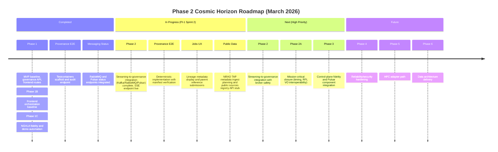

<!-- markdownlint-disable MD013 -->

# ROADMAP

## Status

- Working roadmap for 2026 delivery from architecture baseline to mission-aligned executable platform.
- MVP-first prioritization remains in effect.

## Current

- Foundation baseline established (frontend routes, governance API baseline, contracts, compose observability stack).
- Phase 1, 1B, and 1C completion milestones are recorded.
- Active roadmap execution is centered on Phase 2/2A/3/4 and PI-1 sprint sequencing. Phase 2 features now include a working SSE endpoint and front-end event panel with e2e validation.
- Public-data candidate sources for ETL/viewer work are now documented in `documentation/public-data/PUBLIC_DATA_RESOURCES.md`.
- Remaining frontend hardening is now carried inside adjacent roadmap work.
  See `FRONTEND_HARDENING_TRACKER.md` for the carry-forward cleanup list.

### Current Roadmap Status Overview

## Next

### Immediate

- Complete deterministic provenance E2E implementation (now includes manifest verification and HTTP audit endpoint).
- Close deferred docs-validation items from NGVLA fidelity track. _(completed 2026‑03‑06 — all referenced docs reviewed and synchronized)_
- **Kafka/RabbitMQ/Pulsar ingestion paths are live** – gateway consumes `phase2-events` from all three brokers with idempotent ingest and DLQ handling.
- Broker integration complete; runbook for DLQ/replay and interruption safety published (`documentation/messaging/BROKER_SAFETY_RUNBOOK.md`).- Begin frontend Jobs UX enhancements: surface lineage metadata and allow job submissions with parent references.
- Define public-data integration slice: NRAO TAP metadata ingest, viewer seed imagery, and source attribution fields.

### High

- Phase 2 streaming-to-governance integration with broker interruption/replay safety.
- Phase 2A mission-critical closure (timing integrity, RFI loop, VO interoperability expansion, commissioning, DR policy).
- Phase 3 frontend control-plane fidelity, lineage/manifest display, and Pulsar component integration; Viewer Mode B rollout.
- Phase 3 public-data viewer integration and source citation treatment for externally sourced datasets/images.

### Medium

- Phase 4 reliability/security hardening (backpressure, rate limiting, auth, audit, SLO dashboards).
  - Mission outcome: Institutional trust and audit
  - Operator/science impact: side-effecting execution actions are protected, replay-safe, and attributable to authenticated operators and services
  - Validation evidence: negative-path auth tests, replay/idempotency coverage, and auditable apply/provenance traces
- Phase 4A test reliability and coverage hardening for broker diagnostics, environment surfaces, job lifecycle edge cases, and Cypress runtime stability.
  - Mission outcome: Observatory continuity
  - Operator/science impact: release decisions are based on repeatable unit/e2e evidence across broker health, operator environment flows, and job lifecycle failure paths
  - Validation evidence: RabbitMQ/Pulsar negative-path tests, environment component/service unit coverage, manifest/lineage/retry/cancel controller-service tests, and repaired Cypress smoke execution
- Quarterly NGVLA reference reviews to refresh citations and trigger drift-test updates (first review Mar 2026 completed).
- Phase 5 HPC adapter path and compute-orchestration contract alignment.
- Phase 5A Trident gateway/execution-layer integration: schedule-block/execution-block control flow, subarray+spectral contracts, finite FSP allocation, and mode-aware backend startup around a Trident-like target.
  - Mission outcome: Compute-to-archive efficiency
  - Operator/science impact: operators can move from observation intent to validated gateway configuration plans without manual translation into backend target actions
  - Validation evidence: contract tests for execution payloads plus integration tests for gateway-side allocation and backend fan-out flows
- Phase 6 ngVLA data architecture delivery (manifest, lineage, catalog, RBAC, analytics).
- Phase 6 external-source registry and enrichment pipeline for `data.gov`/`NSF`/`NIST` metadata where mission-relevant.

### Low

- Post-PI long-horizon catalog search/lineage graph and data-lake format evaluation.
- Extended benchmark tracks and optional runtime distribution migrations.

## Backlog

- Phase 2: Kafka/RabbitMQ/Pulsar integration parity, contract versioning, DLQ/replay runbooks, full test matrix.
- Phase 2B: canonical execution event envelope, broker-role ownership, and cross-broker trace/replay discipline for execution-layer flows.
  - Mission outcome: Institutional trust and audit
  - Operator/science impact: the control plane can follow one execution correlation chain across RabbitMQ, Kafka, and Pulsar without ambiguous ownership
  - Validation evidence: shared event contracts, compatibility checks, and integration coverage for correlation propagation and audit mirroring
- Phase 2A: timing/frequency metadata gates, RFI model, TAP/ADQL/DataLink/SODA conformance, commissioning scenarios, DR drills.
- Phase 3: governance-integrated UI lifecycle flows, route-state fidelity, diagnostics hardening, stress-profile UX standardization, public-source citation rendering.
- Phase 4: queue controls, authN/authZ enforcement, immutable audit strategy, load/failure resilience gates.
- Phase 4A: Cypress cache/runtime remediation, frontend smoke-path restoration, broker-status negative-path coverage, environment-surface unit coverage, and job lifecycle edge-case tests.
  - Mission outcome: Reproducible science
  - Operator/science impact: frontend and governance regressions are caught before operator workflows are affected by flaky e2e infrastructure or untested failure paths
  - Validation evidence: smoke e2e lane includes `datasets-provenance`, backend endpoint negative-path suites pass, and coverage reports show new environment/job-path assertions
- Phase 5: external compute adapter contracts, async dispatch, provenance-linked compute outputs.
- Phase 5A: Trident gateway integration with timed configuration application, resource-capacity checks, routing/allocation simulation, and backend product fan-out around an external or simulated Trident-like target.
  - Mission outcome: Observatory continuity
  - Operator/science impact: scheduling errors and incompatible backend setups are caught before run-time data loss paths are entered, without requiring a reimplementation of Trident internals
  - Validation evidence: simulation runbook, gateway allocator failure-path coverage, and end-to-end status/provenance traces
- Phase 6: canonical dataset manifest model, lineage chain APIs, dataset search/catalog, ETL quality validator, publication policy hooks, external-source registry/enrichment.
- Ongoing tracks: testing coverage, documentation synchronization, messaging docs parity, quarterly performance benchmarks.
- Ongoing tracks: execution-layer documentation alignment and broken-link normalization for canonical docs.

---

## Sprint Plan — PI-1 / PI-2 (Mar – May 2026)

> 2-week sprints. PI-1 = Sprints 1–4 (Mar–Apr 2026). PI-2 = Sprints 5–6 (May 2026).
> Priority legend: 🔴 High · 🟡 Medium · 🟢 Low

---

### Sprint 1 · Mar 7–21, 2026 — Console Stability & SSE Integration

**Why:** Three live browser console errors degrade developer confidence and demo readiness today. The `broker-events` SSE 404 means operators receive no live job notifications despite the Kafka/RabbitMQ/Pulsar work being complete. The `vo/cached-samples` 404 fires a polling loop on every VO dialog open against a non-existent endpoint. The `aria-hidden` focus warning is an accessibility regression introduced by the Material dialog overlay. All three are cheap to fix and unblock clean demo runs.

| Priority | Step |
| --- | --- |
| 🔴 | Add `GET /api/v1/broker-events` SSE endpoint (or ensure it is reachable via proxy) and add mock server handler so SSE stream resolves in dev |
| 🔴 | Implement or stub `GET /api/v1/vo/cached-samples` in the Java backend (returns a curated list of sample VO payloads per workflow type); add mock server handler |
| 🟡 | Fix `aria-hidden` focus trap — remove `aria-hidden="true"` from `<app-root>` while a dialog is open; use Angular CDK `inert` strategy instead |
| 🟢 | Audit remaining `console.warn` / `console.error` noise and suppress or gate behind devMode flag |

**Exit criteria:**

- Browser console is clean on page load and on VO submit dialog open
- Broker SSE stream connects and delivers at least one heartbeat/event in dev
- VO dialog populates cached samples without 404
- No `aria-hidden` warning on button focus
- All 50 backend tests + 193 frontend tests continue to pass ✅ _(197 frontend / 53 Java as of 2026-03-07)_
- Unit tests added for S1-1 (SSE headers, connected event, interval cleanup) and S1-2 (`ariaModal` provider) ✅
- Jobs toolbar buttons all visible with distinct vibrant colors (`mat-raised-button` + MDC palette) ✅

---

### Sprint 2 · Mar 21 – Apr 4, 2026 — CI Hardening & Flaky Suite Migration (PI-1 Sprint 3/4)

**Why:** PI-1 Sprint 3 target is flaky-suite migration; Sprint 4 is CI gating. Cypress has known cache/runtime issues that block e2e confidence in both local and CI runs. Without a stable PR gate, future feature merges carry unchecked regression risk. This sprint closes PI-1's testing goals and installs the quality gate that all subsequent sprints depend on.

| Priority | Step |
| --- | --- |
| 🔴 | Cypress runtime/cache remediation — identify root cause, fix in `frontend-e2e` config; re-enable `datasets-provenance.cy.ts` in smoke path |
| 🔴 | Add negative-path tests for RabbitMQ and Pulsar status endpoints (`/api/v1/rabbitmq/status`, `/api/v1/pulsar/status` when broker is down) |
| 🔴 | Configure CI nightly lane: PR gate (unit + smoke e2e), nightly lane (full e2e + integration tests) |
| 🟡 | Add job lifecycle edge-case coverage: manifest, lineage, retry, and cancel controller/service paths |
| 🟡 | Enforce coverage thresholds (Java JaCoCo, frontend Istanbul) with pipeline failure on regression |
| 🟢 | Publish JaCoCo HTML report as CI artifact; link from PR summary |

**Exit criteria:**

- ✅ `pnpm run e2e` completes cleanly in CI without cache errors
- ✅ `datasets-provenance.cy.ts` is in the smoke lane and passes
- ✅ PR gate blocks merges on unit test failure or coverage drop
- ✅ Nightly lane runs full integration suite and publishes report
- ✅ RabbitMQ/Pulsar negative-path tests added and green
- ✅ Job lifecycle edge-case tests: 11 tests covering manifest/lineage/cancel/retry/transition. Fixed `attachManifest` marshaller bug. Java: 64/64.
- ✅ Istanbul coverage collection wired in CI via `project.json` `ci` configuration. `check-coverage.sh` reads correct Nx output path.

**Sprint 2 COMPLETE — all exit criteria met.**

---

### Sprint 3 · Apr 4–18, 2026 — Mission Closure MG-4 & MG-5

**Why:** MG-3 (VO interoperability) closed on Mar 7. MG-4 (Commissioning/AIV readiness) and MG-5 (Archive DR replication) are the next open mission oversight gates. Commissioning scenario coverage proves the platform can model real observatory AIV readiness checks before data-taking begins. DR tooling ensures dataset survival under failure — a prerequisite for any production-adjacent review. Neither has a code baseline yet.

| Priority | Step |
| --- | --- |
| 🔴 | **MG-4** — Create commissioning/AIV scenario test profile: define scenario fixtures (antenna calibration, timing sync, RFI baseline), scaffold `CommissioningScenarioService` and acceptance gate logic |
| 🔴 | **MG-4** — Controller endpoint `GET /api/v1/commissioning/scenarios` + `POST /api/v1/commissioning/validate`; controller and service unit tests |
| 🔴 | **MG-5** — Archive DR replication tooling: `ArchiveDrService`, replication policy model, and restore-drill integration test using Testcontainers |
| 🟡 | **MG-5** — DR policy documentation: `documentation/mission-closure/MG-5-DR-POLICY.md`, operator runbook for replicate/restore/verify cycle |
| 🟡 | **MG-4** — Commissioning status badge/panel on Diagnostics page (scenario pass/fail surface) |
| 🟢 | Cross-link MG-4 and MG-5 into `NGVLA_MISSION_ALIGNMENT.md` with exit criteria |

**Exit criteria:**

- `POST /api/v1/commissioning/validate` returns pass/fail for a scenario fixture payload
- DR restore-drill Testcontainers test passes in CI  
- DR policy doc and runbook published under `documentation/mission-closure/`
- Commissioning status panel visible on Diagnostics page
- MG-4 and MG-5 marked closed in mission alignment docs

---

### Sprint 4 · Apr 18 – May 2, 2026 — MG-6 Transient Alerts + Canonical Event Envelope

**Why:** MG-6 (transient/low-latency alert SLOs) closes the last of the six mission oversight gaps. Simultaneously, the canonical execution event envelope is the prerequisite for the Phase 3 Trident gateway work — without a shared cross-broker event schema and correlation discipline, Sprint 5's Trident domain model cannot be built safely. These two items are linked: MG-6 alert replay requires the same correlation/envelope primitives as the Trident execution layer.

| Priority | Step |
| --- | --- |
| 🔴 | **MG-6** — Transient alert path: SLO metric counters (`alert_ingested_total`, `alert_latency_ms`), alert state model, and Prometheus scrape integration |
| 🔴 | **MG-6** — Jobs/Diagnostics UI: alert SLO indicator panel and replay-from-DLQ button wired to existing DLQ endpoint |
| 🔴 | Canonical execution event envelope schema: `CorrelationId`, `EventType`, `OriginBroker`, `Timestamp`, `Payload`; JSON Schema + Java record definition |
| 🟡 | Broker role partitioning: assign Kafka = audit/replay, RabbitMQ = control commands, Pulsar = federated delivery; document in `BROKER_SAFETY_RUNBOOK.md` |
| 🟡 | Integration tests: correlation ID propagation across brokers; idempotent delivery proof |
| 🟢 | MG-6 SLO dashboard panel in Grafana compose stack |

**Exit criteria:**

- All six mission oversight gates (MG-1..MG-6) marked closed in `NGVLA_MISSION_ALIGNMENT.md`
- Alert SLO metrics appear in `/api/v1/telemetry` and Prometheus scrape
- Replay-from-DLQ button functional in UI
- Canonical event schema published with version identifier
- Correlation ID propagation test passes across Kafka, RabbitMQ, and Pulsar paths

---

### Sprint 5 · May 2–16, 2026 — Trident Domain Model & Gateway Contracts

**Why:** Phase 3/5A Trident gateway integration is the next major architectural layer. Defining `SchedulingBlock`, `ExecutionBlock`, `SubarrayConfiguration`, `SpectralConfiguration`, and the FSP allocation model now unlocks the entire execution-layer API and mode-aware backend orchestration. Without versioned contracts first, subsequent executor and backend fan-out work will be built on shifting foundations. This sprint is contract-first to enable parallel downstream work.

| Priority | Step |
| --- | --- |
| 🔴 | Define and version JSON Schemas for `SchedulingBlock`, `ExecutionBlock`, `SubarrayConfiguration`, `SpectralConfiguration`, `FspAllocationPlan` |
| 🔴 | Java domain records for each entity; `SchemaService` extended with Trident schema builtins |
| 🔴 | Gateway-side FSP allocator simulator: subarray contention detection, incompatible spectral plan rejection, finite-capacity guard; unit tests for all error paths |
| 🟡 | Execution-layer API stub: `POST /api/v1/execution/plans` (validate), `POST /api/v1/execution/plans/{id}/apply` (apply with idempotency key) |
| 🟡 | Mode-aware backend job template stubs: correlation, VLBI, pulsar-timing, pulsar-search — each returns a validated job template from a `SchedulingBlock` input |
| 🟢 | Trident integration documentation: `documentation/trident/TRIDENT_GATEWAY.md` with contract schema versions and routing rules |

**Exit criteria:**

- All five Trident entity schemas versioned and resolvable by `SchemaService`
- FSP allocator rejects contention and incompatible spectral plans with typed errors in tests
- Execution plan API validates against schema and returns `planId`
- Mode routing returns correct backend job template for each of four modes
- Contract tests for all entities pass in Maven verify

---

### Sprint 6 · May 16–30, 2026 — Security Hardening & Phase 4 Auth Enforcement

**Why:** Phase 4 security hardening is the final gap before this platform can support any production-adjacent demo or external review. `AuthFilter` currently runs in dev-permissive mode. Without enforced RBAC, replay protection, and an immutable audit trail, the institutional trust and audit mission outcome is only partially satisfied — the architecture is present but unenforced. This sprint moves from baseline scaffolding to enforced policy, and adds the rate-limiting layer that protects the job submission and ingest hotpaths.

| Priority | Step |
| --- | --- |
| 🔴 | Upgrade `AuthFilter` from dev-permissive to enforced mode: validate JWT claims, enforce role-based policy rules (`OPERATOR`, `SCIENTIST`, `ADMIN`); negative-path auth tests for each role boundary |
| 🔴 | Replay/idempotency protection on job submission (`POST /api/v1/jobs`) and execution apply endpoint — reject duplicate `idempotencyKey` with 409 |
| 🔴 | Immutable audit log enforcement: job state transitions append-only; rewrite/delete of audit records returns 405; audit log integrity test |
| 🟡 | Rate limiting on `POST /api/v1/jobs` and `/api/v1/ingest` (token bucket, configurable per-role limits) |
| 🟡 | Security posture documentation update: `documentation/security/SECURITY_POSTURE.md` revised with enforcement status, threat model delta, and OWASP Top 10 mapping |
| 🟢 | Frontend auth error handling: display 401/403 error states in Jobs and Diagnostics rather than silent failure or spinner hang |

**Exit criteria:**

- Requests with missing, malformed, or unauthorized JWTs receive 401/403 (not 200)
- Duplicate `idempotencyKey` submissions return 409; no duplicate job records created
- Audit log append-only constraint verified by test (PUT/DELETE return 405)
- Rate limiting test demonstrates throttling at configured threshold
- All new security paths covered by unit tests and at least one negative-path integration test
- Security posture doc updated with OWASP coverage status

---

## Completed

- Phase 2 streaming-to-governance integration: Kafka, RabbitMQ, Pulsar ingest implementations, test matrix, DLQ safety and SSE endpoint ✅
- Baseline frontend telemetry/topology/diagnostics plus `Jobs`/`Datasets` routes with SSR shim.
- Baseline streaming stack: data generator + Kafka/Prometheus/Grafana compose setup.
- Baseline governance contracts and API scaffolding with Redis-backed local durability.
- Phase 1: governance API maturity outcomes marked complete.
- Phase 1B: frontend orchestration baseline outcomes marked complete.
- Phase 1C: NGVLA reference fidelity and demo automation outcomes marked complete (except explicitly deferred items moved to next phases).
- Added performance publisher tooling and testing documentation baseline.
- Sprint 1 Testcontainers scaffold and CI lane setup finalized (docker-compose for integration tests, Maven profile `with-containers`, new `ci-tests` workflow).
  - Mission outcome: Reproducible science
  - Operator/science impact: integration checks run automatically, reducing drift between local dev and CI
  - Validation evidence: CI job executes container tests and passes
- Provenance E2E skeleton added with audit-log polling (beginning Sprint 2).
  - Mission outcome: Observatory continuity
  - Operator/science impact: end-to-end metadata capture verified in early tests
  - Validation evidence: `ProvenanceE2ETest` runs in CI and checks in-memory audit log
- Pulsar status component integrated into Telemetry/Diagnostics views.
  - Mission outcome: Human decision speed
  - Operator/science impact: operators can monitor Pulsar broker health alongside Kafka and RabbitMQ in real-time
  - Validation evidence: `/api/v1/pulsar/status` endpoint returns broker, topic, and partition counts; frontend diagnostics page displays Pulsar status

## INSTRUCTIONS

- Add mission linkage to each new roadmap phase deliverable and exit criterion:
  - `Mission outcome:` canonical outcome from mission alignment docs.
  - `Operator/science impact:` observable operator/science improvement.
  - `Validation evidence:` objective artifact or gate.
- Canonical outcomes:
  1. Observatory continuity
  2. Reproducible science
  3. Compute-to-archive efficiency
  4. Institutional trust and audit
  5. Human decision speed
- Keep roadmap runtime-synchronized; avoid documentation-only claims.
- Favor contract-first integration and preserve migration safety with parallel transitional components when needed.
- When external/public data is presented in the UI, prefer showing the authoritative source as subdued small text with a link when layout permits; if a surface cannot support it, preserve the source URL/identifier in metadata for drill-down views.
- Required quality track expectations:
  - PR gate: lint/format/OpenAPI validation/unit tests/coverage/frontend smoke e2e/Java verify.
  - Integration track: Testcontainers-based broker+state dependencies, compose smoke, compatibility tests.
  - Stress track: reproducible synthetic loads, failure injection, long-duration stability assertions.
- PI scheduling baseline:
  - PI-1 (Mar-Apr 2026), 2-week sprints, 4 sprints.
  - Sprint 1: Testcontainers scaffold.
  - Sprint 2: Provenance E2E.
  - Sprint 3: flaky-suite migration.
  - Sprint 4: CI gating and nightly lanes.
- References:
  - Testing: `docuentation/testing/TESTING_FRAMEWORK_ARCHITECTURE.md`, `docuentation/testing/TESTING_REQUIREMENTS.md`
  - Mission: `docuentation/ngvla/NGVLA_MISSION_ALIGNMENT.md`, `docuentation/ngvla/MISSION_TO_CAPABILITY_TRACE.md`, `docuentation/ngvla/MISSION_GATES.md`
  - Data architecture: `docuentation/data/DATA_ARCHITECTURE.md`, `docuentation/ngvla/NGVLA_DATA_ARCHITECT_RESEARCH.md`
  - Mission closure: `docuentation/mission-closure/*.md`
  - Public data planning: `documentation/public-data/PUBLIC_DATA_RESOURCES.md`
  <!-- markdownlint-enable MD013 -->
