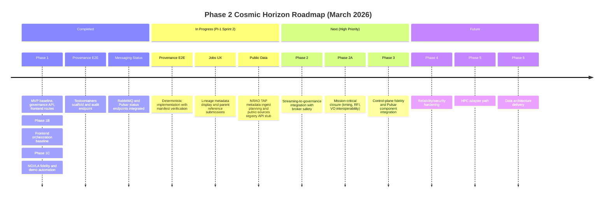

<!-- markdownlint-disable MD013 -->

# ROADMAP

## Status

- Working roadmap for 2026 delivery from architecture baseline to mission-aligned executable platform.
- MVP-first prioritization remains in effect.

## Current

- Foundation baseline established (frontend routes, governance API baseline, contracts, compose observability stack).
- Phase 1, 1B, and 1C completion milestones are recorded.
- Active roadmap execution is centered on Phase 2/2A/3/4 and PI-1 sprint sequencing.
- Public-data candidate sources for ETL/viewer work are now documented in `documentation/public-data/PUBLIC_DATA_RESOURCES.md`.
- Remaining frontend hardening is now carried inside adjacent roadmap work.
  See `FRONTEND_HARDENING_TRACKER.md` for the carry-forward cleanup list.

### Current Roadmap Status Overview

## Next

### Immediate

- Complete deterministic provenance E2E implementation (now includes manifest verification and HTTP audit endpoint).
- Close deferred docs-validation items from NGVLA fidelity track. *(completed 2026‑03‑06 — all referenced docs reviewed and synchronized)*
- Begin frontend Jobs UX enhancements: surface lineage metadata and allow job submissions with parent references.
- Define public-data integration slice: NRAO TAP metadata ingest, viewer seed imagery, and source attribution fields.

### High

- Phase 2 streaming-to-governance integration with broker interruption/replay safety.
- Phase 2A mission-critical closure (timing integrity, RFI loop, VO interoperability expansion, commissioning, DR policy).
- Phase 3 frontend control-plane fidelity, lineage/manifest display, and Pulsar component integration; Viewer Mode B rollout.
- Phase 3 public-data viewer integration and source citation treatment for externally sourced datasets/images.

### Medium

- Phase 4 reliability/security hardening (backpressure, rate limiting, auth, audit, SLO dashboards).
  - Mission outcome: Institutional trust and audit
  - Operator/science impact: side-effecting execution actions are protected, replay-safe, and attributable to authenticated operators and services
  - Validation evidence: negative-path auth tests, replay/idempotency coverage, and auditable apply/provenance traces
- Phase 4A test reliability and coverage hardening for broker diagnostics, environment surfaces, job lifecycle edge cases, and Cypress runtime stability.
  - Mission outcome: Observatory continuity
  - Operator/science impact: release decisions are based on repeatable unit/e2e evidence across broker health, operator environment flows, and job lifecycle failure paths
  - Validation evidence: RabbitMQ/Pulsar negative-path tests, environment component/service unit coverage, manifest/lineage/retry/cancel controller-service tests, and repaired Cypress smoke execution
- Quarterly NGVLA reference reviews to refresh citations and trigger drift-test updates (first review Mar 2026 completed).
- Phase 5 HPC adapter path and compute-orchestration contract alignment.
- Phase 5A Trident gateway/execution-layer integration: schedule-block/execution-block control flow, subarray+spectral contracts, finite FSP allocation, and mode-aware backend startup around a Trident-like target.
  - Mission outcome: Compute-to-archive efficiency
  - Operator/science impact: operators can move from observation intent to validated gateway configuration plans without manual translation into backend target actions
  - Validation evidence: contract tests for execution payloads plus integration tests for gateway-side allocation and backend fan-out flows
- Phase 6 ngVLA data architecture delivery (manifest, lineage, catalog, RBAC, analytics).
- Phase 6 external-source registry and enrichment pipeline for `data.gov`/`NSF`/`NIST` metadata where mission-relevant.

### Low

- Post-PI long-horizon catalog search/lineage graph and data-lake format evaluation.
- Extended benchmark tracks and optional runtime distribution migrations.

## Backlog

- Phase 2: Kafka/RabbitMQ/Pulsar integration parity, contract versioning, DLQ/replay runbooks, full test matrix.
- Phase 2B: canonical execution event envelope, broker-role ownership, and cross-broker trace/replay discipline for execution-layer flows.
  - Mission outcome: Institutional trust and audit
  - Operator/science impact: the control plane can follow one execution correlation chain across RabbitMQ, Kafka, and Pulsar without ambiguous ownership
  - Validation evidence: shared event contracts, compatibility checks, and integration coverage for correlation propagation and audit mirroring
- Phase 2A: timing/frequency metadata gates, RFI model, TAP/ADQL/DataLink/SODA conformance, commissioning scenarios, DR drills.
- Phase 3: governance-integrated UI lifecycle flows, route-state fidelity, diagnostics hardening, stress-profile UX standardization, public-source citation rendering.
- Phase 4: queue controls, authN/authZ enforcement, immutable audit strategy, load/failure resilience gates.
- Phase 4A: Cypress cache/runtime remediation, frontend smoke-path restoration, broker-status negative-path coverage, environment-surface unit coverage, and job lifecycle edge-case tests.
  - Mission outcome: Reproducible science
  - Operator/science impact: frontend and governance regressions are caught before operator workflows are affected by flaky e2e infrastructure or untested failure paths
  - Validation evidence: smoke e2e lane includes `datasets-provenance`, backend endpoint negative-path suites pass, and coverage reports show new environment/job-path assertions
- Phase 5: external compute adapter contracts, async dispatch, provenance-linked compute outputs.
- Phase 5A: Trident gateway integration with timed configuration application, resource-capacity checks, routing/allocation simulation, and backend product fan-out around an external or simulated Trident-like target.
  - Mission outcome: Observatory continuity
  - Operator/science impact: scheduling errors and incompatible backend setups are caught before run-time data loss paths are entered, without requiring a reimplementation of Trident internals
  - Validation evidence: simulation runbook, gateway allocator failure-path coverage, and end-to-end status/provenance traces
- Phase 6: canonical dataset manifest model, lineage chain APIs, dataset search/catalog, ETL quality validator, publication policy hooks, external-source registry/enrichment.
- Ongoing tracks: testing coverage, documentation synchronization, messaging docs parity, quarterly performance benchmarks.
- Ongoing tracks: execution-layer documentation alignment and broken-link normalization for canonical docs.

## Completed

- Baseline frontend telemetry/topology/diagnostics plus `Jobs`/`Datasets` routes with SSR shim.
- Baseline streaming stack: data generator + Kafka/Prometheus/Grafana compose setup.
- Baseline governance contracts and API scaffolding with Redis-backed local durability.
- Phase 1: governance API maturity outcomes marked complete.
- Phase 1B: frontend orchestration baseline outcomes marked complete.
- Phase 1C: NGVLA reference fidelity and demo automation outcomes marked complete (except explicitly deferred items moved to next phases).
- Added performance publisher tooling and testing documentation baseline.
- Sprint 1 Testcontainers scaffold and CI lane setup finalized (docker-compose for integration tests, Maven profile `with-containers`, new `ci-tests` workflow).
  - Mission outcome: Reproducible science
  - Operator/science impact: integration checks run automatically, reducing drift between local dev and CI
  - Validation evidence: CI job executes container tests and passes
- Provenance E2E skeleton added with audit-log polling (beginning Sprint 2).
  - Mission outcome: Observatory continuity
  - Operator/science impact: end-to-end metadata capture verified in early tests
  - Validation evidence: `ProvenanceE2ETest` runs in CI and checks in-memory audit log
- Pulsar status component integrated into Telemetry/Diagnostics views.
  - Mission outcome: Human decision speed
  - Operator/science impact: operators can monitor Pulsar broker health alongside Kafka and RabbitMQ in real-time
  - Validation evidence: `/api/v1/pulsar/status` endpoint returns broker, topic, and partition counts; frontend diagnostics page displays Pulsar status

## INSTRUCTIONS

- Add mission linkage to each new roadmap phase deliverable and exit criterion:
  - `Mission outcome:` canonical outcome from mission alignment docs.
  - `Operator/science impact:` observable operator/science improvement.
  - `Validation evidence:` objective artifact or gate.
- Canonical outcomes:
  1. Observatory continuity
  2. Reproducible science
  3. Compute-to-archive efficiency
  4. Institutional trust and audit
  5. Human decision speed
- Keep roadmap runtime-synchronized; avoid documentation-only claims.
- Favor contract-first integration and preserve migration safety with parallel transitional components when needed.
- When external/public data is presented in the UI, prefer showing the authoritative source as subdued small text with a link when layout permits; if a surface cannot support it, preserve the source URL/identifier in metadata for drill-down views.
- Required quality track expectations:
  - PR gate: lint/format/OpenAPI validation/unit tests/coverage/frontend smoke e2e/Java verify.
  - Integration track: Testcontainers-based broker+state dependencies, compose smoke, compatibility tests.
  - Stress track: reproducible synthetic loads, failure injection, long-duration stability assertions.
- PI scheduling baseline:
  - PI-1 (Mar-Apr 2026), 2-week sprints, 4 sprints.
  - Sprint 1: Testcontainers scaffold.
  - Sprint 2: Provenance E2E.
  - Sprint 3: flaky-suite migration.
  - Sprint 4: CI gating and nightly lanes.
- References:
  - Testing: `docuentation/testing/TESTING_FRAMEWORK_ARCHITECTURE.md`, `docuentation/testing/TESTING_REQUIREMENTS.md`
  - Mission: `docuentation/ngvla/NGVLA_MISSION_ALIGNMENT.md`, `docuentation/ngvla/MISSION_TO_CAPABILITY_TRACE.md`, `docuentation/ngvla/MISSION_GATES.md`
  - Data architecture: `docuentation/data/DATA_ARCHITECTURE.md`, `docuentation/ngvla/NGVLA_DATA_ARCHITECT_RESEARCH.md`
  - Mission closure: `docuentation/mission-closure/*.md`
  - Public data planning: `documentation/public-data/PUBLIC_DATA_RESOURCES.md`
  <!-- markdownlint-enable MD013 -->
