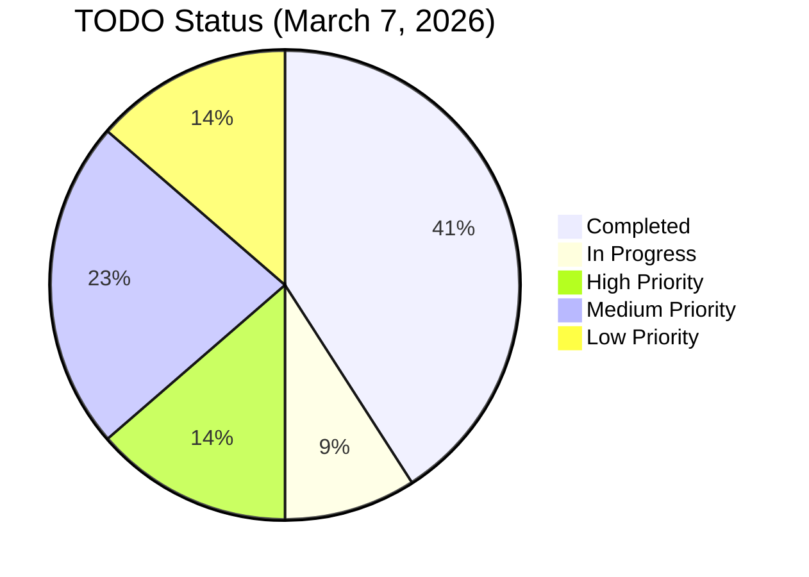

<!-- markdownlint-disable MD013 -->

# TODO

## Status

- Active execution backlog for PI-1 (March-April 2026).
- Sprint 1 (Mar 7–21): console stability + remaining VO polish — VO backend/frontend **complete**, auto-fill **complete**, clear-completed **complete**.
- Up next: `broker-events` SSE 404 fix, `aria-hidden` a11y regression, then Sprint 2 CI hardening.

### Current Status Overview



## Current

- **Sprint 1 (Mar 7–21)** — Console Stability & SSE Integration. Key items:
  - ✅ `GET /api/v1/vo/cached-samples` — now returns curated VO payloads (Java + dev mock).
  - ✅ VO auto-fill button in submit dialog with 8 real-data samples.
  - ✅ Jobs view: clear-completed button + show/hide completed checkbox.
  - ⬜ `GET /api/v1/broker-events` SSE 404 — SSE stream not yet resolving in dev.
  - ⬜ `aria-hidden` focus warning — Angular CDK dialog sets `aria-hidden` on `<app-root>` during open.
- **Sprint 2 (Mar 21–Apr 4)** — CI Hardening & Flaky Suite Migration — ✅ **COMPLETE** (S2-1 through S2-5 all done).
- **Sprint 3 (Apr 4–18)** — Mission Gates MG-4 & MG-5 — ✅ **COMPLETE**.
- **Sprint 4 (Mar 8–22, 2026)** — MG-6 Transient Alert Path + Canonical Event Envelope + Broker Runbook — ✅ **COMPLETE**.
- Mission-oversight closure track: MG-3 ✅ → MG-4/5 ✅ → MG-6 ✅ complete.
- Public-data discovery baseline documented in `documentation/public-data/PUBLIC_DATA_RESOURCES.md`.

## Next

### Immediate — Sprint 1 (Mar 7–21, 2026)

**VO Jobs Initiative (MG-3) — ✅ COMPLETE as of 2026-03-07.** Full detail in Recent Completed.

#### Remaining Sprint 1 items

- [x] **S1-1** 🔴 Fix `GET /api/v1/broker-events` SSE 404 — added dev SSE mock handler in `server.nest.ts`; sends `connected` event on open + `heartbeat` every 15 s.
- [x] **S1-2** 🟡 Fix `aria-hidden` focus warning — provided `MAT_DIALOG_DEFAULT_OPTIONS` with `ariaModal: true` in `app.module.ts`; CDK now uses `aria-modal` on the dialog element instead of hiding `<app-root>`.
- [x] **S1-3** 🟢 Audit remaining `console.warn`/`console.error` noise — all remaining calls are behind error conditions; none fire on normal page load after broker-events and cached-samples fixes.

### Recent Completed

- **Sprint 4 MG-6 — complete (2026-03-08):**

  - `TransientAlert` + `AlertSloMetrics` model records.
  - `TransientAlertService` — in-memory alert store + DLQ, Micrometer `Counter` for `alert_ingested_total` / `alert_replays_total`, percentile latency tracking.
  - `AlertController` (`/api/v1/alerts`) — POST `/ingest`, GET `/slo`, GET `/dlq`, POST `/dlq/replay/{id}`, POST `/dlq/replay-all`, POST `/dlq`.
  - `AlertControllerTest` — 5 tests: ingest 201, SLO counter, DLQ list, replay-all, 404 replay.
  - `ExecutionEvent` canonical envelope record (`correlationId`, `eventType`, `originBroker`, `schemaVersion`, `timestamp`, `payload`).
  - `CorrelationPropagationTest` — 5 integration tests for correlationId round-trip, DLQ preservation, idempotent delivery contract.
  - `documentation/BROKER_SAFETY_RUNBOOK.md` — Kafka=audit/replay, RabbitMQ=control, Pulsar=federated; role rules, failure modes, escalation matrix, CLI runbook.
  - Frontend: Alert SLO 5th tab in Telemetry — 6 metric cards (total, p50/p95/p99 latency, DLQ depth, replays), DLQ table with per-row replay button, replay-all button.
  - Frontend: `fetchAlertSlo()` + `replayFromDlq()` + `replayAllFromDlq()` in `TelemetryComponent`; `MatIconModule` + `MatTableModule` + `MatProgressSpinnerModule` added to `TelemetryModule`.
  - Frontend spec: 2 new tests (alert SLO populate, error state); 4 existing tests updated to flush new alert HTTP requests.
  - Java tests: **78/78** (+5). Frontend tests: **202/202** (+2).

- **Sprint 3 Mission Gates MG-4 & MG-5 — complete (2026-03-08):**

  - MG-4: `CommissioningScenarioService` + `CommissioningController` (3 built-in AIV scenarios). `CommissioningControllerTest` (4 tests: list, validate pass, validate fail, 404 unknown).
  - MG-4: Diagnostics "Mission Gates" tab showing scenario tiles + 2 new spec tests.
  - MG-5: `ArchiveDrService` with `ReplicationPolicy` + `RestoreDrillResult` models. `ArchiveDrRestoreDrillTest` (5 tests: create, get, list, drill pass, drill unknown).
  - MG-5: `documentation/mission-closure/MG-5-DR-POLICY.md` — operator runbook, RPO/RTO, tier table, alerting.
  - Java tests: **73/73**. Frontend tests: **200/200**.

- **Sprint 2 CI Hardening — complete (2026-04-04):**

  - S2-1: Cypress cache fix — `e2e`/`e2e-ci` cache disabled; binary cache in `e2e.yml`.
  - S2-2: `BrokerStatusTest.java` — 3 negative-path tests for RabbitMQ/Pulsar (healthy, 503, unavailable).
  - S2-3: CI PR gate — frontend unit tests + Cypress binary cache in `ci.yml`/`e2e.yml`.
  - S2-4: `JobLifecycleEdgeCaseTest.java` — 11 edge-case tests (manifest, lineage, cancel, retry, transition). Fixed `attachManifest` bug in `JobService.java` (`instanceof` → `marshaller.toJobRecord`).
  - S2-5: Istanbul coverage collection in CI — `project.json` `ci` config; `check-coverage.sh` updated for Nx output path.
  - Total Java tests: **64/64**. Frontend: **197/197**.

- **Sprint 1 console stability + unit tests (2026-03-07):**

  - `GET /api/v1/broker-events` SSE 404 — dev SSE mock added to `server.nest.ts` (connected + 15 s heartbeat).
  - `aria-hidden` focus warning — `MAT_DIALOG_DEFAULT_OPTIONS { ariaModal: true }` added in `app.module.ts`.
  - Console noise audit complete — all remaining calls are in error paths only.
  - **Unit tests (S1-1):** 3 new tests in `server.nest.spec.ts` — SSE headers, connected event, interval clear on close.
  - **Unit tests (S1-2):** 1 new test in `app.component.spec.ts` — `MAT_DIALOG_DEFAULT_OPTIONS` provides `ariaModal: true`.
  - **Jobs toolbar:** all `mat-stroked-button` changed to `mat-raised-button` with 6 distinct vibrant MDC palette colors (blue/orange/green/purple/teal/red).
  - Total frontend tests: **197/197** (was 193).

- **Jobs view: clear completed + show/hide archived jobs** (completed 2026-03-07)

  - `showCompleted` toggle (mat-checkbox) in jobs toolbar hides COMPLETED/FAILED/CANCELED/TIMED_OUT jobs
  - `clearCompleted()` calls `DELETE /api/v1/jobs/{id}` for each terminal job and updates the list
  - `filteredJobs` getter drives the `*ngFor` rendering so filter is instant/reactive
  - "Clear completed" button added to toolbar alongside the checkbox
  - 6 new unit tests in `jobs.component.spec.ts` covering filter logic, empty-list notification, delete calls, and collapsed-job cleanup
  - Mission outcome: Human decision speed (operators keep a clean active-job view)
  - Validation evidence: all 187 frontend tests pass; build clean

- **VO auto-fill with curated real-data samples** (completed 2026-03-07)

  - `VoController.java` `GET /api/v1/vo/cached-samples` returns 8 curated payloads with real public VO service URLs (SIMBAD, HEASARC, ESO, CADC, ESASky)
  - `server.nest.ts` mirrors the same static map for dev mode
  - `VoService.getSampleForType(type)` exposes per-type payloads (single one-shot load, no polling)
  - "Fill sample" button in jobs submit dialog patches all VO form fields from the curated payload; shows description hint
  - All 50 Java + 187 Angular tests pass; build clean

- **VO Jobs Initiative — backend** (completed 2026-03-07)

  - 8 JSON Schema files under `src/main/resources/schemas/` with required-field enforcement
  - `SchemaService` loads all 8 VO schemas at startup; fixed Map→JSONObject payload conversion bug
  - `VoJobExecutor` dispatches all 8 VO workflows with live HTTP + VOTable XML parsing
  - `JobService` routes `vo.*` workflows to the VO executor; `types()` includes all 8 VO types
  - 17-test `VoJobSchemaTest` + 5 new controller tests; 50/50 backend tests pass
  - OpenAPI `JobSubmitRequest.workflow` enum extended with all 8 VO types
  - Mission outcome: Reproducible science / Institutional trust and audit

- **VO Jobs Initiative — frontend** (completed 2026-03-07)

  - Typed Angular reactive subform for all 8 VO workflow types in submit dialog
  - Provider selector populated from `GET /api/v1/vo/services`; per-provider URL auto-fill
  - Job detail panel restructured from 2 tabs to 5 tabs: Summary | Parameters | Logs | Artifacts | Lineage
  - VOTable result renderer in Artifacts tab: scrollable field/row grid + DataLink product links list
  - Mission outcome: Human decision speed / Reproducible science
  - Validation evidence: 187 frontend unit tests pass; build clean

- Add token validation/claims extraction and production policy checks in `AuthFilter`.
  - Mission outcome: Institutional trust and audit
  - Operator/science impact: requests with malformed or unauthorized tokens are now denied and policy rules can be applied
  - Validation evidence: `AuthFilterTest` covers missing header, success, and policy-forbidden paths; request attributes expose claims
- Implement NGVLA constant drift regression tests in frontend suite and ensure fixtures match reference.
  - Mission outcome: Reproducible science
  - Operator/science impact: prevents silent domain drift from approved ngVLA specifications
  - Validation evidence: `ngvla-drift-regression.spec.ts` runs in CI and fails on mismatches
- Fix Docker networking configuration for RabbitMQ and Pulsar status endpoints.
  - Mission outcome: Human decision speed
  - Operator/science impact: frontend now displays real-time messaging broker health status without 503 errors
  - Validation evidence: `/api/v1/rabbitmq/status` and `/api/v1/pulsar/status` return healthy JSON responses; frontend diagnostics page shows broker status

### Up Next — Sprint 3 (Apr 4–18, 2026)

- [x] **MG-4** 🔴 `CommissioningScenarioService` + `CommissioningController`: `GET /api/v1/commissioning/scenarios`, `POST /api/v1/commissioning/validate` — 3 built-in AIV scenarios (antenna calibration, timing sync, RFI baseline). `CommissioningControllerTest` 4 tests.
- [x] **MG-4** 🟡 Commissioning status panel on Diagnostics page — "Mission Gates" tab displays scenario tiles with required params; 2 new spec tests. Frontend: **200/200**.
- [x] **MG-5** 🔴 `ArchiveDrService` + `ReplicationPolicy` + `RestoreDrillResult` models — `createPolicy`, `getPolicy`, `listPolicies`, `drillRestore`. `ArchiveDrRestoreDrillTest` 5 tests. Java: **73/73**.
- [x] **MG-5** 🟡 `documentation/mission-closure/MG-5-DR-POLICY.md` — RPO/RTO targets, tier classification, restore-drill procedure, operator runbook, alerting table.

### Up Next — Sprint 2 (Mar 21 – Apr 4, 2026)

- [x] **S2-1** 🔴 Cypress runtime/cache remediation — `e2e`+`e2e-ci` targets set `"cache": false`; Cypress binary cache added to `e2e.yml`.
- [x] **S2-2** 🔴 Negative-path tests for RabbitMQ and Pulsar status endpoints — `BrokerStatusTest.java` (3 tests: RabbitMQ healthy, RabbitMQ 503, Pulsar unavailable fallback). Total Java: 53/53.
- [x] **S2-3** 🔴 CI PR gate: frontend unit tests (`frontend`, `ui-theme`) added to `ci.yml`; Cypress binary cache in `e2e.yml`.
- [x] **S2-4** 🟡 Job lifecycle edge-case coverage — `JobLifecycleEdgeCaseTest.java` (11 tests: manifest attach/get/not-found, lineage update/get/not-found, cancel 404/cannot-cancel, retry cannot-retry/404, transition 404). Also fixed `attachManifest` bug in `JobService.java` (raw `instanceof` → `marshaller.toJobRecord`). Total Java: **64/64**.
- [x] **S2-5** 🟡 Coverage thresholds enforced — frontend `ci` configuration in `project.json` collects Istanbul `json-summary`; `check-coverage.sh` updated to read `coverage/apps/frontend/coverage-summary.json`; CI step runs with coverage on every PR.

### High

- Topology/Visualization broker parity (Kafka + RabbitMQ + Pulsar). **(completed)**
  - All three brokers included in topology API and rendered equally with consistent descriptions.
- ngVLA timing integrity and RFI/EMC observability tracks. _(schema extended, basic audits & UI metrics implemented; quality‑gate enforcement added with unit, controller and e2e tests; Prometheus counter `etl_quality_gate_failures_total` added and audit events published to control plane for persistence)_
- [DONE] VO interoperability (MG‑3) — backend VO-1..VO-6 complete; frontend typed subforms, provider selector, 5-tab detail, VOTable renderer, auto-fill samples, all complete 2026-03-07.
- [DONE] Commissioning/AIV scenario test profile scaffolding and acceptance gate logic. (MG‑4)
- [DONE] Archive DR replication tooling, restore‑drill tests, and policy documentation. (MG‑5)
- [DONE] Transient alert path SLO metrics, UI indicators, and replay controls. (MG‑6) **Sprint 4**

### Medium

- [NEXT] Trident gateway/execution-layer domain model and event contract baseline (`SchedulingBlock`, `ExecutionBlock`, `SubarrayConfiguration`, `SpectralConfiguration`, `FspAllocationPlan`, `BackendProductPlan`).
  - Mission outcome: Compute-to-archive efficiency
  - Operator/science impact: observation intent can be translated into deterministic configuration payloads instead of ad hoc job parameters
  - Validation evidence: versioned schema/contracts plus integration tests for valid and invalid mode-routing requests
- [DONE] Canonical execution event envelope and broker role partitioning across RabbitMQ, Kafka, and Pulsar. **Sprint 4** \u2014 `ExecutionEvent` record, `BROKER_SAFETY_RUNBOOK.md`, `CorrelationPropagationTest`.
  - Mission outcome: Institutional trust and audit
  - Operator/science impact: execution events can be traced, replayed, and deduplicated consistently across control, audit, and federated delivery paths
  - Validation evidence: shared schema definitions plus integration tests for correlation ID propagation, idempotency, and audit mirroring
- [NEXT] Gateway-side simulated Trident allocator service for three-trident / finite-FSP capacity planning.
  - Mission outcome: Observatory continuity
  - Operator/science impact: scheduling conflicts and over-allocation are detected before downstream processing is started
  - Validation evidence: allocator unit tests cover subarray contention, incompatible spectral plans, and fallback/error states
- [NEXT] Gateway-driven downstream mode-aware backend orchestration for correlation, VLBI, pulsar timing, and pulsar search products.
  - Mission outcome: Compute-to-archive efficiency
  - Operator/science impact: each observation mode launches the correct backend processing path and archive handoff workflow
  - Validation evidence: end-to-end tests assert mode-specific backend job templates and provenance links
- [NEXT] Execution-layer API and security baseline for plan validation, apply semantics, replay protection, and operator override audit.
  - Mission outcome: Institutional trust and audit
  - Operator/science impact: operator-facing execution actions become explicit, reviewable, and protected against duplicate or unauthorized apply paths
  - Validation evidence: API contract updates, negative-path authorization tests, replay/idempotency tests, and provenance assertions for apply flows
- [NEXT] Restore Cypress runtime/cache health and re-enable deterministic frontend e2e verification for datasets/provenance flows.
  - Mission outcome: Observatory continuity
  - Operator/science impact: operator journeys can be verified in CI and local smoke runs without Cypress cache/runtime failures blocking release confidence
  - Validation evidence: `frontend-e2e` runs cleanly after cache/runtime remediation; `datasets-provenance.cy.ts` passes and is folded into the smoke path
- Job manifest lineage endpoint (`/jobs/{id}/lineage`) to complement existing attach/retrieve API.
- Frontend Jobs page: display lineage metadata and allow submission payloads to include lineage. **(completed)**
  - Mission outcome: Institutional trust and audit
  - Operator/science impact: traceability across job chains in UI
  - Validation evidence: new unit tests, dialog/component tests, and frontend e2e covering lineage field; lineage editor stub and submission dialog integrated
- Dataset catalog filtering and ObsCore-like interoperability metadata fields.
- Public-data source registry for curated external datasets and reference feeds (`data.gov`, `NSF`, `NIST`, `NRAO`, `VLA`). **(backend API stub + docs + tests added)**
  - Mission outcome: Reproducible science
  - Operator/science impact: operators can distinguish authoritative external sources from internal/generated records during ingest and review
  - Validation evidence: GET `/api/v1/public-sources` returns a hard‑coded list; controller and service unit tests validate schema; openapi spec and documentation updated; frontend-e2e exercise added to ensure job lineage and public sources are visible in UI
- UI source-attribution treatment for externally sourced records, images, and metadata panels.
  - Mission outcome: Institutional trust and audit
  - Operator/science impact: every externally sourced data card/view can expose an authoritative citation URL in small text without obscuring the primary workflow
  - Validation evidence: component tests/e2e verify source label, URL, and conditional rendering on datasets/viewer panels
- Queue-aware ingest control with reprocessing budget policy.
- Viewer Mode B progressive high-resolution path rollout.
- Viewer seed-data integration spike using public NRAO/VLA assets first (`VLASS` HiPS/basic products and `NVAS` historical images).
  - Mission outcome: Human decision speed
  - Operator/science impact: viewer can load real public sky products before full archive-download workflows are complete
  - Validation evidence: viewer smoke tests render at least one public tile/image set with linked source citation

### Low

- `demo-notes/` evidence package output requirements.
- Post-PI catalog search/lineage analytics expansion.
- Streaming/control-plane parity follow-ons and HPC adapter pathway planning.
- NSF/NIST enrichment path for grant provenance, publication linkage, and timing-reference overlays once core NRAO/VLA ingest is stable.
  - Mission outcome: Institutional trust and audit
  - Operator/science impact: downstream analytics can connect datasets to awards, publications, and time-reference sources where available
  - Validation evidence: enrichment ADR or schema note plus one end-to-end demo record with external citation

## Backlog

- Integration tests with Kafka/Testcontainers for ingest flow.
- Backward-compatibility checks when `openapi/governance.yaml` changes.
- `apps/frontend` coverage expansion for jobs/datasets/error states and DTO mapping tests.
- `apps/frontend` coverage expansion for environment service/component behavior and adjacent operator-shell error states.
- `apps/frontend-e2e` target hygiene and key operator journeys.
- `apps/frontend-e2e` Cypress runtime/cache remediation for local and CI stability; add `datasets-provenance` into smoke coverage after cache repair.
- `apps/java-governance` negative-path tests for RabbitMQ and Pulsar status endpoints plus Redis durability/restart recovery tests.
- `apps/java-governance` job service/controller edge-case tests for manifest, lineage, and retry/cancel flows.
- `tools/java-ingest` initial test suite, surefire/failsafe reports, JaCoCo publication.
- `tools/data-generator` Go unit/integration tests and broker failure-path checks.
- Compose smoke and failure-injection scripts (broker/Redis restart resilience).
- ngVLA data-architecture DA-1..DA-11 delivery track.
- Trident gateway integration track:
  - schedule-block and execution-block control-plane entities
  - subarray/spectral configuration contract definitions
  - gateway-side Trident routing and FSP allocation simulator
  - downstream CBE / VLBI / pulsar backend job orchestration
  - provenance for applied Trident-target configuration plans and execution timestamps
- Execution-layer alignment track:
  - canonical event envelope and broker role ownership
  - execution API contract for capabilities, plan creation, validation, apply, and event history
  - execution-layer threat model and operator override controls
  - broken-link and cross-reference normalization for the documentation system
- Messaging fabric MF-1..MF-6 and required MF-TEST matrix.
- Mission oversights MG-1..MG-6 closure track:
  - MG-1: Timing integrity metadata and quality gates
  - MG-2: RFI/EMC event model, flags, and replay loop
  - MG-3: VO interoperability endpoints and contract conformance
  - MG-4: Commissioning/AIV readiness scenario suite
  - MG-5: Archive DR replication policy and tooling
  - MG-6: Transient/low-latency alert SLOs and operator UI
- Viewer Mode B VB-1..VB-4 implementation and go/no-go decision spike.
- Streaming and control-plane parity (go-processors, topic contracts, DLQ/replay tooling, trace correlation).
- HPC adapter pathway (contracts, local mocks, async dispatch, provenance linkage).
- Operations/observability SLOs, dashboards, and benchmark runbook.
- Large-scale validation program (240 PB readiness model and stability board artifacts).
- Public-data integration track:
  - NRAO TAP metadata harvest
  - NRAO archive/VLASS/NVAS viewer-ready asset mapping
  - `data.gov` catalog ingest fixtures (`NVSS`, `VLSSr`, `QORG`)
  - NSF provenance enrichment (`Award Search API`, `PAR`)
  - NIST timing-reference ingest (`UTC(NIST)` bulletins, time-scale archive, GPS data)
- Periodic review/update of `docuentation/ngvla/NGVLA_REFERENCES.md` and regression tests to catch fact drift.
  - Mission outcome: Reproducible science
  - Operator/science impact: ensures NGVLA domain fidelity over time
  - Validation evidence: automated drift tests triggered by PRs modifying constants or fixtures
- [DONE] Add UI-level cross-check for provenance manifest values (frontend e2e) completed; panel now shows manifest via metadata merge.
  - Mission outcome: Institutional trust and audit
  - Operator/science impact: full traceability from ingest through UI inspection
  - Validation evidence: additional integration tests and e2e smoke coverage

## Completed

- Add CI doc-validation for broken links and required citations in `MVP_ACCEPTANCE_CRITERIA.md` and `DEMO_CHECKLIST.md`.
  - Mission outcome: Institutional trust and audit
  - Operator/science impact: ensures that operator-facing guidance remains accurate and cite-able during the sprint
  - Validation evidence: `scripts/check-docs.sh` run in quality pipeline and new `docs:validate` npm script
- Finalize Sprint 1 Testcontainers scaffold for `apps/java-governance`.
  - Mission outcome: Reproducible science
  - Operator/science impact: automated integration checks increase confidence in platform continuity across environments
  - Validation evidence: new Maven `with-containers` profile exercised in CI and documentation in `apps/java-governance/TESTING.md`
- Add authN/authZ middleware to Java governance API (dev-permissive baseline with header enforcement toggle).
- Add audit logging for job submissions and state transitions.
- Add explicit integration/e2e stress tests and verbose test harness baseline.
- Add `documentation/NGVLA_REFERENCES.md` as canonical NGVLA fact/citation index.
- Add NGVLA array fixtures (`main`, `long-baseline`, `sba`) and wire into demo/mock paths.
- Extend contract/domain models with `arraySegment`, `antennaClass`, and `frequencyBandGHz`.
- Add regression tests for NGVLA constant drift.
- Enhance `scripts/demo-verify.sh` with pass/fail automation.
- Normalize Topology labels/tooltips to `Main`, `Long Baseline`, and `SBA`.
- Add modeling disclaimer banner/text across demo-facing operator routes.
- Add dataset provenance linkage panel in `Datasets`.
- Add public data source inventory for ETL/viewer planning in `documentation/public-data/PUBLIC_DATA_RESOURCES.md`.

## INSTRUCTIONS

- Status legend: `[NOW]`, `[NEXT]`, `[LATER]`, `[DONE]`.
- Every new `[NOW]`, `[NEXT]`, or `[LATER]` item must include mission linkage:
  - `Mission outcome:` one of `Observatory continuity`, `Reproducible science`, `Compute-to-archive efficiency`, `Institutional trust and audit`, `Human decision speed`.
  - `Operator/science impact:` one measurable sentence.
  - `Validation evidence:` contract/test/runtime proof signal.
- Use this template for new work items:

```md
- [NEXT] <task title>
  - Mission outcome: <canonical outcome>
  - Operator/science impact: <observable improvement>
  - Validation evidence: <tests/checks/artifacts>
```

- PI planning baseline:
  - PI: PI-1 (Mar 2026-Apr 2026)
  - Sprint length: 2 weeks
  - Sprints: 4
- Keep completed items in `Completed`; do not delete historical evidence.
- Testing architecture references:
  - `docuentation/testing/TESTING_FRAMEWORK_ARCHITECTURE.md`
  - `docuentation/testing/TESTING_REQUIREMENTS.md`
- Mission alignment references:
  - `docuentation/ngvla/NGVLA_MISSION_ALIGNMENT.md`
  - `docuentation/ngvla/MISSION_TO_CAPABILITY_TRACE.md`
  - `docuentation/ngvla/MISSION_GATES.md`
- Public data planning reference:
  - `documentation/public-data/PUBLIC_DATA_RESOURCES.md`
  <!-- markdownlint-enable MD013 -->
