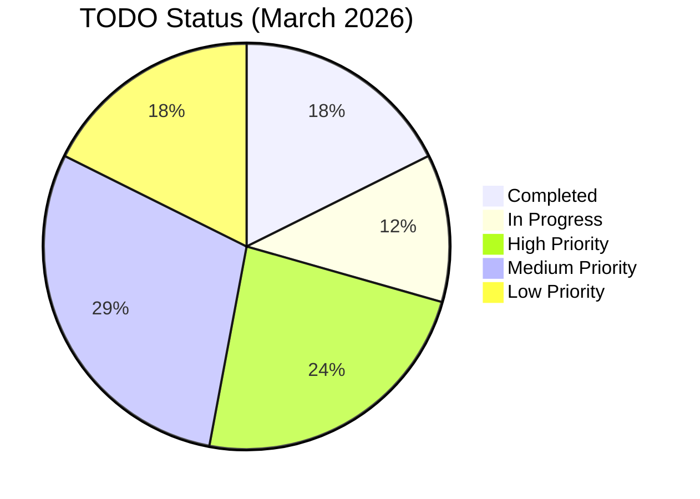

<!-- markdownlint-disable MD013 -->

# TODO

## Status

- Active execution backlog for PI-1 (March-April 2026).
- Current focus: testing reliability, messaging parity, mission-closure gaps, and data-architecture hardening.

### Current Status Overview



## Current

- Sprint execution underway for Testcontainers scaffold, provenance E2E, and CI gating.
- Messaging-fabric expansion planned across Kafka, RabbitMQ, and Pulsar paths.
- ngVLA data-architecture alignment and mission-oversight closure tracks are defined and queued.
- Public-data discovery baseline documented for `data.gov`, `NSF`, `NIST`, `NRAO`, and `VLA`.
  See `documentation/public-data/PUBLIC_DATA_RESOURCES.md`.
- Remaining frontend hardening is being folded into adjacent feature work rather
  than run as a standalone pause. See `FRONTEND_HARDENING_TRACKER.md`.

## Next

### Immediate

(none)

### Recent Completed

- Add token validation/claims extraction and production policy checks in `AuthFilter`.
  - Mission outcome: Institutional trust and audit
  - Operator/science impact: requests with malformed or unauthorized tokens are now denied and policy rules can be applied
  - Validation evidence: `AuthFilterTest` covers missing header, success, and policy-forbidden paths; request attributes expose claims
- Implement NGVLA constant drift regression tests in frontend suite and ensure fixtures match reference.
  - Mission outcome: Reproducible science
  - Operator/science impact: prevents silent domain drift from approved ngVLA specifications
  - Validation evidence: `ngvla-drift-regression.spec.ts` runs in CI and fails on mismatches
- Fix Docker networking configuration for RabbitMQ and Pulsar status endpoints.
  - Mission outcome: Human decision speed
  - Operator/science impact: frontend now displays real-time messaging broker health status without 503 errors
  - Validation evidence: `/api/v1/rabbitmq/status` and `/api/v1/pulsar/status` return healthy JSON responses; frontend diagnostics page shows broker status

### NOW

- (completed) Scaffold and implement Provenance E2E test suite including `TestcontainersConfig` and `ProvenanceE2ETest` (now verifies manifest values and audit endpoint).
  - Mission outcome: Observatory continuity
  - Operator/science impact: verifies end-to-end metadata capture, increasing trust in processing pipelines
  - Validation evidence: skeleton tests compile and run in CI; assertions against the in-memory audit log now included

- (completed) Add backend `public-sources` API stub, service and controller tests, and documentation; openapi updated.
  - Mission outcome: Human decision speed
  - Operator/science impact: frontend components can consume a canonical list of external data sources without hard‑coding
  - Validation evidence: `PublicDataServiceTest`, `GovernanceControllerTest` include coverage; `documentation/public-data` updated; e2e spec added to verify lineage/UI behavior

### NEXT

- [DONE] Quarterly review/update of `docuentation/ngvla/NGVLA_REFERENCES.md` performed (baseline update). Fixture/tests adjusted.
  - Mission outcome: Reproducible science
  - Operator/science impact: ensures domain fidelity over PI cycles
  - Validation evidence: release notes accompany each review, drift regression tests updated accordingly

### High

- Topology/Visualization broker parity (Kafka + RabbitMQ + Pulsar). **(completed)**
  - All three brokers included in topology API and rendered equally with consistent descriptions.
- ngVLA timing integrity and RFI/EMC observability tracks. *(schema extended, basic audits & UI metrics implemented; quality‑gate enforcement added with unit, controller and e2e tests; Prometheus counter `etl_quality_gate_failures_total` added and audit events published to control plane for persistence)*

### Medium

- [NEXT] Trident gateway/execution-layer domain model and event contract baseline (`SchedulingBlock`, `ExecutionBlock`, `SubarrayConfiguration`, `SpectralConfiguration`, `FspAllocationPlan`, `BackendProductPlan`).
  - Mission outcome: Compute-to-archive efficiency
  - Operator/science impact: observation intent can be translated into deterministic configuration payloads instead of ad hoc job parameters
  - Validation evidence: versioned schema/contracts plus integration tests for valid and invalid mode-routing requests
- [NEXT] Canonical execution event envelope and broker role partitioning across RabbitMQ, Kafka, and Pulsar.
  - Mission outcome: Institutional trust and audit
  - Operator/science impact: execution events can be traced, replayed, and deduplicated consistently across control, audit, and federated delivery paths
  - Validation evidence: shared schema definitions plus integration tests for correlation ID propagation, idempotency, and audit mirroring
- [NEXT] Gateway-side simulated Trident allocator service for three-trident / finite-FSP capacity planning.
  - Mission outcome: Observatory continuity
  - Operator/science impact: scheduling conflicts and over-allocation are detected before downstream processing is started
  - Validation evidence: allocator unit tests cover subarray contention, incompatible spectral plans, and fallback/error states
- [NEXT] Gateway-driven downstream mode-aware backend orchestration for correlation, VLBI, pulsar timing, and pulsar search products.
  - Mission outcome: Compute-to-archive efficiency
  - Operator/science impact: each observation mode launches the correct backend processing path and archive handoff workflow
  - Validation evidence: end-to-end tests assert mode-specific backend job templates and provenance links
- [NEXT] Execution-layer API and security baseline for plan validation, apply semantics, replay protection, and operator override audit.
  - Mission outcome: Institutional trust and audit
  - Operator/science impact: operator-facing execution actions become explicit, reviewable, and protected against duplicate or unauthorized apply paths
  - Validation evidence: API contract updates, negative-path authorization tests, replay/idempotency tests, and provenance assertions for apply flows
- [NEXT] Restore Cypress runtime/cache health and re-enable deterministic frontend e2e verification for datasets/provenance flows.
  - Mission outcome: Observatory continuity
  - Operator/science impact: operator journeys can be verified in CI and local smoke runs without Cypress cache/runtime failures blocking release confidence
  - Validation evidence: `frontend-e2e` runs cleanly after cache/runtime remediation; `datasets-provenance.cy.ts` passes and is folded into the smoke path
- Job manifest lineage endpoint (`/jobs/{id}/lineage`) to complement existing attach/retrieve API.
- Frontend Jobs page: display lineage metadata and allow submission payloads to include lineage. **(completed)**
  - Mission outcome: Institutional trust and audit
  - Operator/science impact: traceability across job chains in UI
  - Validation evidence: new unit tests, dialog/component tests, and frontend e2e covering lineage field; lineage editor stub and submission dialog integrated
- Dataset catalog filtering and ObsCore-like interoperability metadata fields.
- Public-data source registry for curated external datasets and reference feeds (`data.gov`, `NSF`, `NIST`, `NRAO`, `VLA`). **(backend API stub + docs + tests added)**
  - Mission outcome: Reproducible science
  - Operator/science impact: operators can distinguish authoritative external sources from internal/generated records during ingest and review
  - Validation evidence: GET `/api/v1/public-sources` returns a hard‑coded list; controller and service unit tests validate schema; openapi spec and documentation updated; frontend-e2e exercise added to ensure job lineage and public sources are visible in UI
- UI source-attribution treatment for externally sourced records, images, and metadata panels.
  - Mission outcome: Institutional trust and audit
  - Operator/science impact: every externally sourced data card/view can expose an authoritative citation URL in small text without obscuring the primary workflow
  - Validation evidence: component tests/e2e verify source label, URL, and conditional rendering on datasets/viewer panels
- Queue-aware ingest control with reprocessing budget policy.
- Viewer Mode B progressive high-resolution path rollout.
- Viewer seed-data integration spike using public NRAO/VLA assets first (`VLASS` HiPS/basic products and `NVAS` historical images).
  - Mission outcome: Human decision speed
  - Operator/science impact: viewer can load real public sky products before full archive-download workflows are complete
  - Validation evidence: viewer smoke tests render at least one public tile/image set with linked source citation

### Low

- `demo-notes/` evidence package output requirements.
- Post-PI catalog search/lineage analytics expansion.
- Streaming/control-plane parity follow-ons and HPC adapter pathway planning.
- NSF/NIST enrichment path for grant provenance, publication linkage, and timing-reference overlays once core NRAO/VLA ingest is stable.
  - Mission outcome: Institutional trust and audit
  - Operator/science impact: downstream analytics can connect datasets to awards, publications, and time-reference sources where available
  - Validation evidence: enrichment ADR or schema note plus one end-to-end demo record with external citation

## Backlog

- Integration tests with Kafka/Testcontainers for ingest flow.
- Backward-compatibility checks when `openapi/governance.yaml` changes.
- `apps/frontend` coverage expansion for jobs/datasets/error states and DTO mapping tests.
- `apps/frontend` coverage expansion for environment service/component behavior and adjacent operator-shell error states.
- `apps/frontend-e2e` target hygiene and key operator journeys.
- `apps/frontend-e2e` Cypress runtime/cache remediation for local and CI stability; add `datasets-provenance` into smoke coverage after cache repair.
- `apps/java-governance` negative-path tests for RabbitMQ and Pulsar status endpoints plus Redis durability/restart recovery tests.
- `apps/java-governance` job service/controller edge-case tests for manifest, lineage, and retry/cancel flows.
- `tools/java-ingest` initial test suite, surefire/failsafe reports, JaCoCo publication.
- `tools/data-generator` Go unit/integration tests and broker failure-path checks.
- Compose smoke and failure-injection scripts (broker/Redis restart resilience).
- ngVLA data-architecture DA-1..DA-11 delivery track.
- Trident gateway integration track:
  - schedule-block and execution-block control-plane entities
  - subarray/spectral configuration contract definitions
  - gateway-side Trident routing and FSP allocation simulator
  - downstream CBE / VLBI / pulsar backend job orchestration
  - provenance for applied Trident-target configuration plans and execution timestamps
- Execution-layer alignment track:
  - canonical event envelope and broker role ownership
  - execution API contract for capabilities, plan creation, validation, apply, and event history
  - execution-layer threat model and operator override controls
  - broken-link and cross-reference normalization for the documentation system
- Messaging fabric MF-1..MF-6 and required MF-TEST matrix.
- Mission oversights MG-1..MG-6 closure track.
- Viewer Mode B VB-1..VB-4 implementation and go/no-go decision spike.
- Streaming and control-plane parity (go-processors, topic contracts, DLQ/replay tooling, trace correlation).
- HPC adapter pathway (contracts, local mocks, async dispatch, provenance linkage).
- Operations/observability SLOs, dashboards, and benchmark runbook.
- Large-scale validation program (240 PB readiness model and stability board artifacts).
- Public-data integration track:
  - NRAO TAP metadata harvest
  - NRAO archive/VLASS/NVAS viewer-ready asset mapping
  - `data.gov` catalog ingest fixtures (`NVSS`, `VLSSr`, `QORG`)
  - NSF provenance enrichment (`Award Search API`, `PAR`)
  - NIST timing-reference ingest (`UTC(NIST)` bulletins, time-scale archive, GPS data)
- Periodic review/update of `docuentation/ngvla/NGVLA_REFERENCES.md` and regression tests to catch fact drift.
  - Mission outcome: Reproducible science
  - Operator/science impact: ensures NGVLA domain fidelity over time
  - Validation evidence: automated drift tests triggered by PRs modifying constants or fixtures
- [DONE] Add UI-level cross-check for provenance manifest values (frontend e2e) completed; panel now shows manifest via metadata merge.
  - Mission outcome: Institutional trust and audit
  - Operator/science impact: full traceability from ingest through UI inspection
  - Validation evidence: additional integration tests and e2e smoke coverage

## Completed

- Add CI doc-validation for broken links and required citations in `MVP_ACCEPTANCE_CRITERIA.md` and `DEMO_CHECKLIST.md`.
  - Mission outcome: Institutional trust and audit
  - Operator/science impact: ensures that operator-facing guidance remains accurate and cite-able during the sprint
  - Validation evidence: `scripts/check-docs.sh` run in quality pipeline and new `docs:validate` npm script
- Finalize Sprint 1 Testcontainers scaffold for `apps/java-governance`.
  - Mission outcome: Reproducible science
  - Operator/science impact: automated integration checks increase confidence in platform continuity across environments
  - Validation evidence: new Maven `with-containers` profile exercised in CI and documentation in `apps/java-governance/TESTING.md`
- Add authN/authZ middleware to Java governance API (dev-permissive baseline with header enforcement toggle).
- Add audit logging for job submissions and state transitions.
- Add explicit integration/e2e stress tests and verbose test harness baseline.
- Add `documentation/NGVLA_REFERENCES.md` as canonical NGVLA fact/citation index.
- Add NGVLA array fixtures (`main`, `long-baseline`, `sba`) and wire into demo/mock paths.
- Extend contract/domain models with `arraySegment`, `antennaClass`, and `frequencyBandGHz`.
- Add regression tests for NGVLA constant drift.
- Enhance `scripts/demo-verify.sh` with pass/fail automation.
- Normalize Topology labels/tooltips to `Main`, `Long Baseline`, and `SBA`.
- Add modeling disclaimer banner/text across demo-facing operator routes.
- Add dataset provenance linkage panel in `Datasets`.
- Add public data source inventory for ETL/viewer planning in `documentation/public-data/PUBLIC_DATA_RESOURCES.md`.

## INSTRUCTIONS

- Status legend: `[NOW]`, `[NEXT]`, `[LATER]`, `[DONE]`.
- Every new `[NOW]`, `[NEXT]`, or `[LATER]` item must include mission linkage:
  - `Mission outcome:` one of `Observatory continuity`, `Reproducible science`, `Compute-to-archive efficiency`, `Institutional trust and audit`, `Human decision speed`.
  - `Operator/science impact:` one measurable sentence.
  - `Validation evidence:` contract/test/runtime proof signal.
- Use this template for new work items:

```md
- [NEXT] <task title>
  - Mission outcome: <canonical outcome>
  - Operator/science impact: <observable improvement>
  - Validation evidence: <tests/checks/artifacts>
```

- PI planning baseline:
  - PI: PI-1 (Mar 2026-Apr 2026)
  - Sprint length: 2 weeks
  - Sprints: 4
- Keep completed items in `Completed`; do not delete historical evidence.
- Testing architecture references:
  - `docuentation/testing/TESTING_FRAMEWORK_ARCHITECTURE.md`
  - `docuentation/testing/TESTING_REQUIREMENTS.md`
- Mission alignment references:
  - `docuentation/ngvla/NGVLA_MISSION_ALIGNMENT.md`
  - `docuentation/ngvla/MISSION_TO_CAPABILITY_TRACE.md`
  - `docuentation/ngvla/MISSION_GATES.md`
- Public data planning reference:
  - `documentation/public-data/PUBLIC_DATA_RESOURCES.md`
  <!-- markdownlint-enable MD013 -->
