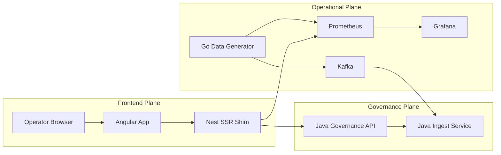
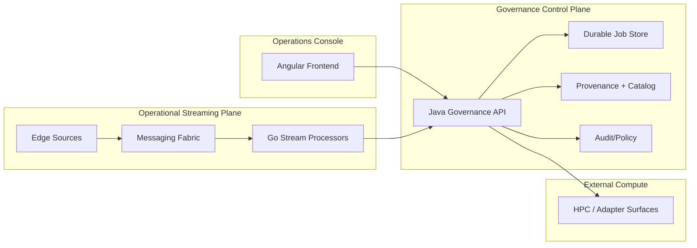

# Cosmic Horizon Architecture (Current + Target)

Alignment anchors
- Frontend UX source of truth: [FRONTEND_UI.md](FRONTEND_UI.md)
- Execution backlog: [../TODO.md](../TODO.md)
- Delivery plan: [../ROADMAP.md](../ROADMAP.md)

This document defines the architecture as it exists today and the intended direction.  
It is the canonical bridge between conceptual design and implementation reality.

## 1. Architectural intent

Cosmic Horizon is a hybrid control platform composed of:

1. Operational Streaming Plane (Go-centric)
- low-latency telemetry ingestion, aggregation, and resilience controls

2. Governance & Orchestration Control Plane (Java-centric)
- authoritative metadata, job lifecycle, policy, and audit semantics

3. Frontend Operations Console (Angular)
- operator-facing control-room UX for awareness, orchestration, and diagnostics

## 2. Status model

### Implemented (baseline)
- Angular frontend shell with telemetry/topology/diagnostics/viewer surfaces
- Nest SSR shim for frontend APIs and proxy behavior
- Go data generator and local observability stack
- Java governance API baseline:
  - `GET /api/v1/health`
  - `POST /api/v1/ingest`
  - `POST /api/v1/jobs`
  - `GET /api/v1/jobs/{id}`
- OpenAPI contract and fixture validation in CI

### In progress
- Durable governance job storage and full lifecycle semantics
- Frontend transition from telemetry-first demo to orchestration console

### Planned
- End-to-end streaming-to-governance contract hardening
- External compute adapter integration (HPC/TACC/CosmicAI)
- Production security and policy enforcement layers

## 3. Current runtime topology

## 4. Target reference topology

## 5. Frontend architecture implications

The frontend must evolve to match control-plane maturity:

1. Near-term pages:
- `Overview`, `Jobs`, `Datasets`, `Topology`, `Telemetry`, `Diagnostics`, `Viewer`, `Settings`

2. Critical missing surfaces:
- `Jobs` and `Datasets` as first-class routes and workflows

3. Data-state contract:
- every page must represent `loading`, `empty`, `stale`, `error`, and `recovered` states

## 6. Architectural constraints

- No architecture claims without runnable baseline or explicit planned status.
- APIs and UI must stay contract-synchronized through OpenAPI + fixture validation.
- Local dev and production assumptions must be explicitly separated.

## 7. Decision checkpoints

Use these checkpoints when changing architecture:

1. Does this reduce docs/runtime drift?
2. Does this strengthen control-plane reliability?
3. Does this improve operator decision speed in the frontend?
4. Does this preserve HPC adapter pathway without overcommitting current scope?

## 8. Related docs

- [OPERATIONAL_STREAMING_PLANE.md](OPERATIONAL_STREAMING_PLANE.md)
- [GOVERNANCE_CONTROL_PLANE.md](GOVERNANCE_CONTROL_PLANE.md)
- [JAVA_GOVERNANCE_SPEC.md](JAVA_GOVERNANCE_SPEC.md)
- [FRONTEND_UI.md](FRONTEND_UI.md)
- [ALIGNMENT.md](ALIGNMENT.md)
