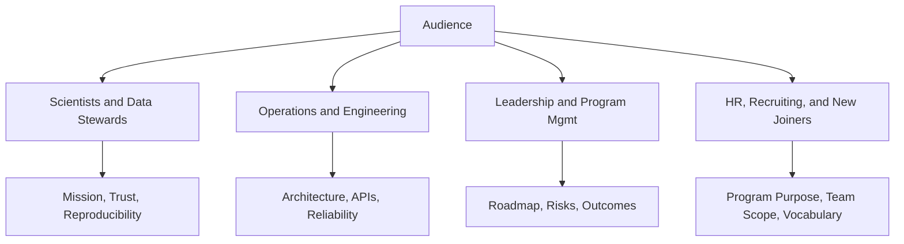
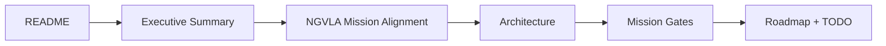

# Documentation Audience Guide (Scientists to HR)

Alignment anchors
- Frontend UX source of truth: [FRONTEND_UI.md](FRONTEND_UI.md)
- Execution backlog: [../TODO.md](../TODO.md)
- Delivery plan: [../ROADMAP.md](../ROADMAP.md)

This guide helps different audiences quickly find the right documentation depth and avoid technical overload.

## 1. Quick role map

## 2. Read paths by audience

### Scientists and Data Stewards
- Start: [EXECUTIVE_SUMMARY.md](EXECUTIVE_SUMMARY.md)
- Then: [NGVLA_MISSION_ALIGNMENT.md](NGVLA_MISSION_ALIGNMENT.md)
- Then: [DATA_TRUST_PLATFORM.md](DATA_TRUST_PLATFORM.md), [PROVENANCE.md](PROVENANCE.md), [storage/STORAGE_EXECUTIVE_SUMMARY.md](storage/STORAGE_EXECUTIVE_SUMMARY.md)
- Why: explains reproducibility, provenance, and SRDP trust guarantees.

### Observatory Operators and Engineers
- Start: [ARCHITECTURE.md](ARCHITECTURE.md)
- Then: [FRONTEND_UI.md](FRONTEND_UI.md), [API_CONTRACT_STATUS.md](API_CONTRACT_STATUS.md), [JAVA_GOVERNANCE_SPEC.md](JAVA_GOVERNANCE_SPEC.md)
- Then: [TESTING_REQUIREMENTS.md](TESTING_REQUIREMENTS.md), [INFRA_TOPOLOGY.md](INFRA_TOPOLOGY.md)
- Why: maps operational workflows to implementation contracts and reliability checks.

### Leadership, Program, and Product
- Start: [PROGRAM_DIRECTION.md](PROGRAM_DIRECTION.md)
- Then: [ROADMAP.md](../ROADMAP.md), [TODO.md](../TODO.md), [MISSION_GATES.md](MISSION_GATES.md)
- Then: [MISSION_TO_CAPABILITY_TRACE.md](MISSION_TO_CAPABILITY_TRACE.md), [DECISIONS.md](DECISIONS.md)
- Why: shows priorities, tradeoffs, and measurable mission delivery.

### HR, Recruiting, and New Joiners
- Start: [README.md](README.md)
- Then: [EXECUTIVE_SUMMARY.md](EXECUTIVE_SUMMARY.md), [NGVLA_MISSION_ALIGNMENT.md](NGVLA_MISSION_ALIGNMENT.md)
- Then: [GETTING_STARTED.md](GETTING_STARTED.md)
- Why: provides plain-language context, mission, and onboarding path without deep implementation details.

## 3. Shared vocabulary (plain language)

- Operational Streaming Plane: handles fast live telemetry and system health signals.
- Governance Control Plane: records job/dataset truth, lifecycle, and policy decisions.
- SRDP: Science Ready Data Product, a publishable research output.
- Provenance: the evidence trail showing how an SRDP was produced.
- Mission gate: a release requirement tied to mission outcomes, not only code completion.

## 4. Reading order for broad audiences

