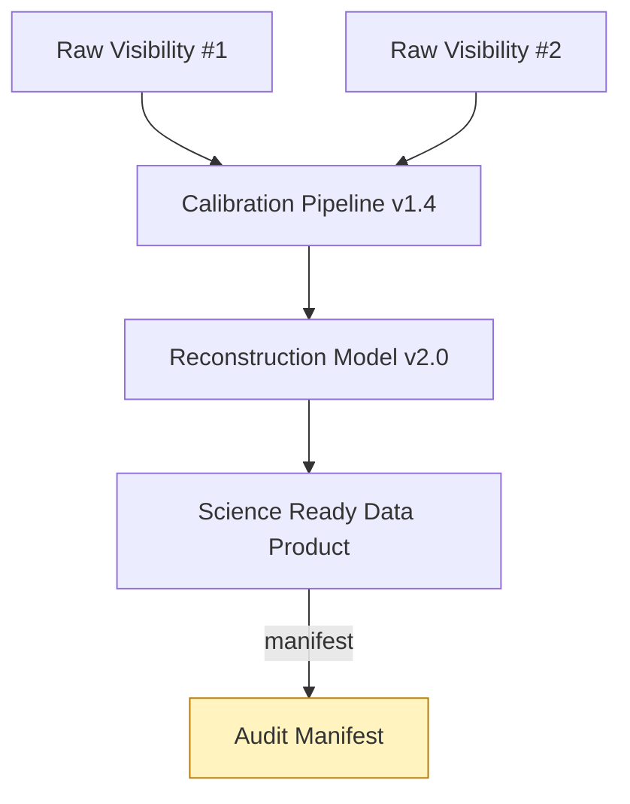

# Data Trust Platform

Cosmic Horizon unites the two planes into a Data Trust Platform — a system designed to deliver both operational velocity and institutional trust.

Principles

- Trust: every SRDP is accompanied by auditable provenance and signed manifests.
- Discoverability: typed metadata and lineage graphs make datasets discoverable and verifiable.
- Safety: operational telemetry is scoped to avoid exposing raw science data and to prevent governance overload.
- Reproducibility: provenance bundles must contain everything needed to reproduce results (inputs, code, parameters, environment descriptors).

Platform capabilities

- Real-time operational dashboards with automated runbook triggers
- Provenance-driven discovery and dataset reconstruction
- Policy-driven lifecycle management and data retention
- Secure signing and long-term archival of audit manifests

Provenance example (conceptual)

Operationalizing trust

- Define provenance schema and required attributes for SRDP creation.
- Enforce minimal provenance checklists in the Governance API before allowing any SRDP to be promoted to public or shared status.
- Implement cryptographic signing for manifests and integrate hash anchors with long-term archival stores.
