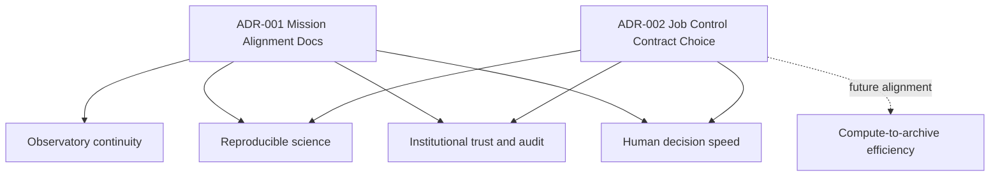

# Decisions Log (Mission-Critical ADRs)

Alignment anchors
- Frontend UX source of truth: [FRONTEND_UI.md](FRONTEND_UI.md)
- Execution backlog: [../TODO.md](../TODO.md)
- Delivery plan: [../ROADMAP.md](../ROADMAP.md)

Use this file to record architecture and scope decisions that materially affect ngVLA mission outcomes.

## ADR format

- `Date`:
- `Decision ID`:
- `Status`: proposed | accepted | deprecated | superseded
- `Context`:
- `Decision`:
- `Mission outcome impact`:
- `Tradeoffs`:
- `Validation plan`:
- `Links`:

## ADR impact map

---

## 2026-03-01 | ADR-001 | accepted

- Date: 2026-03-01
- Decision ID: ADR-001
- Status: accepted
- Context:
  Phase 2 had strong technical direction but limited explicit mission-level gating.
- Decision:
  Add mission-alignment documents:
  - `NGVLA_MISSION_ALIGNMENT.md`
  - `MISSION_TO_CAPABILITY_TRACE.md`
  - `MISSION_GATES.md`
  - `DECISIONS.md`
- Mission outcome impact:
  Improves focus on observatory continuity, reproducibility, and trust by requiring traceability from backlog and implementation to mission value.
- Tradeoffs:
  Additional documentation maintenance overhead.
- Validation plan:
  Require updates to mission trace/gates for major capability PRs.
- Links:
  - [NGVLA_MISSION_ALIGNMENT.md](NGVLA_MISSION_ALIGNMENT.md)
  - [MISSION_TO_CAPABILITY_TRACE.md](MISSION_TO_CAPABILITY_TRACE.md)
  - [MISSION_GATES.md](MISSION_GATES.md)

## 2026-03-01 | ADR-002 | proposed

- Date: 2026-03-01
- Decision ID: ADR-002
- Status: proposed
- Context:
  Job control API currently uses `/jobs/{id}/transition`; roadmap also references explicit cancel semantics.
- Decision:
  Choose one canonical control contract:
  1. keep generic transition endpoint with strict state machine rules, or
  2. expose explicit action endpoints (`cancel`, `retry`, `pause`) and retain transition internally.
- Mission outcome impact:
  Directly affects operator clarity, automation safety, and audit semantics.
- Tradeoffs:
  Generic endpoint is flexible but can become ambiguous; explicit endpoints improve clarity but increase surface area.
- Validation plan:
  Contract tests + UI action mapping + error taxonomy consistency.
- Links:
  - [API_CONTRACT_STATUS.md](API_CONTRACT_STATUS.md)
  - [ROADMAP.md](../ROADMAP.md)
  - [TODO.md](../TODO.md)
