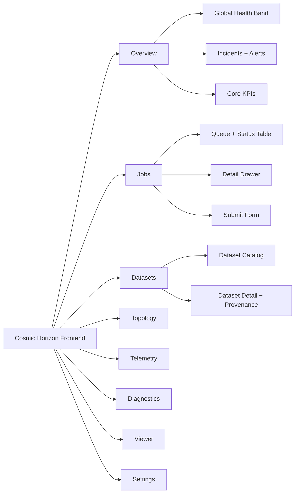

# Cosmic Horizon Frontend UI Specification (Phase 2)

Alignment anchors
- Frontend UX source of truth: [FRONTEND_UI.md](FRONTEND_UI.md)
- Execution backlog: [../TODO.md](../TODO.md)
- Delivery plan: [../ROADMAP.md](../ROADMAP.md)

This document defines the target frontend product for Cosmic Horizon as an operational control-room application, not a generic dashboard.

It replaces the previous theme-only guidance with an execution-ready UI spec:
- user roles and workflows
- information architecture
- page-level interaction and data contracts
- visual and accessibility standards
- performance budgets
- implementation sequencing and acceptance criteria

Use this together with:
- [GETTING_STARTED.md](GETTING_STARTED.md)
- [VIEWER_MODEB.md](VIEWER_MODEB.md)
- [JAVA_GOVERNANCE_SPEC.md](JAVA_GOVERNANCE_SPEC.md)
- [TESTING_REQUIREMENTS.md](TESTING_REQUIREMENTS.md)

## 1. Product intent

The frontend must support three simultaneous goals:

1. Operational awareness:
- detect and communicate current platform health in seconds

2. Orchestration control:
- submit, monitor, and diagnose data processing jobs

3. Trust and traceability:
- show provenance/context for data and outputs with clear audit visibility

The UI is successful when an operator can answer, quickly and confidently:
- What is healthy right now?
- What is failing right now?
- What action should I take now?

## 2. Primary user personas

### 2.1 Observatory Operator
Primary goal:
- keep ingest and processing stable during active operations

Top tasks:
- monitor ingest rate and queue depth
- identify incidents and degraded services
- trigger approved recovery actions

### 2.2 Pipeline Engineer
Primary goal:
- diagnose and resolve failed or slow jobs

Top tasks:
- inspect job parameters, logs, statuses, and transitions
- compare run behavior across datasets or versions
- verify retries/timeouts and failure modes

### 2.3 Data Steward / Scientist
Primary goal:
- confirm dataset readiness and output trustworthiness

Top tasks:
- find dataset state and metadata
- inspect provenance and artifact links
- verify that outputs map to expected pipeline runs

## 3. Information architecture

The app must expose these top-level sections:

1. Overview
2. Jobs
3. Datasets
4. Topology
5. Telemetry
6. Diagnostics
7. Viewer
8. Settings

Current codebase status:
- `Telemetry`, `Topology`, `Diagnostics`, and `Viewer` exist in baseline form.
- `Jobs` and `Datasets` routes now exist in baseline scaffold form and are the highest-priority surfaces for professionalization.

### IA map (visual)



## 4. Global shell and layout behavior

### 4.1 App shell

Required shell regions:
- Header: app identity, environment tag, global health indicator
- Left navigation: stable section links
- Main stage: route content
- Footer: build/version and timestamp zone

### 4.2 Global status band

A persistent status band must show:
- environment (`dev`, `staging`, `prod`)
- data freshness (`live`, `stale`)
- incident count
- queue depth summary

### 4.3 Responsive behavior

Desktop (>=1280px):
- three-panel job and diagnostics layouts allowed

Tablet (768-1279px):
- two-panel layouts

Mobile (<768px):
- single-column with collapsible details
- no horizontal data table overflow without explicit control

## 5. Page-by-page functional specification

## 5.1 Overview

Purpose:
- provide a 30-second situational snapshot

Must include:
- ingest rate KPI
- active jobs KPI
- failed jobs last 24h
- top alerts list
- service health summary

Interaction requirements:
- KPI cards drill into owning page with filters pre-applied
- stale-data banner if core telemetry older than threshold

Data contract summary:
- `GET /api/proxy/prometheus` (short-term baseline)
- future: governance summary endpoint for consolidated KPIs

## 5.2 Jobs (highest-priority missing page)

Purpose:
- operational control plane for job orchestration

Primary components:
- submit panel
- queue/status table
- job detail drawer

Submit panel fields:
- workflow
- dataset id
- parameter editor (key/value)
- requested by

Queue table columns:
- job id
- workflow
- dataset
- status
- created at
- updated at
- requested by

Detail drawer tabs:
- summary
- parameters
- timeline
- logs/errors
- artifacts (future)

Status model:
- `QUEUED`, `RUNNING`, `COMPLETED`, `FAILED`, `CANCELED`, `TIMED_OUT`

Baseline API mapping:
- `POST /api/v1/jobs`
- `GET /api/v1/jobs/{id}`

Future required API additions:
- `GET /api/v1/jobs?status=&workflow=&datasetId=&page=`
- `POST /api/v1/jobs/{id}/cancel`

## 5.3 Datasets

Purpose:
- searchable metadata and readiness lens for science data

Core UI:
- dataset table with quick filters
- detail panel for metadata + provenance summary

Must show:
- dataset id
- source
- size
- ingest status
- last update
- associated jobs count

## 5.4 Topology

Purpose:
- dependency awareness and bottleneck localization

Current baseline:
- D3 graph with fallback mock data

Required improvements:
- explicit edge health indicators
- link throughput/latency overlays
- service node status colors with legend
- click action opens diagnostics context for selected node

## 5.5 Telemetry

Purpose:
- metric trend analysis and short-term performance inspection

Current baseline:
- metric select, polling/range controls, line chart, histogram, gauge, CSV export

Required improvements:
- annotate incident windows
- compare two metrics overlay mode
- configurable rollups and units

## 5.6 Diagnostics

Purpose:
- evidence and troubleshooting workspace

Current baseline:
- diagnostics index and system specs views

Required improvements:
- structured log search/filtering
- runbook linkouts
- environment-gated access controls (must be restricted outside dev)

## 5.7 Viewer

Purpose:
- sky/asset visualization linked to operational context

Current baseline:
- Aladin container bootstrap

Required improvements:
- attach selected dataset/job context
- include provenance badge and timestamp
- expose visualization mode switching consistent with `VIEWER_MODEB.md`

## 5.8 Settings

Purpose:
- user-level behavior preferences

Must include:
- theme mode
- refresh cadence defaults
- reduced motion toggle
- timezone preference

## 6. State model and UX behavior standards

Every page with remote data must support:
- loading
- empty
- partial
- stale
- error
- recovered

State copy standards:
- never use generic “something went wrong”
- include concise cause + next action

Example:
- “Job status unavailable (timeout after 10s). Retry now or open diagnostics.”

## 7. Data freshness and reliability UX

The UI must represent confidence, not just values.

Required signals:
- last updated timestamp per widget
- stale threshold indicator color
- explicit “live polling paused” state
- source badge (`mock`, `live`, `cached`)

## 8. Visual design and professional quality bar

## 8.1 Design direction

Visual tone:
- disciplined operations console
- high signal density without clutter
- stable hierarchy and low cognitive load

## 8.2 MD3 and tokens

Use Angular Material MD3 with centralized tokens in `libs/ui-theme`.

Token categories:
- color semantic roles (success/warn/error/info/neutral)
- type scale and emphasis
- spacing and density
- motion durations/easing
- elevation and surface levels

## 8.3 Professional UI behaviors

- Consistent table behavior (sort/filter/pagination)
- Predictable focus order and keyboard access
- No blocking spinners for long polling; prefer skeletons and in-place refresh
- Context-preserving navigation (return user to prior filtered view)

## 9. Accessibility requirements

Must satisfy:
- WCAG AA contrast minimum for operational text and controls
- full keyboard navigation for all primary workflows
- visible focus indicators
- reduced motion support via OS and app preference
- non-color-only status encoding (shape/text/icon support)

## 10. Performance budgets and constraints

Frontend targets:
- initial app shell interactive in <=2.5s on standard dev hardware
- route transitions <=300ms perceived response
- telemetry updates without full chart teardown/recreate

Implementation constraints:
- prefer incremental chart updates
- avoid large synchronous transforms on main thread
- debounce high-frequency UI updates

## 11. Security and environment gating

UI must reflect backend mode and restrictions.

Requirements:
- diagnostics routes/features disabled or guarded outside dev
- no rendering of host absolute paths
- clear banner when data source is mocked

## 12. Frontend-to-backend contract map

```mermaid
flowchart TD
  UI[Frontend Pages]
  API[Gateway APIs]
  Data[Prometheus / Governance / Diagnostics]

  UI --> JobsPage[Jobs Page]
  UI --> TelemetryPage[Telemetry Page]
  UI --> TopologyPage[Topology Page]
  UI --> DiagnosticsPage[Diagnostics Page]

  JobsPage -->|POST/GET| GovJobs[/api/v1/jobs + /api/v1/jobs/{id}/]
  TelemetryPage -->|GET| PromProxy[/api/proxy/prometheus/]
  TopologyPage -->|GET| TopologyAPI[/api/topology/]
  DiagnosticsPage -->|GET| DiagAPI[/api/diagnostics*/]

  GovJobs --> Data
  PromProxy --> Data
  TopologyAPI --> Data
  DiagAPI --> Data
```

## 13. Implementation roadmap (frontend-specific)

Phase A (immediate):
1. Build `Jobs` page using current governance endpoints.
2. Add global status band and stale-data indicators.
3. Harden diagnostics/proxy visibility in UI for non-dev modes.

Phase B:
1. Build `Datasets` page and integrate with governance metadata APIs.
2. Add topology overlays and node detail drilldowns.
3. Add consistent empty/error/retry patterns across all routes.

Phase C:
1. Integrate provenance context into Viewer and Jobs detail.
2. Add role-aware UI behavior.
3. Add advanced incident annotation and timeline correlations.

## 14. Acceptance criteria

The frontend is considered professionally ready when:

1. An operator can identify system state and active incident in <30 seconds.
2. A pipeline engineer can submit a job, track status, and inspect failure context without leaving UI.
3. Key views clearly show data freshness and source (`live/mock/stale`).
4. Pages meet accessibility and performance requirements under normal update load.
5. UI claims match implemented backend contracts with no placeholder-only critical routes.

## 15. Immediate action list

1. Add `JobsComponent` route and baseline UX now.
2. Add shared page-state components (`loading`, `empty`, `error`, `stale`).
3. Add app-level health/status bar in main shell.
4. Update e2e coverage to include Jobs submission and status polling flow.
