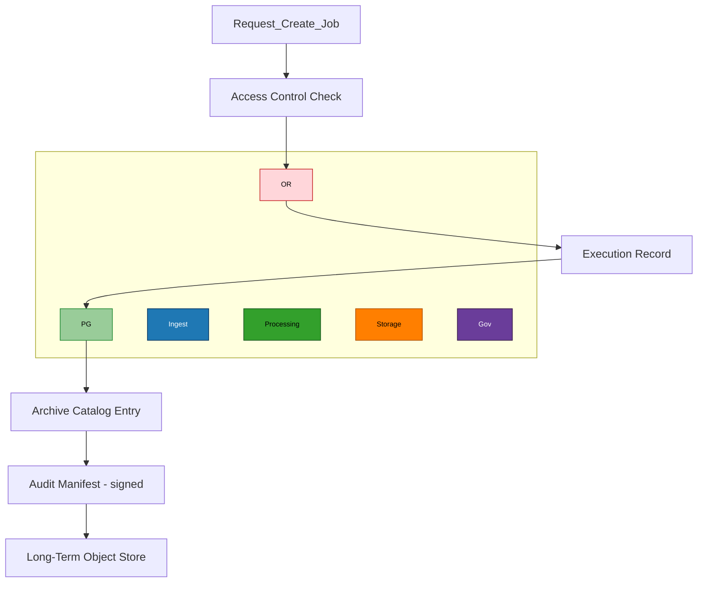

# Governance & Orchestration Control Plane (Java)

Purpose

The Governance Plane is the authoritative system of record. It stores structural metadata, access and lifecycle policies, job orchestration definitions and the provenance graph that links SRDPs to raw inputs, code versions, and execution environments.

Core services

- Archive Catalog — typed relational models for datasets and products

- Provenance Graph — directed graph of inputs, transforms, parameters, and outputs

- Job Orchestration — definitions, retries, and recorded execution traces

- Policy & Access Control — RBAC/ABAC models with policy versioning

- Audit & Signing — signed manifests and retention rules

Workflow: creating a cataloged SRDP

Key guarantees

- ACID transactions for catalog updates where necessary, or well-defined eventual consistency patterns for high-volume updates.

- Immutable audit manifests with cryptographic anchoring available for long-term verification.

- Human and machine-readable policy evaluation traces for post-hoc review.

Integration

- The Governance Plane exposes a versioned API (REST/gRPC) for the streaming plane to create or annotate durable entries. Contracts must be stable across minor versions; breaking changes require coordinated migrations.
