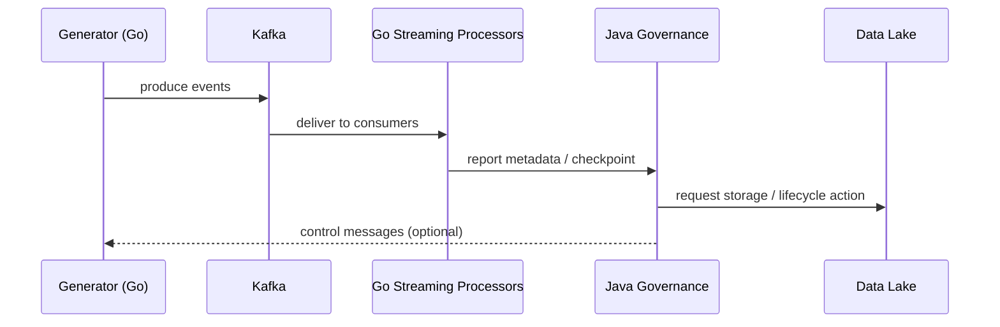

# Java Governance API Specification

Alignment anchors

- Frontend UX source of truth: [FRONTEND_UI.md](FRONTEND_UI.md)
- Execution backlog: [../TODO.md](../TODO.md)
- Delivery plan: [../ROADMAP.md](../ROADMAP.md)

Status: Baseline implemented (Phase 2)

## Overview

This document describes the Governance API service implemented in Java Spring Boot (OpenAPI-first). The Java service is intended as the canonical control-plane runtime for metadata, job submission, and governance operations.

## Goals & Rationale

- Provide a stable, strongly-typed OpenAPI contract for governance operations (ingest control, job orchestration, metadata management).

- Use Java 21 and Spring Boot for enterprise-grade stability, existing ecosystem support (JaCoCo, Spring Actuator), and easy OpenAPI generation/validation.

- Keep the existing NestJS API as a compatibility shim until the Java service is production-ready.

## Requirements

- Language/runtime: Java 21 (LTS)

- Build: Maven

- OpenAPI: `openapi/governance.yaml` is the source of truth; generate server and client stubs as needed

- Endpoints (baseline implemented):

  - `GET /api/v1/health` (implemented)

  - `POST /api/v1/ingest` — ingest metadata/events (implemented)

  - `POST /api/v1/jobs` — submit processing jobs (implemented)

  - `GET /api/v1/jobs/{id}` — job status (implemented)

- Observability: Spring Actuator endpoints, Prometheus metrics (micrometer), structured logs

- Security: mTLS or OAuth2 token introspection in production; for local dev support a permissive mode

## API contract & validation

- Keep the OpenAPI file `openapi/governance.yaml` in-sync with server implementations. CI must run an `openapi-validate` job that:
  1. Lints the spec
  1. Generates a mock server and posts `schemas/fixtures/` to validate responses

## Mermaid: Interaction overview

## Operational concerns

- Transactionality: avoid long synchronous operations on ingest paths; prefer async handoff with acknowledgement.

- Backpressure: surface broker/backpressure state in endpoints and emit metrics to Prometheus.

- Schema evolution: host `schemas/` and provide versioned endpoints and migration runbooks.

## CI & Testing

- Unit tests (Maven surefire) and JaCoCo coverage.

- Integration tests: spin up an in-memory Kafka (or testcontainers) and run key flows.

- Contract tests: validate OpenAPI fixtures in `schemas/fixtures/`.

## Deployment & Docker

- Provide a multi-stage `Dockerfile` (see `apps/java-governance/Dockerfile`) and a `build:docker` Nx target.

- Ensure the image exposes `/actuator/prometheus` for metrics and `/actuator/health` for readiness checks.

## Why Java + Spring Boot?

- Enterprise patterns for long-running control plane services, mature observability and security integrations, OpenAPI tooling, and wide familiarity across infra teams.

## Next work

- Add authentication and RBAC to all `/api/v1/*` routes.
- Replace in-memory job tracking with durable storage (Redis or relational DB).
- Add integration tests with Kafka/Testcontainers for ingest and job lifecycle flows.
