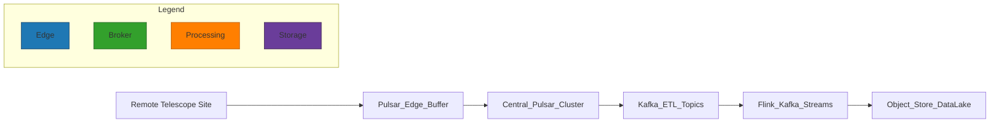
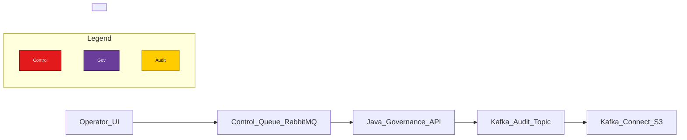
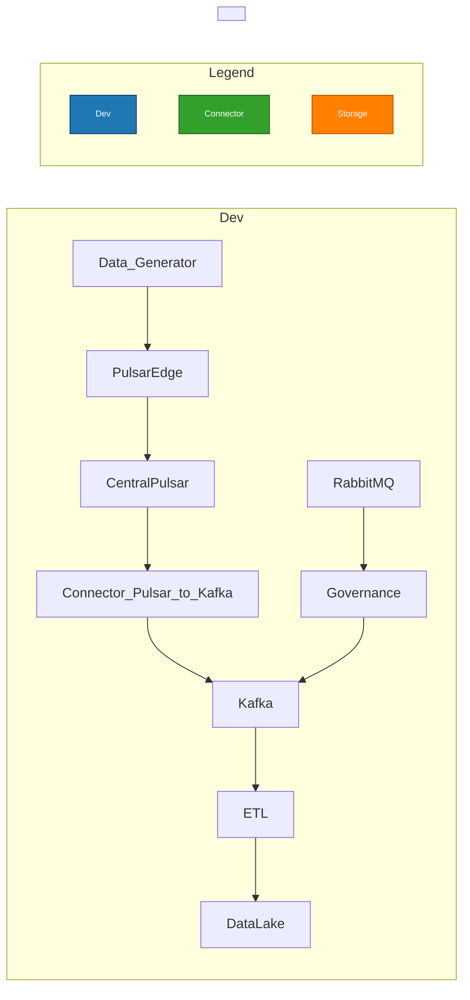

# Messaging Integration: Pulsar, Kafka, RabbitMQ (Phase 2)

## Overview

This document prescribes roles, integration patterns, connectors, and operational guidance for combining Apache Pulsar, Apache Kafka (Confluent-compatible), and RabbitMQ in Phase 2.

High-level recommendation

- Pulsar: edge/ingest and geo-buffering at remote telescope sites; use Pulsar for local resiliency and tiered storage where links are intermittent.
- Kafka: central durable log for high-throughput ETL, stream processing, and sinks into the Data Lake (use Confluent or vanilla Kafka as preferred).
- RabbitMQ: control-plane messaging, RPC/command patterns, and operational workflows where routing and ack-backed queues are required.

## Roles & Responsibilities

- Edge ingestion (Pulsar):
  - Local buffering and short-term retention on-site.
  - Built-in geo-replication or tiered-offload to central clusters.
  - Use Pulsar IO or connectors to forward validated topics to central processing paths.

- Central processing (Kafka):
  - High-throughput, partitioned topics for ETL and analytics.
  - Stream processing with Flink/Kafka Streams and durable retention for replay.
  - Sink connectors (Kafka Connect) for bulk writes to object stores (S3/MinIO) and databases.

- Control & orchestration (RabbitMQ):
  - Short-lived command messages, job dispatch, and RPC between UI/operators and the Governance API.
  - Mirror critical control events into Kafka for audit/ETL when required.

## Integration Patterns

- Pulsar → Kafka
  - Pattern A: Centralize on Pulsar for edge ingress, then use a Pulsar→Kafka sink (Pulsar IO) to populate Kafka topics for analytics.
  - Pattern B: Use KoP (Kafka-on-Pulsar) selectively if you want Kafka clients to talk to Pulsar during migration.

- Kafka ↔ RabbitMQ
  - Bridge control events using Kafka Connect RabbitMQ Sink/Source or RabbitMQ Shovel for operational messages that must also be captured in Kafka for auditing.
  - Avoid using RabbitMQ for bulk telemetry; it is for control/command messages.

- Schema & contract handling
  - Use a shared schema registry (Confluent Schema Registry or Apicurio) and enforce schema compatibility on producer/consumer topics.

## Connectors and tooling

- Recommended connectors:
  - `pulsar-io-kafka` (Pulsar IO Kafka sink) or native Pulsar sink connectors
  - `kafka-connect-s3` (for object store sinks)
  - `kafka-connect-rabbitmq` (bridge small control flows)
  - `rabbitmq-shovel` for lightweight bridging in constrained environments

- Operational notes:
  - Test connector throughput and partitioning behavior; connectors add overhead and must be tuned.
  - Use dead-letter-queues (DLQs) for failed deliveries and monitor connector lag.

## Security, Observability, and Operations

- Security:
  - Enforce TLS/mTLS for cross-site replication and broker-to-broker communication.
  - Apply ACLs at topic/exchange level; use role-based policies for producers/consumers.

- Observability:
  - Export metrics to Prometheus (JMX exporter for Kafka, Pulsar metrics endpoint, RabbitMQ Prometheus exporter).
  - Trace cross-system flows using distributed tracing (W3C traceparent) and correlate via `producer_id` and `sequence` fields.

- Operations:
  - Keep clear runbooks for connector restarts, schema migrations, and reprocessing flows.
  - Automate smoke-tests that validate end-to-end delivery from edge -> central -> sink.

## Example flows (Mermaid)

### Edge ingest -> central ETL

### Control & orchestration flow

### Dev / local topology (simplified)

## Example recommendations for `docker/dev-compose.yml`

- Include lightweight containers for: Pulsar (or Pulsar standalone), Kafka + Zookeeper (or KRaft), RabbitMQ, a small Kafka Connect instance, and the `tools/data-generator` service.
- Provide a Pulsar→Kafka connector example and a simple RabbitMQ bridge to Kafka for control events.

## Testing and smoke-tests

- End-to-end smoke test:
  1. Start dev compose environment.
  2. Run `tools/data-generator` to produce sample telemetry to PulsarEdge.
  3. Verify a message delivered to Kafka and written to the object store via connector.
  4. Verify governance control messages sent via RabbitMQ are mirrored into Kafka audit topics.

## Next steps

- Add `docker/dev-compose.yml` examples and connector configs to `documentation/` (recommended next task).
