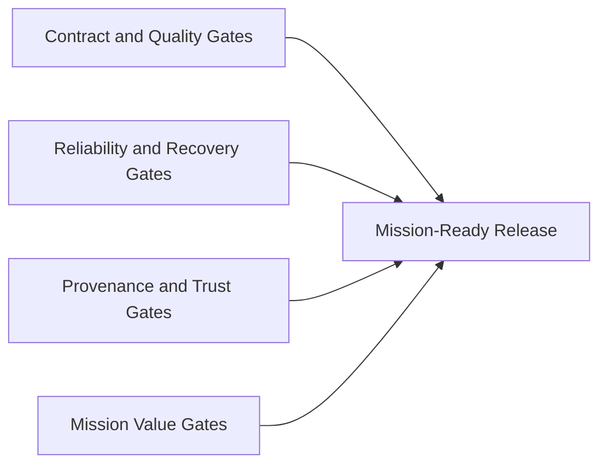

# Mission Gates

Alignment anchors
- Frontend UX source of truth: [FRONTEND_UI.md](FRONTEND_UI.md)
- Execution backlog: [../TODO.md](../TODO.md)
- Delivery plan: [../ROADMAP.md](../ROADMAP.md)

This document defines release readiness gates tied to ngVLA mission outcomes, not only technical completion.

## 1. Gate model

A release candidate is mission-ready only if all gate groups pass:
1. Mission Value Gates
2. Contract and Quality Gates
3. Reliability and Recovery Gates
4. Provenance and Trust Gates

## 2. Mission Value Gates

1. Operator situational awareness:
- In a smoke scenario, an operator identifies unhealthy service and affected workflow from the UI within 30 seconds.

2. Job lifecycle operability:
- A user can submit a job, view transition state, and retrieve logs/artifacts from the UI without manual API calls.

3. Dataset workflow continuity:
- A user can create/list/read datasets and trace associated pipeline context at baseline fidelity.

## 3. Contract and Quality Gates

1. `pnpm run quality:ci` must pass (lint, format, tests, OpenAPI validation, e2e smoke).
2. OpenAPI and fixtures are updated in the same change when API contract changes.
3. No required verification lane uses silent test bypass for correctness checks.

## 4. Reliability and Recovery Gates

1. Governance job state survives service restart in dev durability mode.
2. Broker/API dependency interruption has observable UI state (`stale`/`error`/`recovered`) and documented recovery path.
3. At least one replay/failure drill is executed in scheduled runs (nightly or weekly).

## 5. Provenance and Trust Gates

1. Every promoted SRDP pathway includes required provenance fields (inputs, workflow/version, parameters, timestamps, actor/system identity).
2. Promotion path blocks when provenance minimum is not met.
3. Audit trail entries are queryable for submission and state transition actions.

## 6. Gate ownership

- Workstream A (Governance): lifecycle durability, provenance enforcement, auditability
- Workstream B (Frontend): operator workflows, state UX, mission clarity
- Workstream C (Streaming): ingest reliability, handoff semantics, replay posture
- Workstream D (Quality/Security): CI correctness, environment gating, release policy

## 7. Waiver policy

Mission gate waivers are temporary and must include:
1. documented risk
2. mitigation owner
3. expiration date
4. linked follow-up issue in root backlog
