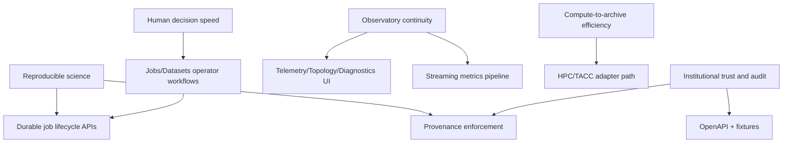

# Mission To Capability Trace

Alignment anchors
- Frontend UX source of truth: [FRONTEND_UI.md](FRONTEND_UI.md)
- Execution backlog: [../TODO.md](../TODO.md)
- Delivery plan: [../ROADMAP.md](../ROADMAP.md)

This matrix maps ngVLA mission outcomes to concrete capabilities and current implementation status.

Status legend:
- `implemented`
- `in-progress`
- `planned`

## 1. Trace matrix

| Mission outcome | Capability | Primary implementation surface | Status | Evidence |
|---|---|---|---|---|
| Observatory continuity | Health visibility and incident context in one console | Angular routes (`Telemetry`, `Topology`, `Diagnostics`, `Dashboard`) | in-progress | `apps/frontend/src/app/app.routes.ts`, `docuentation/FRONTEND_UI.md` |
| Observatory continuity | Low-latency operational metrics pipeline | Generator + Kafka + Prometheus/Grafana dev stack | implemented (baseline) | `docker/dev-compose.yml`, `docuentation/OPERATIONAL_STREAMING_PLANE.md` |
| Reproducible science | Durable job lifecycle tracking | Java governance API + Redis-backed state | in-progress | `apps/java-governance/src/main/java/com/cosmic/governance/api/controller/GovernanceController.java`, `ROADMAP.md` |
| Reproducible science | Provenance bundle policy for SRDP promotion | Governance checks + provenance model | planned | `docuentation/PROVENANCE.md`, `docuentation/DATA_TRUST_PLATFORM.md`, `TODO.md` |
| Compute-to-archive efficiency | HPC/TACC adapter integration path | Adapter contracts + mocks + dispatch semantics | planned | `ROADMAP.md` Phase 5, `docuentation/INFRA_TOPOLOGY.md` |
| Institutional trust and audit | OpenAPI/fixture contract control | `openapi/governance.yaml` + fixture validation | implemented (baseline) | `tools/validate-openapi.mjs`, `schemas/fixtures/*.json` |
| Institutional trust and audit | Immutable/signed manifest path | Audit manifest signing + archival strategy | planned | `docuentation/EXECUTIVE_SUMMARY.md`, storage docs |
| Human decision speed | End-to-end jobs workflow in UI | `Jobs` submit/status/transition with API mapping | implemented (baseline) | `apps/frontend/src/app/features/jobs`, `docuentation/API_CONTRACT_STATUS.md` |
| Human decision speed | Dataset operational readiness view | `Datasets` route + governance dataset APIs | in-progress | `apps/frontend/src/app/features/datasets`, `GET /api/v1/datasets` |

## 1.1 Mission dependency map

## 2. Gaps requiring immediate closure

1. Mission-level success metrics are not yet first-class release gates.
2. Provenance enforcement for SRDP promotion is not yet implemented.
3. HPC adapter behavior is represented mainly as roadmap intent and stubs.
4. Job and dataset flows exist but need richer operational fidelity (filtering, cancellation semantics, stronger error taxonomy).

## 3. Change policy

Any major capability PR must update:
1. this trace matrix
2. [MISSION_GATES.md](MISSION_GATES.md) if acceptance criteria change
3. [DECISIONS.md](DECISIONS.md) when scope tradeoffs affect mission outcomes
