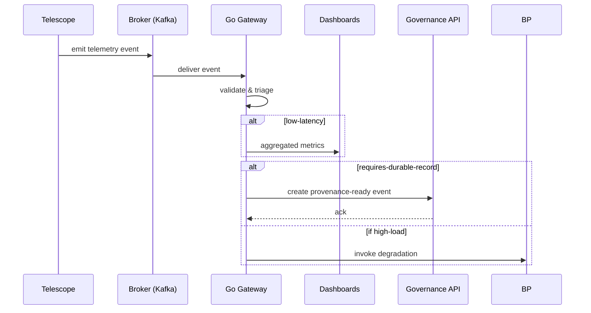

# Operational Streaming Plane (Go)

Purpose

The Operational Streaming Plane is responsible for delivering low-latency operational visibility and protecting downstream systems from surge. It is intentionally lightweight and stateless where possible, optimized for throughput and graceful degradation.

Responsibilities

- Telemetry ingestion from instruments, agents, and HPC job schedulers
- Light validation, deduplication, and schema enforcement
- Windowed aggregation and feature extraction for dashboards and automated runbooks
- Bounded fan-out and backpressure enforcement
- Forwarding curated events to the Governance Plane when durable records are required

Sequence: telemetry to governance (simplified)

Design considerations

- Use topic partitioning and keyed events to preserve ordering when required.
- Implement idempotent event submission to the Governance API to tolerate retries.
- Provide operator-facing modes: normal, degraded, and emergency (with strict sampling policies).

Operational controls

- Rate limiting and admission control at the broker and gateway
- Circuit breakers and graceful sampling when downstream latency increases
- Metrics and SLOs exposed via Prometheus and synthetic checks for contract compliance
