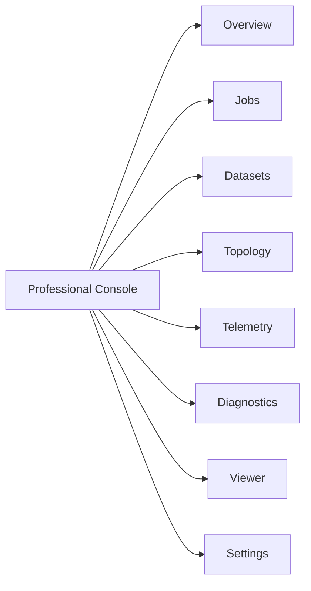
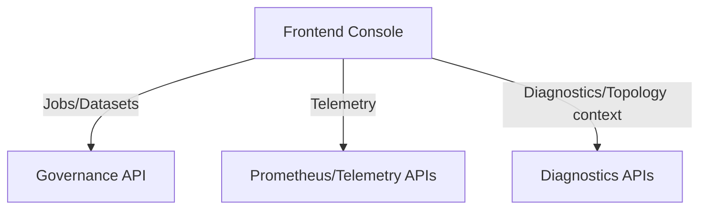

# Professional Console Specification

Alignment anchors

- Frontend UX source of truth: [FRONTEND_UI.md](FRONTEND_UI.md)
- Execution backlog: [../TODO.md](../TODO.md)
- Delivery plan: [../ROADMAP.md](../ROADMAP.md)

Status: `authoritative` for frontend professional-console behavior.

## 1. Purpose

This document defines the exact product and UX requirements for the Cosmic Horizon professional console.

It is the single consolidated reference for:

- operator workflows
- page-level behaviors
- data contracts
- reliability and security UX
- acceptance and release criteria

## 2. Product definition

The professional console is a control-room application for live operations and orchestration, not a marketing dashboard.

It must enable users to:

1. detect issues quickly
2. act safely
3. explain outcomes with evidence

## 3. Primary users and critical tasks

### 3.1 Observatory Operator

- monitor system health and data freshness
- identify incidents and degraded services
- execute approved corrective actions

### 3.2 Pipeline Engineer

- submit jobs with validated parameters
- monitor lifecycle transitions
- diagnose failures and timeouts

### 3.3 Data Steward / Scientist

- find datasets and readiness status
- inspect provenance relationships
- trace outputs back to execution context

## 4. Information architecture

Top-level routes:

1. Overview
2. Jobs
3. Datasets
4. Topology
5. Telemetry
6. Diagnostics
7. Viewer
8. Settings

## 5. Global shell requirements

Mandatory shell regions:

- Header: identity, environment, session controls
- Status band: health, queue depth, data freshness
- Navigation: stable route entry points
- Main stage: focused task surface

Global UX behaviors:

- show last-updated times consistently
- distinguish live vs stale vs unavailable data
- preserve context on route transitions (filters, selected entities)

## 6. Page specifications

## 6.1 Overview

- KPI cards: ingest rate, queue depth, active incidents, failed jobs
- incident list: severity + timestamp + drilldown
- health summary: service-level quick state

## 6.2 Jobs (highest priority)

- submit form with inline validation
- queue table with filtering and sorting
- details drawer (summary, params, timeline, errors, artifacts)
- polling for non-terminal states

API baseline:

- `GET /api/v1/jobs`
- `POST /api/v1/jobs`
- `GET /api/v1/jobs/{id}`
- `POST /api/v1/jobs/{id}/transition`

Required next:

- `GET /api/v1/jobs` with filters/pagination
- explicit cancellation strategy (`/cancel` endpoint or constrained transition policy)

## 6.3 Datasets

- searchable dataset table
- details panel with readiness + related jobs + provenance links
- action: “Create job from dataset”

Required APIs:

- `GET /api/v1/datasets`
- `POST /api/v1/datasets`
- `GET /api/v1/datasets/{id}`
- `GET /api/v1/datasets/{id}/jobs`
- `GET /api/v1/datasets/{id}/provenance`

## 6.4 Topology

- node and link status visualization
- throughput/latency overlays
- node detail drilldown into diagnostics context

## 6.5 Telemetry

- time-series and distribution visualizations
- range/polling controls
- incident window annotations

## 6.6 Diagnostics

- logs/evidence access
- runbook and troubleshooting links
- restricted behavior outside development environments

## 6.7 Viewer

- contextualized visualization linked to selected dataset/job
- provenance-aware labels and timestamps

## 6.8 Settings

- theme and density preferences
- refresh cadence
- reduced motion and accessibility preferences

## 7. UX state model (required everywhere)

All data-driven views must support:

- loading
- empty
- partial
- stale
- error
- recovered

Copy requirements:

- explicit issue cause and next action
- no ambiguous generic error text

## 8. Visual and interaction standards

Design intent:

- disciplined, high-signal operational UI
- stable hierarchy and low cognitive overhead

Standards:

- consistent component behavior across pages
- keyboard accessibility on all critical workflows
- no blocking full-screen spinners for routine refresh
- explicit severity and urgency encoding in alerts

## 9. Security and trust UX requirements

- show environment mode and data source type (`live`, `mock`, `cached`)
- gate sensitive diagnostics UI in non-dev environments
- avoid rendering sensitive host/path details in user-facing surfaces
- log user write actions with auditable context

## 10. Performance requirements

- shell interactive <= 2.5s on baseline dev hardware
- route interaction response <= 300ms perceived for local actions
- charts updated incrementally (avoid full teardown per tick)

## 11. API contract map

## 12. Implementation phases (console-specific)

Phase A:

- Jobs route hardening and full submit/monitor loop
- global status band and stale-data UX

Phase B:

- Datasets route hardening and dataset-to-job workflow
- topology enrichments tied to governance context

Phase C:

- role-aware experiences
- deeper provenance and audit context in UI

## 13. Acceptance criteria

The console is professionally ready when:

1. operators can identify current system state in under 30 seconds
2. engineers can submit and diagnose jobs without leaving the console
3. dataset readiness and provenance are navigable and actionable
4. stale/error states are explicit and actionable across routes
5. API contracts and UI behavior are synchronized in CI-guarded workflows

## 14. Related docs

- [FRONTEND_UI.md](FRONTEND_UI.md)
- [frontend/features/JOBS.md](frontend/features/JOBS.md)
- [frontend/features/DATASETS.md](frontend/features/DATASETS.md)
- [PROGRAM_DIRECTION.md](PROGRAM_DIRECTION.md)
- [TESTING_REQUIREMENTS.md](TESTING_REQUIREMENTS.md)
