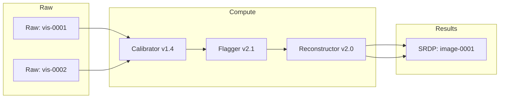

# Provenance Model & Lineage

This document defines provenance concepts and provides examples for constructing verifiable lineage graphs for SRDPs.

Provenance primitives

- Entity: a dataset, file, or artifact (raw visibility, calibrated table, image)

- Activity: a computational process that transforms entities (calibration job, reconstruction job)

- Agent: an identity or system that submitted or authorized an activity (user, workflow engine)

- Bundle/Manifest: a packaged representation of entities, activities, agents, parameters, and environment metadata used for reproducibility

Lineage example (DAG)



Provenance bundle contents (recommended minimum)

- Identifiers and stable URIs for all input entities

- Exact software versions and container digests

- Parameter sets and configuration files (diffable)

- Execution timestamps, resource footprints, and node identifiers

- Signed audit manifest linking the bundle to the governance catalog entry

Verification and replay

- Provide tools that can consume a provenance bundle and re-run workflows in a controlled environment.

- Where exact hardware parity is impossible, provide emulation layers or runbooks describing equivalence classes of environments.

## Expanded provenance scope: data types

Provenance spans more than just files — it must describe behavior, custody, and lifecycle across many data classes:

- Raw visibilities: time-series complex samples produced by the correlator. Very large, high-throughput, often sharded across files/objects.

- Calibration products: calibration tables, solutions, and metadata used to correct raw visibilities.

- Intermediate derivates: staged measurement sets, averaged products, and tiled artifacts used during pipelines.

- Science Ready Data Products (SRDPs): images, cubes, catalogs, and final products published to users.

- Telemetry & operational logs: low-latency signals, diagnostics, and system traces (often high-cardinality but smaller per-event).

- Machine learning artifacts: model weights, checkpoints, feature stores, and derived inference outputs.

- Metadata & catalogs: typed records linking entities, checksums, access policies, and storage pointers.

Each class requires different provenance granularity: raw visibilities need object-level identifiers and storage anchors; telemetry may need sampling and aggregated fingerprints; ML artifacts require model lineage (training data, hyperparameters, seed/commit).

## Scale and 50-year horizon

Use the production-rate target (approx. 7.5–8 GB/s) as a baseline for long-term planning. At 7.5 GB/s continuous ingest:

- Annual raw ingest: ~7.5 GB/s * 31,536,000 s/yr ≈ 236 PB/year (decimal PB = 10^15 bytes).

- 50-year raw accumulation (no deduplication, no tiering): ≈ 11.8 EB (exabytes).

Practical considerations that increase effective storage needs:

- Derived data and intermediate copies: pipelines create multiple derivatives — plan for 2–5x multiplicative overhead depending on retention windows.

- Replication and backups: geo-replication and protection increase aggregate storage by N-way replication (commonly 2–3x).

- Indexes, catalogs, and provenance bundles: small relative to raw bytes but critical for discoverability; expect single-digit percent overhead for indexed metadata stores and catalogs.

Example sizing scenarios (rounded):

- Conservative: store raw + one replica + essential intermediates = 236 PB * (1 + 1 + 0.5) ≈ 590 PB/year.

- Aggressive (long-term research retention): include full intermediate sets and ML artifacts = 236 PB * (1 + 2 + 1) ≈ 944 PB/year.

Over 50 years these translate into multi-exabyte footprints; practical operations will rely on tiering, aggressive lifecycle policies, and archival anchors to control costs.

## Provenance actions across lifecycle

Provenance must record actions at each lifecycle stage:

- Ingest: record producer, capture timestamp, checksum, storage location, and access policy.

- Processing: record job id, code/container digest, parameters, compute footprint, and input->output mappings.

- Publication: record dataset identifiers, access controls, derived product relationships, and human-readable abstracts.

- Retention & deletion: record lifecycle transitions, TTLs, legal holds, and an immutable deletion record when objects are destroyed.

- In-flight security: record encryption-in-transit/mTLS parameters, key identifiers, and token/evidence of integrity checks executed during transfer.

## Auditability & long-term verification

- Signed manifests: every published SRDP should be anchored by a signed audit manifest containing stable URIs and cryptographic hashes.

- Anchors: consider blockchain-like anchoring or periodic Merkle anchoring to an external, immutable store to strengthen long-term verifiability.

- Reproducibility bundles: provide a machine-readable bundle that includes inputs, exact code versions, container digests, and a runnable recipe for replay.

## Mermaid: provenance & lifecycle overview

```

mermaid
flowchart LR
  ingest[Ingest Gateway]
  ingest --> hot[Hot Store (NVMe/SSD)]
  hot --> processing[Processing / Pipelines]
  processing --> warm[Warm Object Store]
  warm --> cold[Cold Storage]
  cold --> archive[Archive / Deep Cold]

  processing -.-> provenance[Provenance Bundle Creator]
  provenance --> catalog[Metadata Catalog]
  catalog --> audit[Signed Audit Manifest]
  audit --> anchor[External Anchor / Merkle]

  %% Legend
    %% Compact Legend (bottom-right)
  subgraph Legend[ ]
    direction TB
    provenance[Provenance]
    audit[Audit]
    L_ingest[Ingest]
    L_processing[Processing]
    L_storage[Storage]
    L_gov[Gov]
    L_metrics[Metrics]
    L_ui[Ui]
  end
    style provenance fill:#33a02c,stroke:#1b5e20,color:#ffffff,font-size:10px
    style audit fill:#ffcc00,stroke:#b88600,color:#000000,font-size:10px
    style L_ingest fill:#1f78b4,stroke:#0b3a66,color:#ffffff,font-size:10px
    style L_processing fill:#33a02c,stroke:#1b5e20,color:#ffffff,font-size:10px
    style L_storage fill:#ff7f00,stroke:#b35400,color:#ffffff,font-size:10px
    style L_gov fill:#6a3d9a,stroke:#3b1f4d,color:#ffffff,font-size:10px
    style L_metrics fill:#ffcc00,stroke:#b88600,color:#000000,font-size:10px
    style L_ui fill:#e31a1c,stroke:#74110b,color:#ffffff,font-size:10px
  classDef legendClass font-size:10px;
  class provenance,audit,L_ingest,L_processing,L_storage,L_gov,L_metrics,L_ui legendClass
    L_ingest[Ingest]
    L_processing[Processing]
    L_storage[Storage]
    L_gov[Governance]
    L_metrics[Metrics]
    L_ui[UI]
  end

  style provenance fill:#33a02c,stroke:#1b5e20
  style audit fill:#ffcc00,stroke:#b88600
  style L_ingest fill:#1f78b4,stroke:#0b3a66
  style L_processing fill:#33a02c,stroke:#1b5e20
  style L_storage fill:#ff7f00,stroke:#b35400
  style L_gov fill:#6a3d9a,stroke:#3b1f4d
  style L_metrics fill:#ffcc00,stroke:#b88600
  style L_ui fill:#e31a1c,stroke:#74110b

```

## Recommendations

- Treat provenance metadata as first-class: ingest it atomically with data when possible, and replicate metadata more widely than raw bytes.

- Use compact fingerprints for high-rate telemetry (sampling + aggregated provenance) and full bundles for SRDPs.

- Design lifecycle policies that keep minimal intermediates in Hot/Warm and push bulk raw visibilities to Cold/Archive with strong provenance anchors.

- Budget for multi-exabyte archives over multi-decade horizons and implement automated lifecycle tests that verify provenance bundles remain resolvable.
