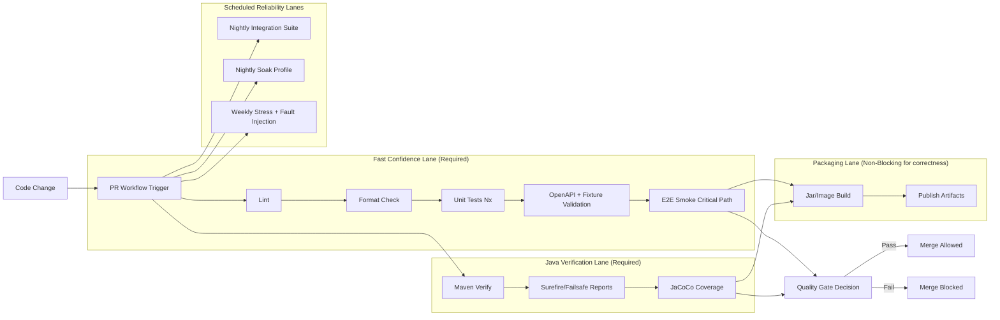
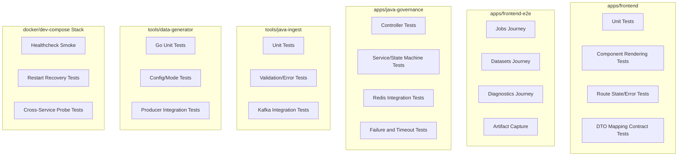
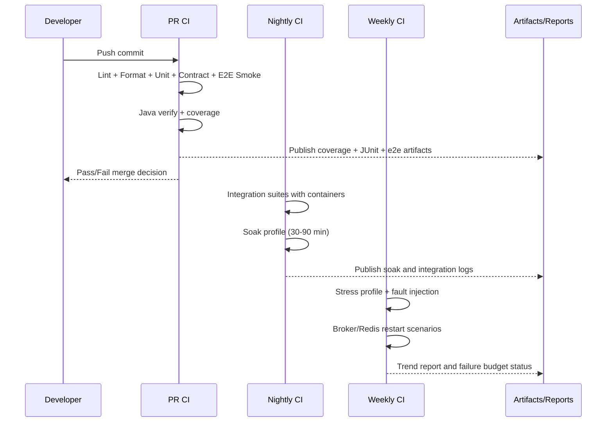
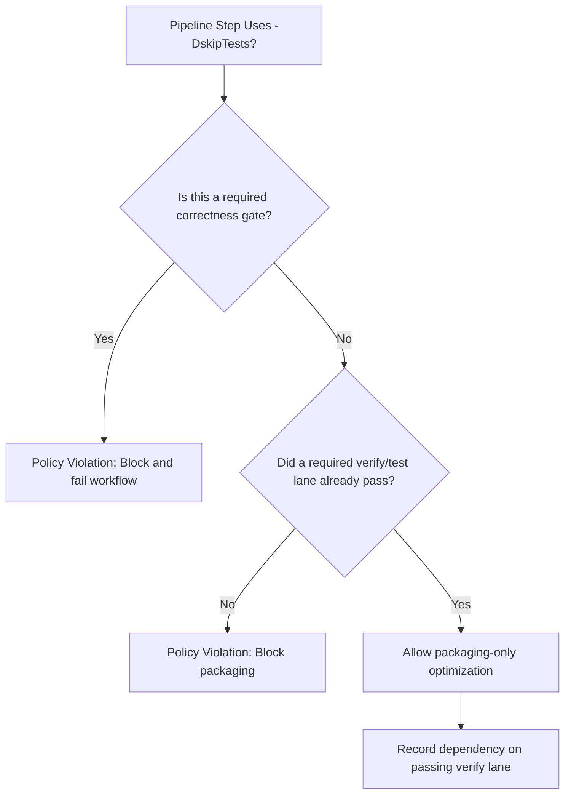

# Testing Framework Architecture

Alignment anchors
- Frontend UX source of truth: [FRONTEND_UI.md](FRONTEND_UI.md)
- Execution backlog: [../TODO.md](../TODO.md)
- Delivery plan: [../ROADMAP.md](../ROADMAP.md)
- Policy baseline: [TESTING_REQUIREMENTS.md](TESTING_REQUIREMENTS.md)

This document defines the architecture of testing in Cosmic Horizon as a system, not just a checklist. It explains how unit, integration, e2e, and stress testing fit together across services and CI lanes, and why skip-flags in merge-critical paths are prohibited.

## 1. Why this architecture exists

The platform is intentionally hybrid:
- Angular operator console
- Java governance control plane
- Go generator/streaming plane
- Dockerized dependencies (Kafka, Redis, observability stack)

That means defects appear at different layers:
- Unit-level logic regressions
- Cross-service contract drift
- Async lifecycle race conditions
- Long-run stability and backpressure failures

A single testing style cannot cover all of this. The framework architecture provides a layered model where each lane has a clear purpose and failure semantics.

## 2. Testing planes and trust model

The testing framework is divided into four planes:
1. Fast correctness plane (unit + static checks) for PR confidence.
2. Contract plane (OpenAPI + fixtures + DTO mapping) for drift prevention.
3. Integration plane (container-backed) for real dependency behavior.
4. Operational plane (smoke/soak/stress) for reliability under realistic load patterns.

If one plane is weak, trust is weak. For large-scale smoke goals, the operational plane is required, not optional.

## 3. End-to-end CI test matrix flow

## 4. Service-by-service testing ownership

## 5. Execution cadence and runtime strategy

## 6. Build-flag policy (`-DskipTests`) decision model

## 7. Scale-profile architecture for reliability confidence

The framework defines three explicit load profiles:

1. `profile-smoke`
- Intent: fast PR-safe confidence.
- Runtime: minutes.
- Checks: critical API flow + basic UI flow + no fatal errors.

2. `profile-soak`
- Intent: detect memory leaks, queue growth, retry storms.
- Runtime: 30 to 90 minutes.
- Checks: bounded resource growth, stable throughput, recoverable failures.

3. `profile-stress`
- Intent: validate degradation and recovery controls.
- Runtime: scheduled (nightly/weekly).
- Checks: fault injection, backpressure behavior, recovery time objectives.

For very large-scale goals, these profiles act as equivalence testing on synthetic workloads. They are not replacements for production-scale infrastructure tests, but they are required gates for local and CI confidence.

## 8. Required outputs and observability hooks

Every test lane must emit machine-parseable artifacts:
- JUnit XML/Surefire XML for Java lanes.
- Coverage reports for Nx, Java, and Go components.
- E2E screenshots/videos and command logs.
- Integration and stress run logs with profile metadata (seed, rate, duration).

Minimum metadata for stress artifacts:
- profile name
- run start/end timestamp
- synthetic seed/config id
- error counts by class
- retry counts
- queue depth maxima
- memory and disk high-water marks

## 9. Gating policy and non-negotiables

Required PR gates:
1. Fast confidence lane.
2. Java verification lane.
3. Contract validation lane.

Allowed to be scheduled:
1. Long soak runs.
2. Stress/fault-injection runs.

Not allowed:
1. Merge-critical workflows that never execute tests.
2. Silent skip-flags that bypass required test intent.

## 10. Implementation alignment checklist

Use this checklist during each roadmap pass:

- CI workflows: required verify lanes present and blocking.
- Docker test-runner: runs unit + integration + e2e smoke and exports artifacts.
- Service gaps: explicit tests exist for `tools/java-ingest` and `tools/data-generator`.
- Coverage gate: aggregated threshold is enforced and visible in CI status.
- Docs: this file, [TESTING_REQUIREMENTS.md](TESTING_REQUIREMENTS.md), [../TODO.md](../TODO.md), and [../ROADMAP.md](../ROADMAP.md) stay synchronized.

## 11. Related documents

- [TESTING_REQUIREMENTS.md](TESTING_REQUIREMENTS.md)
- [JAVA_GOVERNANCE_SPEC.md](JAVA_GOVERNANCE_SPEC.md)
- [GO_GENERATOR_SPEC.md](GO_GENERATOR_SPEC.md)
- [INFRA_TOPOLOGY.md](INFRA_TOPOLOGY.md)
- [../TODO.md](../TODO.md)
- [../ROADMAP.md](../ROADMAP.md)
