# Viewer (Mode B) — Unified High-Resolution View

Alignment anchors
- Frontend UX source of truth: [FRONTEND_UI.md](FRONTEND_UI.md)
- Execution backlog: [../TODO.md](../TODO.md)
- Delivery plan: [../ROADMAP.md](../ROADMAP.md)


## Summary

- Goal: merge the planned Mode B high-resolution viewer into a single, unified viewer experience in the `apps/cosmic-horizons-web` UI for Phase 2.

- Keep the current Aladin/Mode A flow as the fast-preview path; add Mode B as a high-fidelity rendering path that is either auto-activated by zoom level or explicitly toggled.

## Frontend analysis (phase-2 pruning)

- Minimal Phase 2 surface: viewer canvas, toolbar (zoom/pan/contrast), layer manager, basic annotations, and data controls.

- Defer or remove for Phase 2: remote compute adapters, heavyweight export pipelines, optional comments/v2, and any legacy plugins not used by core scientific workflows.

- Keep: data schema/contract fixtures, authentication hooks, metrics instrumentation, and the UI shim for compatibility with existing APIs.

## Mode B design (requirements from MODE-B.md)

- Support FITS and spectral-cube inputs (client-side or server-side rendering).

- GPU-accelerated rendering (WebGL/WebGPU client or server render service).

- Per-pixel controls: contrast, colormap, slice navigation, annotations, reproducible snapshot generation.

- Integrate with existing viewer surface; user may be prompted to switch when zoom crosses a pixelization threshold.

## Component diagram

```mermaid
flowchart LR
  U[User & UI Shell] --> V(Viewer Container)
  V --> RA[Renderer Adapter]
  RA --> Aladin(Aladin HiPS Renderer)
  RA --> ModeB(Canvas/WebGL Renderer)
  RA --> SSR[Server-side Render Service]
  ModeB --> GPU[WebGL / WebGPU]
  SSR --> GPU-Server[GPU Render Backend]
  V --> C(Controls Panel)
  C --> Tools(Contrast / Colormap / Slice)
  V --> L(Layer Manager)
  V --> D(Data Layer)
  D --> TileService(Tile / HiPS)
  D --> FITSProxy(FITS proxy / fetch)
  D --> Governance(Governance API / OpenAPI)
  Governance --> Auth(Auth & Roles)
  style ModeB fill:#238f1a,stroke:#1b5e20,stroke-width:1px
  style SSR fill:#4f2b6f,stroke:#3b1f4d,stroke-width:1px

  %% Compact vertical legend (bottom-right)
  subgraph Legend[ ]
    direction TB
    L_ui[UI]
    L_render[Renderer]
    L_data[Data]
    ModeB[ModeB]
    SSR[SSR]
  end

  style L_ui fill:#1f78b4,stroke:#0b3a66,color:#ffffff,font-size:10px
  style L_render fill:#238f1a,stroke:#1b5e20,color:#ffffff,font-size:10px
  style L_data fill:#ff7f00,stroke:#b35400,color:#000000,font-size:10px
  style ModeB fill:#238f1a,stroke:#1b5e20,color:#ffffff,font-size:10px
  style SSR fill:#4f2b6f,stroke:#3b1f4d,color:#ffffff,font-size:10px
  classDef legendClass font-size:10px;
  class L_ui,L_render,L_data,ModeB,SSR legendClass

```



## Operational notes & API

- Use `OpenAPI`-first contracts for the Governance API (Java Spring Boot service). Keep the `NestJS` server as a compatibility/proxy shim during migration; the shim should route or proxy OpenAPI-defined endpoints to the Java service once implemented.

- For FITS-heavy workloads consider a small server-side FITS proxy that can: validate, transcode, and optionally tile/convert FITS into GPU-friendly tiles or SSR snapshots.

Developer notes: For running the frontend and local infra in development, see [GETTING_STARTED.md](GETTING_STARTED.md). For `.env` policy and which values may be exposed to the browser via `/api/env`, see [ENVIRONMENT.md](ENVIRONMENT.md).

## Startup performance & pre-loading data

Aladin‑lite itself fetches imagery and catalog resources on demand; nothing renders on the
server. However you can improve the perceived startup speed by warming the browser cache
before the viewer is instantiated and by delivering a small initial configuration blob via SSR.

- **Cache pre‑fetch.** emit a few `fetch()` calls in server‑generated markup or in an early
  client script.  Aladin‑lite will reuse cached responses when it later requests the same
  URLs, yielding an effectively instant first tile load.

```html
<script>
  // warm a HiPS tile and a JSON catalog entry
  fetch('https://alasky.u-strasbg.fr/hips/DSS2/color/100/0/0.jpg');
  fetch('/api/catalog/initial.json');
</script>
```

- **Bootstrap endpoint.** if you control the tile/catalog server, expose an API that returns a
  small JSON blob describing the default layers, target and fov, or a pre‑computed bookmark.
  Render that blob into the HTML (Angular can read it from a `<script type="application/json">`)
  so the client can call `aladin(...)` with all parameters already available.

> **Note:** the viewer cannot execute on the server; SSR is only used to deliver hints and
> caches, not to render image data.  Nevertheless, these techniques can make the first
> client-side render feel much faster.

## Phased implementation suggestions

1. Add `ModeB` client adapter scaffold in `apps/cosmic-horizons-web` (UI placeholder + WebGL wrapper).
1. Implement a light FITS-proxy endpoint (can be minimal) that returns test FITS slices for development.
1. Add a UI toggle + zoom-threshold prompt that switches the Renderer Adapter to `ModeB`.
1. Add Prometheus metrics for viewer render time, tile load latency, and ModeB activation counts.

## Deliverables (short)

- `docuentation/VIEWER_MODEB.md` (this file)

- Frontend adapter scaffold in `apps/cosmic-horizons-web/src/app/viewer/mode-b-adapter` (scaffold task)

- Small FITS proxy service (separate tool/service; can be a minimal dev container)

## Next steps

- I can: (A) scaffold the `mode-b-adapter` in the frontend, (B) add the FITS-proxy prototype, or (C) draft the Spring Boot OpenAPI skeleton and migration plan for the API. Tell me which to start with.
