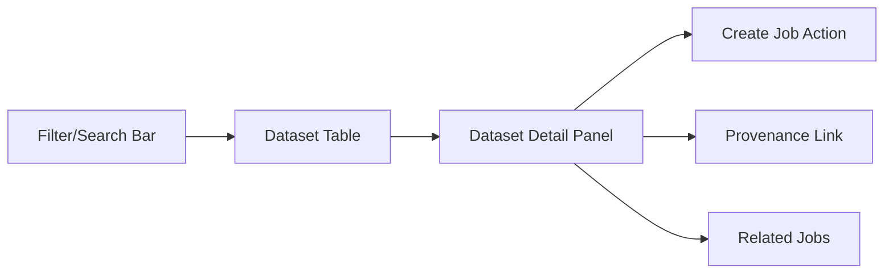

# Dataset UI View (Verbose Product Specification)

Alignment anchors
- Frontend UX source of truth: [../../FRONTEND_UI.md](/docuentation/frontend/FRONTEND_UI.md)
- Execution backlog: [../../../TODO.md](/docuentation/planning/TODO.md)
- Delivery plan: [../../../ROADMAP.md](/ROADMAP.md)

Status: `planned` (detailed UX and contract spec ready for implementation)

## 1. Why this view exists

The Dataset UI view is the bridge between data availability and orchestration action.

Without this view:
- users submit jobs with weak context
- readiness and quality checks stay hidden
- provenance navigation becomes fragmented

With this view:
- users can find the right dataset faster
- users can verify readiness before spending compute
- users can move directly from dataset context into jobs and provenance workflows

## 2. Core product idea

The dataset page is not a static catalog table.  
It is an operational decision surface that answers:

1. What data is available right now?
2. Is this dataset ready for processing?
3. What happened to it already (jobs, outputs, provenance)?
4. What should I do next (create job, inspect lineage, escalate)?

## 3. Primary user journeys

### Journey A: “Find and run”
1. User opens datasets view.
2. Applies filters (status/source/date).
3. Selects dataset row.
4. Confirms readiness checks.
5. Clicks “Create job from dataset.”
6. Lands in prefilled Jobs flow.

### Journey B: “Investigate quality/readiness”
1. User opens dataset detail panel.
2. Sees ingest status and readiness signals.
3. Reviews associated recent failures.
4. Opens related diagnostics or provenance.

### Journey C: “Audit and trust”
1. User opens dataset details.
2. Navigates lineage/provenance link.
3. Validates origin and transformations.
4. Shares evidence for review.

## 4. UX layout model

Desktop layout:
- Top: filter and search bar
- Left/Center: datasets table
- Right: detail panel for selected dataset

Tablet:
- filter bar + table
- detail panel becomes bottom drawer

Mobile:
- list cards
- full-screen detail modal

## 5. Data table specification

Required columns:
- dataset id
- source/system
- size
- ingest status
- readiness score/state
- last updated
- related jobs count

Required interactions:
- sort by any primary column
- text search (id/source)
- filter by status/source/date
- row selection opens details

Bulk interactions (phase 2+):
- multi-select for comparison
- bulk export metadata

## 6. Detail panel specification

Sections:

1. Summary
- dataset id
- ownership/source
- created/updated timestamps

2. Readiness
- readiness state (`ready`, `warning`, `blocked`)
- blocking reasons
- suggested next action

3. Related jobs
- recent jobs list with status badges
- direct deep-link to jobs detail

4. Provenance
- lineage link
- trust/audit indicators

5. Artifacts
- known output references (when available)

## 7. State model (must-have)

The page must explicitly represent:
- loading
- empty
- partial
- stale
- error
- recovered

State messaging examples:
- Empty: “No datasets match current filters.”
- Stale: “Dataset index is 3m old; refresh recommended.”
- Error: “Dataset service unavailable (timeout). Retry or open diagnostics.”

## 8. Readiness scoring model (UI semantics)

Readiness is a user-facing abstraction, not raw backend internals.

Proposed mapping:
- `ready`: all checks passed, safe to submit jobs
- `warning`: usable with caveats
- `blocked`: missing required prerequisites

Each non-ready state must include:
- reason
- timestamp
- owner/system hint
- remediation link when possible

## 9. API contract requirements

Baseline required endpoints:
- `GET /api/v1/datasets`
- `GET /api/v1/datasets/{id}`
- `GET /api/v1/datasets/{id}/jobs`
- `GET /api/v1/datasets/{id}/provenance`

Suggested response shape (list):
- `id`
- `source`
- `sizeBytes`
- `ingestStatus`
- `readinessState`
- `readinessReason`
- `updatedAt`
- `jobCount`

Suggested response shape (detail):
- summary metadata
- readiness checks
- related job references
- provenance reference(s)

## 10. Professional UI quality bar

Professional expectations:
- table and details stay synchronized without full page reset
- filter state persists while navigating away and back
- keyboard-first interactions supported
- no hidden state transitions
- timestamps and data source freshness always visible

## 11. Security and data handling

Requirements:
- do not expose sensitive filesystem paths
- do not expose internal credentials/tokens
- protect dataset actions based on role/policy (as backend auth matures)
- show source mode (`live` or `mock`) for transparency

## 12. Performance expectations

Targets:
- first dataset list render under 1s on warm local environment
- table filter/sort interactions feel instant (<150ms perceived)
- detail panel open transition <200ms

Approach:
- page-level caching with freshness indicator
- incremental updates for selected row/details
- avoid refetching full table on every detail interaction

## 13. Accessibility requirements

- full keyboard navigation
- ARIA labeling on table, filters, and detail actions
- high-contrast compliant status badges
- non-color status encoding (icon + text)
- reduced motion support

## 14. Implementation plan

Phase 1:
- scaffold route and static layout
- define TypeScript models and API service
- implement loading/empty/error states

Phase 2:
- wire list/detail APIs
- add related jobs and create-job action
- persist filters in route query params

Phase 3:
- provenance integration
- readiness scoring polish
- e2e scenarios for workflow confidence

## 15. Acceptance criteria

The Dataset UI view is considered successful when:
1. user can locate a dataset using filters/search in under 30 seconds
2. user can determine readiness and reason without leaving page
3. user can launch a job from dataset context in one action
4. stale/error states are explicit and actionable
5. dataset detail clearly links to jobs and provenance evidence

## 16. Related references

- [DATASETS.md](/docuentation\frontend\features\DATASETS.md)
- [JOBS.md](/docuentation\frontend\features\JOBS.md)
- [PROFESSIONAL_CONSOLE_SPEC.md](/docuentation/architecture/PROFESSIONAL_CONSOLE_SPEC.md)
- [FRONTEND_UI.md](/docuentation/frontend/FRONTEND_UI.md)
