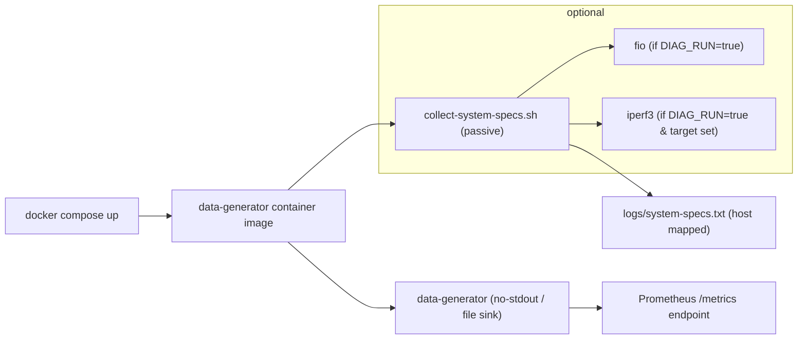

# Diagnostics

Alignment anchors

- Frontend UX source of truth: [../../FRONTEND_UI.md](../../FRONTEND_UI.md)
- Execution backlog: [../../../TODO.md](../../../TODO.md)
- Delivery plan: [../../../ROADMAP.md](../../../ROADMAP.md)

This document describes the diagnostics that run inside the `data-generator` container image, where their artifacts land, and how to use them for troubleshooting or capacity planning.

## What runs at container startup

- A lightweight passive collector runs automatically on container start and writes output to `logs/system-specs.txt` inside the container (and to the mapped host folder when using `docker-compose` with volume mounts).
- Optionally, when `DIAG_RUN=true`, short active benchmarks are executed if the required tools are available: `fio` for a quick disk IO micro-benchmark and `iperf3` for a short network benchmark (requires `DIAG_IPERF_TARGET`).

Current relationship to global stress profile:

- The frontend footer profile (`10%`, `25%`, `50%`, `100%`) currently affects telemetry polling intensity only.
- Diagnostics outputs here are still the primary machine-capacity reference for development planning.
- Runtime machine stress control is planned and will require live host metrics + generator control APIs.

## Files produced

- `logs/system-specs.txt` — human-readable snapshot (CPU model, kernel, memory, disk topology, mountpoints, basic ip route and interface details, container limits).
- `logs/` may also contain `fio-*.log` or `iperf3-*.log` when `DIAG_RUN=true` produced active benchmark outputs.

## How to run locally

1. Using Docker Compose (development): `docker compose -f docker/dev-compose.yml up --build -d` — the `data-generator` container will write `logs/system-specs.txt` into the mapped `tools/data-generator/logs` folder by default.
2. Run interactively inside the image (for manual diagnostics):

```bash
docker run --rm -it \
  -e DIAG_RUN=true -e DIAG_IPERF_TARGET=10.0.0.1 \
  -v $(pwd)/tools/data-generator/logs:/app/logs \
  your-registry/data-generator:latest /bin/sh -c '/app/collect-system-specs.sh && /app/data-generator --no-stdout'
```

### Enable diagnostics in `docker/dev-compose.yml` (example)

Add or override the `data-generator` service environment and volume to enable active diagnostics and persist logs on the host:

```yaml
services:
  data-generator:
    image: your-registry/data-generator:local
    build: ./tools/data-generator
    environment:
      - DIAG_RUN=true
      - DIAG_IPERF_TARGET=10.0.0.1 # optional; only if you have a reachable iperf3 server
    volumes:
      - ./tools/data-generator/logs:/app/logs
```

After bringing the compose stack up, the diagnostics files will appear in `tools/data-generator/logs` on the host.

## Environment variables

- `DIAG_RUN` (default: `false`) — when `true`, attempt `fio` and `iperf3` active tests.
- `DIAG_IPERF_TARGET` — hostname/IP of a reachable `iperf3` server for a short network test.

## Interpretation & usage

- Use `logs/system-specs.txt` as the canonical snapshot of the container's view of the host/node (kernel, CPU features, mounts, cgroup limits). Attach it to bug reports when investigating IO or network anomalies.
- Active benchmark outputs are intentionally short; they are for signal and trend, not exhaustive benchmarking.
- Treat startup diagnostics as baseline envelope data for choosing stress profile defaults in development until live host exporters are integrated.

## Privacy & Safety

- Active diagnostics may generate network traffic to the configured `iperf3` target and will perform small disk IO tests. Only enable `DIAG_RUN` in trusted environments.

## Mermaid: diagnostics and generator startup flow



## Where to find the script

- The collector script is available at `tools/data-generator/collect-system-specs.sh` in this repository and is included in the container image.

## Recommended next steps

- The Nest SSR server now exposes two readonly diagnostics endpoints:

  - `GET /api/diagnostics` — lists files present under `tools/data-generator/logs` (readonly index)
  - `GET /api/diagnostics/system-specs` — returns `system-specs.txt` content when present

- Add a JSON output mode for machine parsing, and a small summary parser that extracts CPU/memory/disk metrics into a single JSON file.
- Add a diagnostics summary endpoint specifically for stress-profile planning (`cpu_cores`, `mem_total`, `net_iface`, optional `gpu_present`) to support automatic dev profile recommendations.
