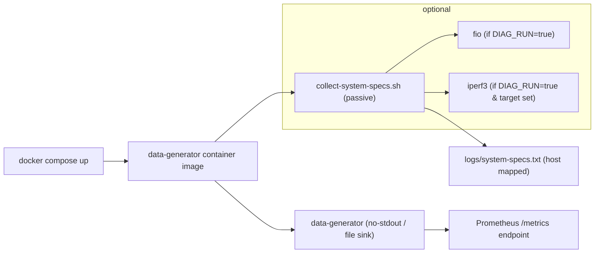

# Diagnostics

Alignment anchors

- Frontend UX source of truth: [../../FRONTEND_UI.md](/docuentation/frontend/FRONTEND_UI.md)
- Execution backlog: [../../../TODO.md](/docuentation/planning/TODO.md)
- Delivery plan: [../../../ROADMAP.md](/ROADMAP.md)

This document describes the diagnostics that run inside the `data-generator` container image, where their artifacts land, and how to use them for troubleshooting or capacity planning.

## What runs at container startup

- A lightweight passive collector runs automatically on container start and writes output to `logs/system-specs.txt` inside the container (and to the mapped host folder when using `docker-compose` with volume mounts).
- Optionally, when `DIAG_RUN=true`, short active benchmarks are executed if the required tools are available: `fio` for a quick disk IO micro-benchmark and `iperf3` for a short network benchmark (requires `DIAG_IPERF_TARGET`).

Current relationship to global stress profile:

- The frontend footer profile (`10%`, `25%`, `50%`, `100%`) currently affects telemetry polling intensity only.
- Diagnostics outputs here are still the primary machine-capacity reference for development planning.
- Runtime machine stress control is planned and will require live host metrics + generator control APIs.

## Files produced

- `logs/system-specs.txt` — human-readable snapshot (CPU model, kernel, memory, disk topology, mountpoints, basic ip route and interface details, container limits).
- `logs/` may also contain `fio-*.log` or `iperf3-*.log` when `DIAG_RUN=true` produced active benchmark outputs.

## How to run locally

1. Using Docker Compose (development): `docker compose -f docker/dev-compose.yml up --build -d` — the `data-generator` container will write `logs/system-specs.txt` into the mapped `tools/data-generator/logs` folder by default.
2. Run interactively inside the image (for manual diagnostics):

```bash
docker run --rm -it \
  -e DIAG_RUN=true -e DIAG_IPERF_TARGET=10.0.0.1 \
  -v $(pwd)/tools/data-generator/logs:/app/logs \
  your-registry/data-generator:latest /bin/sh -c '/app/collect-system-specs.sh && /app/data-generator --no-stdout'
```

### Enable diagnostics in `docker/dev-compose.yml` (example)

Add or override the `data-generator` service environment and volume to enable active diagnostics and persist logs on the host:

```yaml
services:
  data-generator:
    image: your-registry/data-generator:local
    build: ./tools/data-generator
    environment:
      - DIAG_RUN=true
      - DIAG_IPERF_TARGET=10.0.0.1 # optional; only if you have a reachable iperf3 server
    volumes:
      - ./tools/data-generator/logs:/app/logs
```

After bringing the compose stack up, the diagnostics files will appear in `tools/data-generator/logs` on the host.

## Environment variables

- `DIAG_RUN` (default: `false`) — when `true`, attempt `fio` and `iperf3` active tests.
- `DIAG_IPERF_TARGET` — hostname/IP of a reachable `iperf3` server for a short network test.

## Interpretation & usage

- Use `logs/system-specs.txt` as the canonical snapshot of the container's view of the host/node (kernel, CPU features, mounts, cgroup limits). Attach it to bug reports when investigating IO or network anomalies.
- Active benchmark outputs are intentionally short; they are for signal and trend, not exhaustive benchmarking.
- Treat startup diagnostics as baseline envelope data for choosing stress profile defaults in development until live host exporters are integrated.

## Privacy & Safety

- Active diagnostics may generate network traffic to the configured `iperf3` target and will perform small disk IO tests. Only enable `DIAG_RUN` in trusted environments.

## Mermaid: diagnostics and generator startup flow



## Where to find the script

- The collector script is available at `tools/data-generator/collect-system-specs.sh` in this repository and is included in the container image.

## Recommended next steps

- The Nest SSR server now exposes two readonly diagnostics endpoints:

  - `GET /api/diagnostics` — lists files present under `tools/data-generator/logs` (readonly index)
  - `GET /api/diagnostics/system-specs` — returns `system-specs.txt` content when present

- Add a JSON output mode for machine parsing, and a small summary parser that extracts CPU/memory/disk metrics into a single JSON file.
- Add a diagnostics summary endpoint specifically for stress-profile planning (`cpu_cores`, `mem_total`, `net_iface`, optional `gpu_present`) to support automatic dev profile recommendations.

## Frontend realtime diagnostics analysis

The current frontend Diagnostics page already has the right three tab groups, but the realtime behavior is uneven and the tabs do not yet act like one coordinated operational surface.

### Current implementation observations

- The `Overview` tab renders six live Prometheus cards.
- Each card polls independently and performs both an instant query and a range query on every cycle.
- The `Broker Systems` tab is the only tab with explicit auto-refresh controls.
- The `Broker Systems` polling only refreshes docker-service tiles, not the diagnostics file index or `system-specs` content.
- The `Files` tab is mostly manual: users must refresh the index explicitly and must separately load `system-specs.txt`.
- The UI styles support `degraded` tiles, but the list endpoint currently returns `online`, `offline`, or `unknown`.
- The backend already exposes `GET /api/diagnostics/system-specs.json`, but the current view still treats raw text as the primary file detail.

### Problems to address

- Realtime data is fragmented by tab, so freshness is inconsistent across the page.
- Prometheus polling is more expensive than necessary because each tile owns its own refresh cycle.
- Tabs do not show whether their contents are live, stale, mock, or manually loaded.
- Broker tiles are visually strong but weak as decision tools because they lack age, severity ordering, fallback context, and short history.
- The Files tab shows evidence, but it does not summarize what changed or why the artifacts matter.

### Improvements for tab groups

- Move to a page-level diagnostics view model that combines:
  - live overview metrics
  - broker-service health
  - diagnostics artifact index
  - parsed `system-specs.json` summary
- Poll once per load-profile cadence and fan the results into all tabs, instead of having each overview card fetch independently.
- Add shared page metadata:
  - `lastUpdated`
  - `refreshing`
  - `stale`
  - `source` (`live` or `mock`)
  - `error`
- Add summary badges on tab labels, for example:
  - `Overview (live)`
  - `Broker Systems (2 offline)`
  - `Files (3 new)`
- Keep the active tab in route query params so refreshes and deep links preserve context.
- Lazy-load only heavy detail views:
  - keep summary data hot
  - load raw `system-specs.txt` only when the Files tab is active

### Improvements for overview tiles

- Replace per-card polling with shared observables or a diagnostics facade/store.
- Add trend and delta indicators so operators can see whether a value is climbing, flat, or falling.
- Add `updated x seconds ago` to every tile.
- Normalize units and display formats:
  - bytes/sec
  - records/sec
  - percent
  - target count
- Add thresholds so a tile can show warning or abnormal state, not only its color tone.
- Revisit the current CPU query so it reflects the intended jobs or host/container scope rather than an overly broad aggregate.

### Live tile chart findings

The individual live-tile sparklines currently feel sporadic for structural reasons, not just because of the underlying metric data.

- Each `app-promql-card` issues two independent requests on every refresh:
  - `queryInstant()` for the headline value
  - `queryRange()` for the sparkline
- Those requests are not tied to the same sample timestamp, so the large value and the sparkline endpoint can disagree even when Prometheus is healthy.
- In mock mode, the mismatch is larger because:
  - `telemetryInstant()` returns a random point sample
  - `telemetryRange()` returns a generic sine-wave-plus-noise series
  - neither path is metric-specific
- For counters like bytes and records, the card requests the raw metric for the line chart rather than a rate-derived series. That makes the tile compare a total-value sparkline against a headline value that users often interpret as throughput.
- The CPU tile in Diagnostics uses `100 * sum(rate(process_cpu_seconds_total[1m]))` without the narrower job filter used elsewhere, so the metric scope is inconsistent between pages.
- The sparkline rescales to its local min and max on every refresh. Small changes in range can make the line jump visually even when the underlying trend is stable.

### Why `100%` mock mode does not peg CPU today

The current `100%` setting should not be expected to peg the CPU in mock mode.

- `LoadProfileService` changes polling cadence when the profile changes.
- In live mode, the backend can also start runtime generator workers for higher profiles.
- In mock mode, there is no real CPU stressor and no CPU model. The mock layer only scales synthetic values and shortens polling intervals.
- `MockDataService` does not map profile level to realistic CPU saturation behavior. At `100%`, it still generates abstract synthetic numbers, not a capped CPU series approaching sustained saturation.

This is why the CPU sparkline can look noisy or arbitrary instead of pinning near a stable upper bound.

### GPU usage

There is no current GPU utilization path in this frontend diagnostics flow.

- No diagnostics tile queries a GPU metric.
- No mock-data generator emits GPU-specific telemetry.
- The diagnostics endpoints do not expose GPU presence, utilization, memory, or device health.

If GPU awareness matters for workload planning, it needs to be added explicitly in both diagnostics collection and frontend presentation.

### Recommended changes for live tile charts

- Make each tile fetch one coherent payload per refresh cycle:
  - one instant value
  - one aligned recent series
  - one shared `sampledAt`
- Use metric-specific adapters instead of a generic card model:
  - counters should show rate sparklines
  - gauges should show gauge sparklines
  - percentages should be capped and formatted as percentages
- For bytes and records cards, use `rate()` or `increase()/window` for the sparkline so the line represents throughput rather than monotonically increasing totals.
- For CPU, standardize on one query across Diagnostics and Telemetry. Prefer either:
  - process-level CPU for scoped services, or
  - host/container CPU metrics if the intent is true system load
- For CPU percentage charts, clamp or validate the display range and show the expected denominator:
  - per process
  - per selected jobs
  - per host
  - per container
- Stabilize the sparkline y-domain:
  - use a rolling domain with hysteresis
  - or pin percent metrics to `0..100`
  - or expose a faint reference band so users can interpret scale changes
- Add missing data states:
  - `no samples`
  - `stale`
  - `mock`
  - `query error`
- Show the sparkline time window and step so users know whether they are seeing `5m / 15s`, `5m / 1s`, or another window.

### Recommended changes for mock-mode realism

- Replace the generic mock telemetry generator with metric-specific series behavior.
- For CPU in mock mode:
  - `10%` should sit in a low stable band
  - `25%` should trend moderately higher
  - `50%` should show sustained mid-load with occasional spikes
  - `100%` should stay near a high saturation band with brief variance, not random oscillation
- Ensure the instant value is derived from the latest point in the generated range series instead of being generated separately.
- Add optional jitter profiles so mock mode can simulate:
  - stable system
  - saturated system
  - bursty system
  - flapping data source

### Recommended GPU additions if needed

- Extend diagnostics collection to report GPU presence and basic inventory when available.
- Add optional GPU metrics tiles only when GPU hardware is detected.
- Expose a lightweight diagnostics summary payload with fields such as:
  - `gpu_present`
  - `gpu_vendor`
  - `gpu_model`
  - `gpu_memory_total`
  - `gpu_utilization_pct`

Without that explicit work, the frontend is not utilizing GPU data at all.

### Improvements for broker system tiles

- Sort by severity first so offline or degraded systems appear before healthy ones.
- Group tiles by role:
  - observability
  - messaging
  - state/cache
- Extend the backend list endpoint to include:
  - `lastChecked`
  - `usedFallback`
  - `degraded`
  - optional recent probe history
- Mark a service as `degraded` when fallback succeeds, latency is above threshold, or readiness is partial.
- Show whether the tile is using its primary endpoint or a localhost fallback.
- Preserve error type detail, especially timeout vs DNS vs connection refusal.

### Improvements for the Files tab

- Use `GET /api/diagnostics/system-specs.json` as the primary summary source.
- Add summary tiles above the file list:
  - total artifacts
  - latest artifact age
  - `system-specs.txt` present/missing
  - `fio` log count
  - `iperf3` log count
- Parse timestamped filenames into relative age and absolute time.
- Highlight newly arrived artifacts since the last refresh.
- Keep raw `system-specs.txt` in an expandable detail section instead of making it the first-level view.

### Recommended implementation sequence

1. Introduce a shared diagnostics facade/store so all three tabs use one refresh model.
2. Switch summary rendering to `GET /api/diagnostics/system-specs.json`.
3. Rework `app-promql-card` so each tile uses one coherent metric model and aligned instant/range samples.
4. Replace mock telemetry generation with metric-specific series, especially for CPU at `100%`.
5. Extend `GET /api/diagnostics/docker-services` to return richer tile metadata and a real `degraded` state.
6. Update tab labels and tiles to show freshness, severity, and change since last refresh.
7. Reduce duplicate Prometheus traffic by consolidating overview-card queries.
