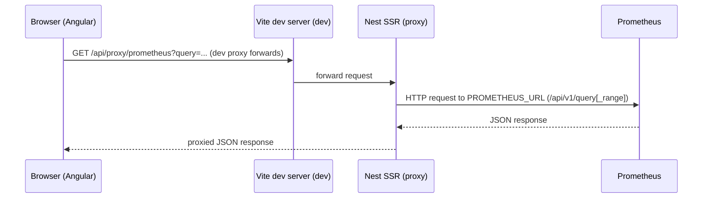

# Telemetry (Prometheus → Frontend)

Alignment anchors
- Frontend UX source of truth: [../../FRONTEND_UI.md](../../FRONTEND_UI.md)
- Execution backlog: [../../../TODO.md](../../../TODO.md)
- Delivery plan: [../../../ROADMAP.md](../../../ROADMAP.md)


This document explains how Prometheus metrics are proxied to the frontend and how the telemetry visuals are wired (line chart, histogram, radial gauge). It also documents the endpoints and developer workflow for capturing telemetry screenshots and logs.

## Overview

- Prometheus scrapes the `data-generator` `/metrics` endpoint.
- The Nest SSR server exposes a proxy endpoint at `/api/proxy/prometheus` which forwards Prometheus queries (avoids CORS and centralizes `PROMETHEUS_URL`).
- The Angular frontend (`TelemetryComponent`) polls the proxy for instant and range queries and renders D3-based visuals.

## Key endpoints

- Backend proxy: `/api/proxy/prometheus?query=<promql>` — accepts `start`, `end`, `step` for range queries and will call `query_range` vs `query` appropriately.
- Generator metrics: scraped by Prometheus at the configured scrape target (see `docker/dev-compose.yml` for the local compose job).

## Frontend workflow

1. `TelemetryService` issues HTTP GET to `/api/proxy/prometheus` and receives JSON.
2. For counters suffixed with `_total`, the component requests a `rate()` range and an instant raw counter to compute current throughput plus cumulative value.
3. The `TelemetryComponent` renders:
   - a smoothed line with moving-average overlay,
   - a histogram of recent per-sample rates,
   - a radial gauge for current throughput and CSV export button.

## Mermaid: request flow from browser to Prometheus



## Developer capture & Playwright notes

- When running the frontend in Vite watch/HMR mode, HMR can cause page reloads that interrupt headful Playwright captures. For reliable automated screenshots use a static build:

```bash
pnpm nx build frontend
npx serve -s dist/apps/frontend -l 4200
node scripts/playwright/telemetry-screenshot.js
```

## Suggested documentation additions

- Add a short reference with example PromQL queries used by the `TelemetryComponent` (e.g., `generator_bytes_produced_total` and `rate(generator_bytes_produced_total[1m])`).

## PromQL examples

- Instant (raw counter):

```promql
generator_bytes_produced_total
```

- Range rate (per-second rate over 1 minute):

```promql
rate(generator_bytes_produced_total[1m])
```

- Aggregate throughput across all generators (sum of per-pod rates):

```promql
sum(rate(generator_bytes_produced_total[1m]))
```

## Curl examples (using the Nest proxy)

- Instant query (returns Prometheus instant vector result):

```bash
curl -G "http://localhost:3000/api/proxy/prometheus" --data-urlencode "query=generator_bytes_produced_total"
```

- Range query (rate over 1m, step 15s). Replace `START` and `END` with RFC3339 timestamps or epoch seconds; a simple way on Linux/macOS:

```bash
START=$(date -u -d '5 minutes ago' +%s)
END=$(date -u +%s)
curl -G "http://localhost:3000/api/proxy/prometheus" \
  --data-urlencode "query=rate(generator_bytes_produced_total[1m])" \
  --data-urlencode "start=${START}" \
  --data-urlencode "end=${END}" \
  --data-urlencode "step=15"
```

- Example: fetch the developer diagnostics snapshot (readonly endpoint exposed by the Nest SSR server):

```bash
curl http://localhost:3000/api/diagnostics/system-specs -o system-specs.txt
```

Notes:

- If your frontend dev server is proxied (Vite) the request should still reach the Nest endpoint; if you run the frontend static server, call the Nest server port directly (default 3000).
