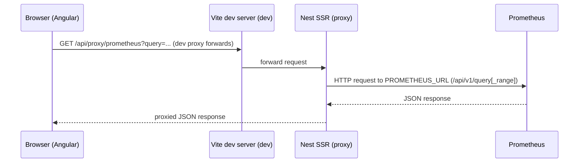

# Telemetry (Prometheus → Frontend)

Alignment anchors

- Frontend UX source of truth: [../../FRONTEND_UI.md](/docuentation/frontend/FRONTEND_UI.md)
- Execution backlog: [../../../TODO.md](/docuentation/planning/TODO.md)
- Delivery plan: [../../../ROADMAP.md](/ROADMAP.md)

This document explains how Prometheus metrics are proxied to the frontend and how the telemetry visuals are wired (line chart, histogram, radial gauge). It also documents the endpoints and developer workflow for capturing telemetry screenshots and logs.

## Proposed load-test presets (analysis only, not implemented)

Status: approved as a good direction for development realism, but it needs control-plane and metrics additions first.

Current implementation status (March 2, 2026):

- A global footer load-profile selector (`10%`, `25%`, `50%`, `100%`) now exists in the frontend and propagates to telemetry widgets as a shared polling-intensity profile.
- This is intentionally a scaffold for future development and does **not** yet enforce host CPU/GPU utilization targets by itself.

### Global stress-testing plan (development)

Phase 1 (implemented scaffold):

- Global profile state in footer and shared telemetry refresh cadence.
- Cross-page visual reflection in telemetry-driven widgets.

Phase 2 (next):

- Add runtime generator control API to adjust effective throughput without full manual restarts.
- Add explicit source badge per widget (`live`, `mock`, `fallback`, `stale`).

Phase 3 (next):

- Add live host metrics for CPU, memory, and network into Prometheus scrape path.
- Add optional GPU metrics in GPU-enabled environments.

Phase 4 (next):

- Add closed-loop profile controllers:
  - `25%`: low-intensity bounded target
  - `50%`: steady-state target
  - `100%`: smoke burst with max duration + auto-revert

Phase 5 (next):

- Add e2e and soak tests that validate profile changes are visible globally and revert safely to developer default.

### Why this is useful

- It gives developers a fast way to validate throughput visual behavior under realistic pressure.
- It helps validate that the green throughput visuals track machine load changes instead of only fixed generator defaults.
- It enables repeatable smoke checks (for example, a short 100% stress profile) without manual shell workflows.

### Current constraints in this repository

- `TelemetryComponent` is currently observability-only (Prometheus query UI), not a runtime load controller.
- The metric dropdown currently contains only:
  - `generator_bytes_produced_total`
  - `generator_records_produced_total`
- The data generator uses startup flags (`--rate`, `--payload-size`) and does not expose a runtime API to change load.
- `system-specs` diagnostics are a startup snapshot (`system-specs.txt`), not a live stream.
- No live GPU utilization metric path exists today in the local stack.

### Recommended design

Add a separate **Load Profile** control (do not overload Metric semantics):

- `Developer Default` (current baseline behavior)
- `Rated 50%` (attempt to stabilize around ~50% host resource utilization)
- `Smoke 100%` (bounded-duration max stress run, then auto-revert)

Keep Metric dropdown for visualization queries only. Selecting bytes/records should continue to be read-only and should return to default profile behavior if a stress profile is active.

### Required backend/runtime capabilities

- A generator control endpoint to update target throughput at runtime (or restart with explicit profile parameters).
- Live host telemetry exporters:
  - CPU/memory/network (node-level metrics via Prometheus-scraped exporters)
  - GPU utilization metrics where GPU exists (for example, NVIDIA DCGM exporter in GPU environments)
- A feedback controller loop to tune generator rate toward target utilization (50% profile), rather than fixed rate assumptions.
- Safety rails:
  - max duration for smoke mode
  - explicit stop/revert
  - profile state visible in UI
  - disabled in production unless explicitly allowed

### Throughput visualization behavior target

- The green throughput visual should be derived from real `rate(generator_bytes_produced_total[window])` data and correlated with live host utilization signals.
- Visual labels should indicate whether values are baseline, rated (50%), or smoke (100%) profile-driven.
- On profile exit or switch back to normal bytes/records workflow, revert generator to developer default rate and poll cadence.

### Implementation order (recommended)

1. Add live host metrics to Prometheus and validate queries for CPU/memory/network (plus GPU where available).
2. Add generator runtime control API and safe profile state machine.
3. Add Telemetry UI `Load Profile` selector and profile status chip.
4. Add closed-loop tuning logic for rated 50% target.
5. Add smoke-100% bounded run and automatic reversion.
6. Add e2e checks for profile transitions and default reversion.

## Overview

- Prometheus scrapes the `data-generator` `/metrics` endpoint.
- The Nest SSR server exposes a proxy endpoint at `/api/proxy/prometheus` which forwards Prometheus queries (avoids CORS and centralizes `PROMETHEUS_URL`).
- The Angular frontend (`TelemetryComponent`) polls the proxy for instant and range queries and renders D3-based visuals.

## Key endpoints

- Backend proxy: `/api/proxy/prometheus?query=<promql>` — accepts `start`, `end`, `step` for range queries and will call `query_range` vs `query` appropriately.
- Generator metrics: scraped by Prometheus at the configured scrape target (see `docker/dev-compose.yml` for the local compose job).

## Frontend workflow

1. `TelemetryService` issues HTTP GET to `/api/proxy/prometheus` and receives JSON.
2. For counters suffixed with `_total`, the component requests a `rate()` range and an instant raw counter to compute current throughput plus cumulative value.
3. The `TelemetryComponent` renders:
   - a smoothed line with moving-average overlay,
   - a histogram of recent per-sample rates,
   - a radial gauge for current throughput and CSV export button.

## Mermaid: request flow from browser to Prometheus



## Developer capture & Playwright notes

- When running the frontend in Vite watch/HMR mode, HMR can cause page reloads that interrupt headful Playwright captures. For reliable automated screenshots use a static build:

```bash
pnpm nx build frontend
npx serve -s dist/apps/frontend -l 4200
node scripts/playwright/telemetry-screenshot.js
```

## Suggested documentation additions

- Add a short reference with example PromQL queries used by the `TelemetryComponent` (e.g., `generator_bytes_produced_total` and `rate(generator_bytes_produced_total[1m])`).

## PromQL examples

- Instant (raw counter):

```promql
generator_bytes_produced_total
```

- Range rate (per-second rate over 1 minute):

```promql
rate(generator_bytes_produced_total[1m])
```

- Aggregate throughput across all generators (sum of per-pod rates):

```promql
sum(rate(generator_bytes_produced_total[1m]))
```

## Curl examples (using the Nest proxy)

- Instant query (returns Prometheus instant vector result):

```bash
curl -G "http://localhost:3000/api/proxy/prometheus" --data-urlencode "query=generator_bytes_produced_total"
```

- Range query (rate over 1m, step 15s). Replace `START` and `END` with RFC3339 timestamps or epoch seconds; a simple way on Linux/macOS:

```bash
START=$(date -u -d '5 minutes ago' +%s)
END=$(date -u +%s)
curl -G "http://localhost:3000/api/proxy/prometheus" \
  --data-urlencode "query=rate(generator_bytes_produced_total[1m])" \
  --data-urlencode "start=${START}" \
  --data-urlencode "end=${END}" \
  --data-urlencode "step=15"
```

- Example: fetch the developer diagnostics snapshot (readonly endpoint exposed by the Nest SSR server):

```bash
curl http://localhost:3000/api/diagnostics/system-specs -o system-specs.txt
```

Notes:

- If your frontend dev server is proxied (Vite) the request should still reach the Nest endpoint; if you run the frontend static server, call the Nest server port directly (default 3000).
