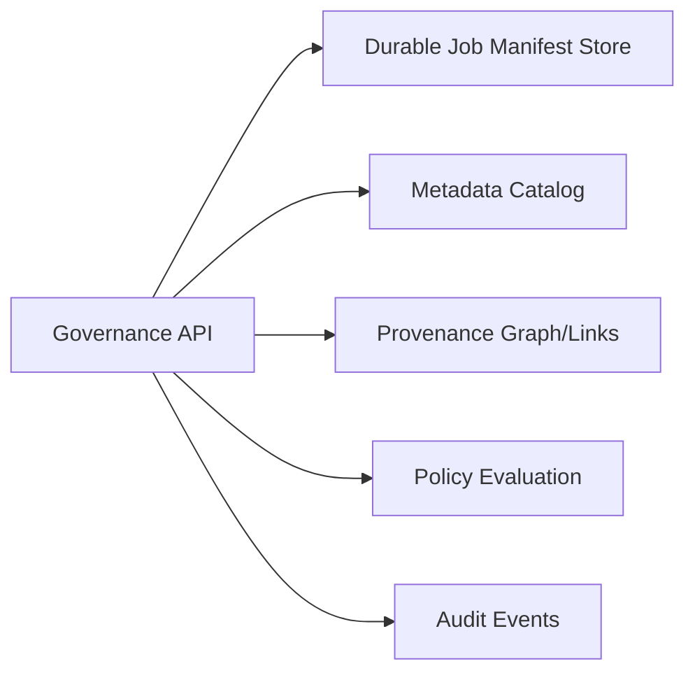

# Governance & Orchestration Control Plane

Alignment anchors

- Frontend UX source of truth: [FRONTEND_UI.md](/docuentation/frontend/FRONTEND_UI.md)
- Execution backlog: [../TODO.md](/docuentation/planning/TODO.md)
- Delivery plan: [../ROADMAP.md](/ROADMAP.md)

The Governance Plane is the authoritative system of record for orchestration metadata, policy, lineage, and audit behavior.

## 1. Scope and role

Primary responsibilities:

- accept and validate orchestration requests
- track job lifecycle and state transitions
- provide durable, queryable governance records
- anchor provenance and policy outcomes

## 2. Current implementation status

### Implemented

- Java Spring Boot service scaffold
- API baseline:
  - `GET /api/v1/health`
  - `POST /api/v1/ingest`
  - `POST /api/v1/jobs`
  - `GET /api/v1/jobs/{id}`
- OpenAPI contract and fixture validation path

### In progress

- durable job store
- complete lifecycle transitions and cancellation semantics
- richer query APIs for frontend jobs and datasets surfaces

### Planned

- authN/authZ enforcement
- policy decision traceability
- immutable audit streams and signatures

## 3. Component model

## 4. API contract and frontend dependency

The frontend `Jobs` page depends on:

- `POST /api/v1/jobs`
- `GET /api/v1/jobs/{id}`

Required near-term API expansion:

- `GET /api/v1/jobs` with filtering and pagination
- `POST /api/v1/jobs/{id}/cancel`
- dataset-oriented read APIs for `Datasets` frontend route

## 5. Lifecycle semantics (target)

Canonical states:

- `QUEUED`
- `RUNNING`
- `COMPLETED`
- `FAILED`
- `CANCELED`
- `TIMED_OUT`

Requirements:

- monotonic state progression
- explicit transition timestamps
- idempotent state updates
- restart-safe persistence

## 6. Reliability and integrity controls

Minimum required controls:

- request validation at API boundary
- trace-id and request-id propagation
- optimistic concurrency for updates
- clear error taxonomy for UI and automation

## 7. Security posture

Near-term:

- environment-based protective mode and endpoint hardening

Target:

- token-based auth for user-facing calls
- service-to-service trust controls
- role-aware policy enforcement and auditable denials

## 8. Frontend alignment rules

1. No frontend orchestration feature should depend on undocumented status values.
2. Every user-visible job action must map to a single API contract operation.
3. Error responses must include enough context for actionable UI messaging.

## 9. Related docs

- [JAVA_GOVERNANCE_SPEC.md](/docuentation/governance/JAVA_GOVERNANCE_SPEC.md)
- [PROVENANCE.md](/docuentation/provenance/PROVENANCE.md)
- [DATA_TRUST_PLATFORM.md](/docuentation/data/DATA_TRUST_PLATFORM.md)
- [FRONTEND_UI.md](/docuentation/frontend/FRONTEND_UI.md)
