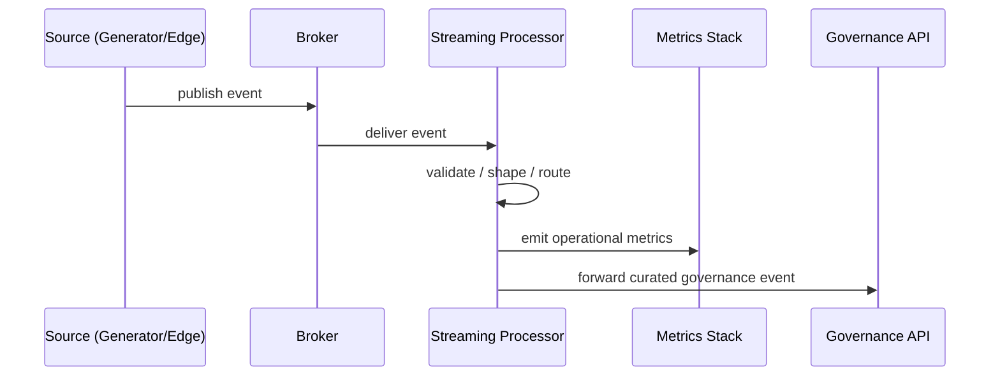

# Operational Streaming Plane

Alignment anchors

- Frontend UX source of truth: [FRONTEND_UI.md](/docuentation/frontend/FRONTEND_UI.md)
- Execution backlog: [../TODO.md](/docuentation/planning/TODO.md)
- Delivery plan: [../ROADMAP.md](/ROADMAP.md)

The Operational Streaming Plane is responsible for low-latency telemetry handling and protective flow control.

## 1. Scope

Core responsibilities:

- ingest telemetry/events from generators and edge sources
- apply lightweight validation and shaping
- expose operational metrics for dashboards and alerting
- hand off curated records to governance workflows when durable semantics are required

## 2. Status

### Implemented

- local data-generator flow
- Kafka-based ingest path in local environment
- Prometheus/Grafana observability baseline

### In progress

- durable curated-event handoff guarantees to governance plane
- topic/schema governance and replay controls

### Planned

- full go-processor service layer with hardened backpressure/degradation modes

## 3. Flow model

## 4. Frontend dependencies

Frontend pages depending on streaming-plane outputs:

- `Overview`
- `Telemetry`
- `Topology`
- portions of `Diagnostics`

Required UX properties:

- data freshness signaling
- graceful stale-state behavior
- clear distinction between missing data and healthy zero values

## 5. Reliability priorities

Near-term priorities:

1. idempotent handoff semantics toward governance APIs
2. trace-id propagation across broker and API boundaries
3. DLQ and replay runbook for failed processing flows

## 6. Related docs

- [MESSAGING_INTEGRATION.md](/docuentation/messaging/MESSAGING_INTEGRATION.md)
- [INFRA_TOPOLOGY.md](/docuentation/infra/INFRA_TOPOLOGY.md)
- [GOVERNANCE_CONTROL_PLANE.md](/docuentation/governance/GOVERNANCE_CONTROL_PLANE.md)
