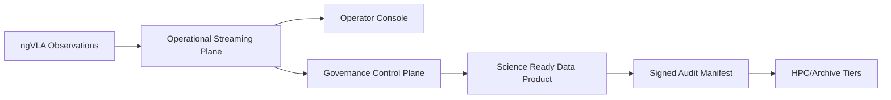

# NGVLA Mission Alignment

Alignment anchors
- Frontend UX source of truth: [FRONTEND_UI.md](/docuentation/frontend/FRONTEND_UI.md)
- Execution backlog: [../TODO.md](/docuentation/planning/TODO.md)
- Delivery plan: [../ROADMAP.md](/ROADMAP.md)

This document defines why Cosmic Horizon exists for ngVLA-class operations and how to evaluate whether implementation work is mission-serving.

## 1. Mission statement

Cosmic Horizon exists to help ngVLA operations turn extreme data volume into trusted, actionable scientific outcomes by combining:
- real-time operational awareness
- durable governance and provenance
- reproducible SRDP lifecycle control

## 2. Mission outcomes (authoritative)

1. Observatory continuity:
- Operators identify active system health and incidents quickly enough to protect observation runs and reduce avoidable data loss.

2. Reproducible science:
- Every promoted Science Ready Data Product (SRDP) can be traced and reproduced from inputs, workflow definition, parameters, and execution context.

3. Compute-to-archive efficiency:
- Data processing is orchestrated near HPC archive tiers where feasible, minimizing high-cost large-scale transfers.

4. Institutional trust and audit:
- Governance records and manifests provide durable, queryable evidence for policy, lineage, and publication readiness.

5. Human decision speed:
- Engineers and stewards can submit, monitor, diagnose, and recover workflows from a single operator console.

## 2.1 Mission flow (conceptual)

## 3. Non-goals (current phase)

- Full replacement of HPC runtime internals.
- Full production security posture in local dev mode.
- Perfect end-state architecture before baseline operational workflows are proven.

## 4. Program risks to mission

1. Technology-first drift:
- New components ship without explicit connection to ngVLA mission outcomes.

2. Contract drift:
- UI/implementation behavior diverges from OpenAPI, fixture, or lifecycle semantics.

3. Provenance under-specification:
- Workflow completion exists without required metadata to support SRDP reproducibility.

4. Reliability gap:
- Streaming and governance handoff failures are not visible or replay-safe.

## 5. Mission-first planning rule

Any roadmap item must include:
- the mission outcome it improves
- the measurable operator/science impact
- the contract/test evidence that validates the claim

## 6. Related docs

- [EXECUTIVE_SUMMARY.md](/docuentation/overview/EXECUTIVE_SUMMARY.md)
- [DATA_TRUST_PLATFORM.md](/docuentation/data/DATA_TRUST_PLATFORM.md)
- [PROVENANCE.md](/docuentation/provenance/PROVENANCE.md)
- [storage/STORAGE_EXECUTIVE_SUMMARY.md](/docuentation/storage/STORAGE_EXECUTIVE_SUMMARY.md)
- [MISSION_TO_CAPABILITY_TRACE.md](/docuentation/ngvla/MISSION_TO_CAPABILITY_TRACE.md)
- [MISSION_GATES.md](/docuentation/ngvla/MISSION_GATES.md)
