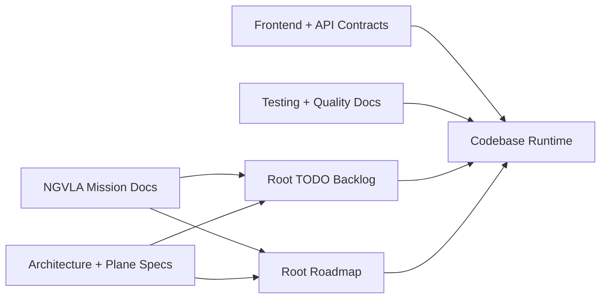

# Documentation Alignment Matrix (2026-03-02, Rev 4)

Alignment anchors
- Frontend UX source of truth: [FRONTEND_UI.md](/docuentation/frontend/FRONTEND_UI.md)
- Execution backlog: [../TODO.md](/docuentation/planning/TODO.md)
- Delivery roadmap: [../ROADMAP.md](/ROADMAP.md)

Purpose:
- prevent docs/runtime/roadmap drift
- keep implemented vs in-progress vs planned explicit
- keep communication clear for mixed audiences (scientists to HR)

## Status legend

- `aligned`: consistent with current codebase and mission direction
- `needs-update`: directionally valid but missing current implementation or policy context
- `planned`: intentionally future-state, not yet runtime-complete

## How sources connect

## Root documentation status

| Document group | Status | Alignment notes |
|---|---|---|
| Root docs entrypoint + grouped READMEs | needs-update | Root `README.md` is not present, but tooling/docs still reference it (`scripts/check-docs.sh`, TODO references). |
| Mission docs (`NGVLA_MISSION_ALIGNMENT`, `MISSION_TO_CAPABILITY_TRACE`, `MISSION_GATES`, `DECISIONS`) | aligned | Canonical mission framing and gate model now exist. |
| Core architecture docs (`ARCHITECTURE`, `OPERATIONAL_STREAMING_PLANE`, `GOVERNANCE_CONTROL_PLANE`) | aligned | Implemented/in-progress/planned framing matches repository status. |
| Product and UX docs (`FRONTEND_UI`, `PROFESSIONAL_CONSOLE_SPEC`, `frontend/features/*`) | needs-update | Footer load profile exists, but machine-load control remains scaffolded (polling cadence only; no runtime generator control API). |
| Contracts and API docs (`JAVA_GOVERNANCE_SPEC`, `API_CONTRACT_STATUS`) | aligned | Baseline endpoints and drift controls are documented and consistent. |
| Trust and lineage docs (`DATA_TRUST_PLATFORM`, `PROVENANCE`, `storage/*`) | planned | Strategic direction is clear; several controls remain future-state. |
| Environment/deployment/testing docs (`GETTING_STARTED`, `ENVIRONMENT`, `DEPLOYMENT`, testing docs) | aligned | Current commands and quality gates are represented. |
| `docuentation/planning/TODO.md` (simulation harness) | aligned | Explicitly secondary to root `TODO.md`; remains useful as scoped runbook/backlog. |

## Drift risks observed

1. Mission intent can still be overshadowed by implementation detail if new tasks skip mission linkage fields.
2. Storage and provenance docs are strategy-heavy; runtime checkpoints need periodic status tags.
3. Contract shape decisions (for example job control semantics) remain partially open and should be finalized in ADR flow.
4. Root docs entrypoint drift: missing root `README.md` while scripts and docs still depend on it.
5. Security wording drift: docs describe auth as pending in some places, while baseline header enforcement is implemented and token/policy validation is the remaining gap.

## Alignment decisions (effective immediately)

1. Root [TODO.md](/docuentation/planning/TODO.md) is the only canonical execution backlog.
2. Root [ROADMAP.md](/ROADMAP.md) is the only canonical phase plan.
3. Mission docs are required references for new backlog and roadmap items.
4. For major feature PRs, update mission trace and decision log when scope or semantics change.

## Documentation follow-up now required

1. Add mission linkage fields to existing high-priority backlog/roadmap items over time (not only new items).
2. Add explicit status tags (`implemented`, `in-progress`, `planned`) to long-form storage sections as runtime integration lands.
3. Keep audience navigation current in [AUDIENCE_GUIDE.md](/docuentation/overview/AUDIENCE_GUIDE.md).
4. Choose one root-doc strategy and apply consistently:
   - add a root `README.md`, or
   - remove root `README.md` references from scripts/docs and point to [README.md](/docuentation/README.md) in `docuentation/`.
5. Keep stress-profile language explicit as `scaffold` until backend runtime load controls are delivered.
