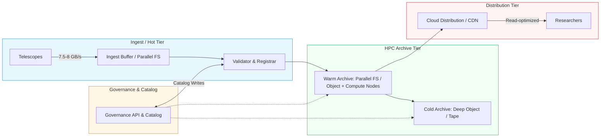

# Storage Architecture Overview

This document describes the hybrid tiered storage topology and its interactions with the Governance Plane and compute fabric.

Architecture diagram

Key interfaces

- Ingest -> Governance: dataset registration API call assigns persistent identifiers and initial metadata.
- Governance -> Archive: cataloged locations and retention policies drive lifecycle transitions.
- Archive -> Distribution: derived products are exported or mirrored to distribution tier under governance rules.

Data placement and federation

- Localized ingest buffers accept raw visibilities and provide short-term fault-tolerant storage to absorb bursts and network disruptions.
- The HPC Archive is the authoritative store; it may be federated across multiple national centers for redundancy and geolocation.
- The Distribution Tier holds derived products and indexed subsets optimized for global retrieval.

Observability and operational controls

- Each transition emits events consumed by the Operational Streaming Plane for monitoring and SLO enforcement.
- The Governance Plane supports audits, retention enforcement, and provenance validation hooks triggered during transitions.
