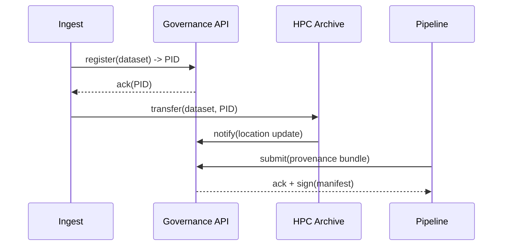

# Storage Governance & Catalog Integration

The governance layer provides the logical control plane for the storage system: dataset identity, provenance, lifecycle orchestration, access control, and audit manifests.

Metadata categories

- Structural Metadata: dataset identifiers, relationships, containerization and file-level layout

- Administrative Metadata: ownership, access control lists, retention rules, billing tags

- Provenance Metadata: pipeline versions, parameters, container digests, inputs, execution traces

Catalog responsibilities

- Provide a single authoritative mapping from dataset PID -> physical locations across tiers and providers

- Enforce minimal provenance checklists before a dataset may be published or mirrored

- Orchestrate lifecycle actions (policy-driven migrations, retention enforcement)

- Record audit manifests and sign them for long-term verifiability

APIs and contracts

- Dataset Registration API: called at ingest to create a PID and initial metadata

- Location Update API: invoked when datasets are moved between tiers

- Provenance Submission API: used by pipelines to attach provenance bundles and execution traces

- Retention & Policy API: allows operators to define lifecycle rules that the governance engine executes

Mermaid: governance lifecycle events

## Legend

- `Ingest`: edge or gateway producing dataset registrations

- `Governance API`: control plane handling PIDs and manifests

- `HPC Archive`: archival storage target

- `Pipeline`: processing job that submits provenance bundles

Auditability

- Each promoted SRDP must have a signed manifest containing hashes of inputs and outputs.

- Manifests are stored in the Governance Plane and optionally archived in long-term stores with replication.

Interoperability

- Design the Governance APIs to be storage-agnostic: underlying object/tape/backends are implementation details.

- Support federation: catalogs can federate indices and location pointers across national partners while preserving a global PID namespace.
