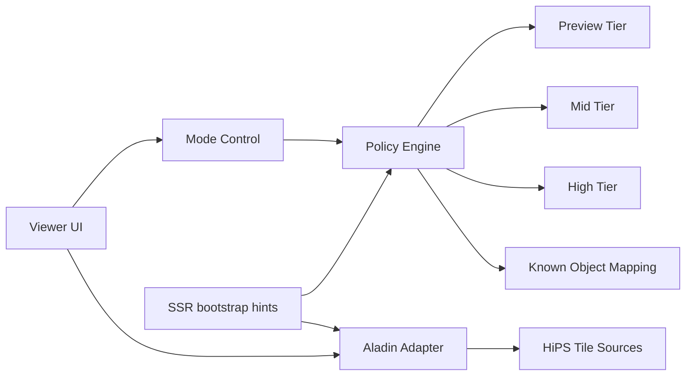

# Viewer (Mode B) — Progressive High-Resolution Strategy

Alignment anchors

- Frontend UX source of truth: [FRONTEND_UI.md](/docuentation/frontend/FRONTEND_UI.md)
- Execution backlog: [../TODO.md](/docuentation/planning/TODO.md)
- Delivery plan: [../ROADMAP.md](/ROADMAP.md)

## Objective

Mode B introduces progressive high-resolution imagery behavior in the Viewer:

- Keep a fast wide-field survey for initial navigation.
- Switch to higher-resolution surveys as zoom increases.
- Use known-object hints to prefer better public surveys when available.
- Provide a manual lower-left control so operators can force high-resolution mode.

## Why this is needed

- Wide-field browsing and deep zoom have different performance and fidelity needs.
- A single fixed survey is not optimal across all zoom levels.
- Operators/scientists need predictable control over quality vs latency behavior.

## Scope for current implementation

- Current app path: `apps/frontend` Viewer (Aladin Lite integration).
- Mode A: default fast preview survey.
- Mode B: progressive survey switching plus manual high-resolution control.
- Out of scope for first iteration: full custom renderer replacement.

## SSR realities

Aladin does client-side rendering and tile fetching. SSR cannot render final imagery.

SSR can still help by:

- preloading likely tile/catalog URLs
- delivering initial viewer config (target, fov, survey priority list)
- reducing first-interaction latency through cache warming

SSR cannot:

- execute full Aladin render pipeline on server
- replace client-side tile composition behavior

## UX behavior

Required controls:

- Lower-left toggle group:
  - `Auto` (default)
  - `High Resolution`
  - `Preview`
- Survey/source badge showing current active survey and source-state (`live`, `fallback`, `mock`, `stale`).

Required switching behavior:

- `Auto` mode:
  - use FOV thresholds to switch survey tiers
  - apply known-object survey preference map when object is recognized
  - fall back gracefully when target survey is unavailable
- `High Resolution` mode:
  - prefer highest configured survey tier at current sky location
  - continue fallback cascade if tiles fail
- `Preview` mode:
  - keep fast baseline survey regardless of zoom

## Survey-tier strategy (initial)

- Tier 0 (preview): robust wide-field survey (current DSS2 baseline)
- Tier 1 (mid zoom): higher-resolution HiPS where available
- Tier 2 (deep zoom): highest-resolution public HiPS or object-specialized survey

Selection inputs:

- FOV/zoom
- target/object identifier
- survey availability and tile load error rate
- manual override mode

## Integration architecture

## Public-source integration notes

- Use public HiPS sources with stable terms and availability.
- Keep survey registry configurable.
- Track CORS and outage behavior per source.
- Log source switches and tile failures for diagnostics.

## Decision gate: remain on Aladin vs new viewer engine

Stay on Aladin if:

- progressive switching and controls work reliably
- deep zoom meets latency and visual quality targets
- required interactions are achievable without fragile hacks

Evaluate new viewer engine if:

- Aladin API limits block required operations
- high-resolution mode is unstable across key objects
- required interactions (advanced blending/cube slicing/etc.) cannot be delivered

Possible next-engine paths (evaluation only in this phase):

- OpenLayers/Cesium/WebGL custom tile stack
- FITS/WebGL specialized renderer path
- hybrid adapter model (Aladin for sky navigation, custom renderer for deep analysis)

## Implementation phases

Phase 1:

- add lower-left mode control
- implement FOV-tier survey switching in `Auto`
- add survey/source badge
- add object-aware survey mapping scaffold

Phase 2:

- add robust fallback cascade and source health tracking
- add metrics: switch counts, tile load latency, error rates
- add e2e coverage for zoom-driven switching and manual overrides

Phase 3:

- run capability benchmark against requirements
- decide whether to continue with Aladin-only Mode B or begin new viewer engine track

## Testing requirements

Unit:

- policy engine threshold logic
- manual override precedence
- known-object mapping selection

Integration:

- survey switching under tile failure
- source fallback and recovery behavior

E2E:

- zoom in/out transitions trigger expected tier changes in `Auto`
- `High Resolution` and `Preview` overrides work as expected
- UI displays active survey/source-state correctly

## Acceptance criteria

- Deep zoom switches to higher-resolution surveys when available.
- Manual lower-left control overrides automatic behavior.
- Viewer remains responsive during switching and fallback.
- Metrics and tests provide reproducible evidence of behavior.
