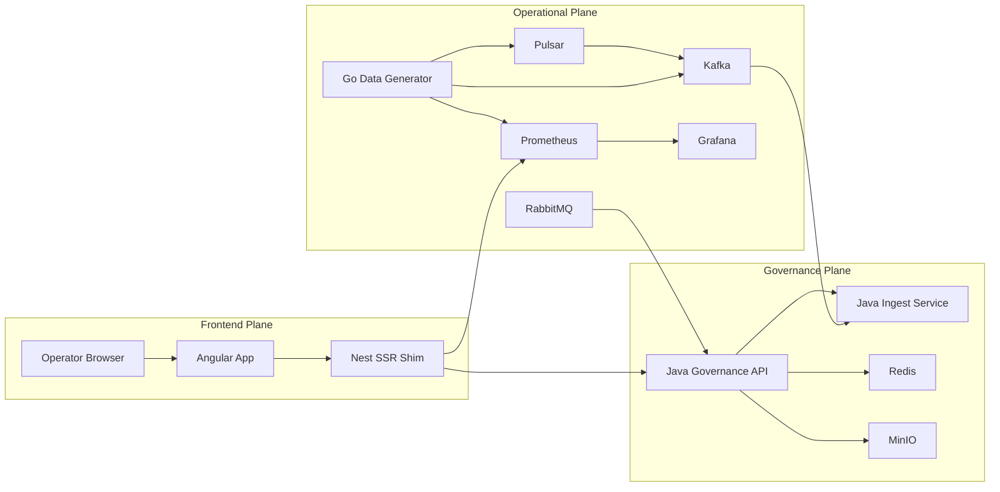
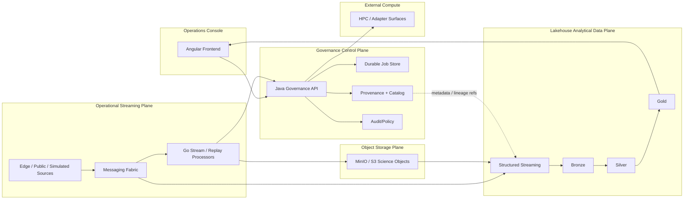

# Cosmic Horizon Architecture (Current + Target)

Alignment anchors

- Frontend UX source of truth: [FRONTEND_UI.md](/docuentation/frontend/FRONTEND_UI.md)
- Execution backlog: [../TODO.md](/docuentation/planning/TODO.md)
- Delivery plan: [../ROADMAP.md](/ROADMAP.md)

This document defines the architecture as it exists today and the intended direction.  
It is the canonical bridge between conceptual design and implementation reality.

## 1. Architectural intent _(implemented + planned extensions)_

Cosmic Horizon is a hybrid control platform composed of:

1. Operational Streaming Plane (Go-centric)

- low-latency telemetry ingestion, aggregation, and resilience controls

1. Governance & Orchestration Control Plane (Java-centric)

- authoritative metadata, job lifecycle, policy, and audit semantics

1. Frontend Operations Console (Angular)

- operator-facing control-room UX for awareness, orchestration, and diagnostics

1. Lakehouse Analytical Data Plane _(planned)_

- structured streaming ingestion, medallion transformations, query-optimized analytical tables, and governed data products layered over the existing broker and object-storage foundations
- does **not** replace the Governance Plane or authoritative MinIO/S3 science-object storage

## 2. Status model _(implemented documentation of current/in-progress/planned)_

### Implemented (baseline)

- Angular frontend shell with telemetry/topology/diagnostics/viewer surfaces
- Nest SSR shim for frontend APIs and proxy behavior
- Go data generator and local observability stack
- Java governance API baseline:
  - `GET /api/v1/health`
  - `POST /api/v1/ingest`
  - `POST /api/v1/jobs`
  - `GET /api/v1/jobs/{id}`
- OpenAPI contract and fixture validation in CI

### In progress

- Durable governance job storage and full lifecycle semantics
- Frontend transition from telemetry-first demo to orchestration console

### Planned

- End-to-end streaming-to-governance contract hardening
- External compute adapter integration (HPC/TACC/CosmicAI)
- Production security and policy enforcement layers
- Lakehouse Analytical Data Plane:
  - Kafka-first structured streaming proof
  - Bronze / Silver / Gold Delta tables
  - real/public astronomy data replay or extraction
  - schema evolution, deduplication, quarantine, late-data, and lineage evidence
  - Pulsar direct/bridge comparison after the Kafka baseline is stable

## 3. Current runtime topology _(implemented)_

> **Service naming note:** The Docker compose stacks use container names `java-governance` and `java-ingest` to reflect their filesystem locations; documentation and API references generally call them "governance service" and "ingest bridge" for readability. These names are now aligned in this document.
>
> **Runtime model note:** local development is intentionally hybrid, not fully containerized. Docker Compose runs infrastructure and Java services, while the Nest SSR shim and Angular dev server run on the host for faster iteration.

## 4. Target reference topology _(planned)_

The target topology intentionally separates **authoritative science-object storage** from **analytical table storage**. Large Measurement Sets, FITS products, calibration artifacts, and archive bundles remain in MinIO/S3-compatible storage; the lakehouse stores structured events, metadata, quality results, lineage references, and analytical products.

Detailed Lakehouse Initiative diagrams are maintained in [../lakehouse/docs/LAKEHOUSE_TOPOLOGY.md](../lakehouse/docs/LAKEHOUSE_TOPOLOGY.md), with reusable Mermaid sources under [../lakehouse/diagrams/](../lakehouse/diagrams/README.md).

## 5. Frontend architecture implications _(in progress)_

The frontend must evolve to match control-plane maturity:

1. Near-term pages:

- `Overview`, `Jobs`, `Datasets`, `Topology`, `Telemetry`, `Diagnostics`, `Viewer`, `Settings`

1. Critical missing surfaces:

- `Jobs` and `Datasets` as first-class routes and workflows

1. Data-state contract:

- every page must represent `loading`, `empty`, `stale`, `error`, and `recovered` states

The Lakehouse Initiative does not require immediate new frontend routes. Gold analytical products should be surfaced only after the initial data path has runnable evidence and a concrete operator/scientist use case. The current implementation is intentionally additive: the Lakehouse proof slice appears in the existing dashboard and API surface as an analytical overlay, while the rest of the platform continues to rely on the current Go generator, broker transport, and Java governance services for operational truth.

## 6. Architectural constraints _(implemented + planned initiative guardrails)_

- No architecture claims without runnable baseline or explicit planned status.
- APIs and UI must stay contract-synchronized through OpenAPI + fixture validation.
- Local dev and production assumptions must be explicitly separated.
- MinIO/S3 remains authoritative for large scientific objects unless an explicit architecture decision changes that ownership.
- The Java Governance Plane remains authoritative for application-level jobs, dataset registration, policy, provenance, and audit semantics.
- Lakehouse copies of governance entities are analytical projections unless ownership is explicitly changed.
- Bronze must preserve source fidelity sufficient for replay and forensic analysis.
- Gold tables must name a concrete consumer/question rather than becoming ungoverned duplicate stores.

## 7. Decision checkpoints _(implemented + planned)_

Use these checkpoints when changing architecture:

1. Does this reduce docs/runtime drift?
2. Does this strengthen control-plane reliability?
3. Does this improve operator decision speed in the frontend?
4. Does this preserve HPC adapter pathway without overcommitting current scope?
5. Does the lakehouse addition preserve authoritative object-storage and Governance Plane boundaries?
6. Is a lakehouse topology edge backed by runnable evidence or clearly labeled planned?
7. Does each derived analytical product preserve traceability to its source event/object and transformation?

## 8. Related docs _(implemented + planned)_

- [OPERATIONAL_STREAMING_PLANE.md](/docuentation/infra/OPERATIONAL_STREAMING_PLANE.md)
- [GOVERNANCE_CONTROL_PLANE.md](/docuentation/governance/GOVERNANCE_CONTROL_PLANE.md)
- [JAVA_GOVERNANCE_SPEC.md](/docuentation/governance/JAVA_GOVERNANCE_SPEC.md)
- [FRONTEND_UI.md](/docuentation/frontend/FRONTEND_UI.md)
- [ALIGNMENT.md](/docuentation/overview/ALIGNMENT.md)
- [../lakehouse/README.md](../lakehouse/README.md) — Lakehouse Initiative scope and progression
- [../lakehouse/docs/LAKEHOUSE_TOPOLOGY.md](../lakehouse/docs/LAKEHOUSE_TOPOLOGY.md) — integrated physical/logical topology
- [../lakehouse/docs/MEDALLION_ARCHITECTURE.md](../lakehouse/docs/MEDALLION_ARCHITECTURE.md) — Bronze/Silver/Gold contracts
- [../lakehouse/docs/STORAGE_RESPONSIBILITIES.md](../lakehouse/docs/STORAGE_RESPONSIBILITIES.md) — object-store versus analytical-table ownership
- [../lakehouse/docs/REAL_DATA_SOURCES.md](../lakehouse/docs/REAL_DATA_SOURCES.md) — public astronomy metadata sources for the first real-data proof slice
- [../lakehouse/docs/ESO_PROOF_SLICE_BRIEF.md](../lakehouse/docs/ESO_PROOF_SLICE_BRIEF.md) — concrete ESO-based proof-slice brief for the initial Lakehouse implementation
- [../lakehouse/diagrams/README.md](../lakehouse/diagrams/README.md) — standalone Mermaid source catalog
