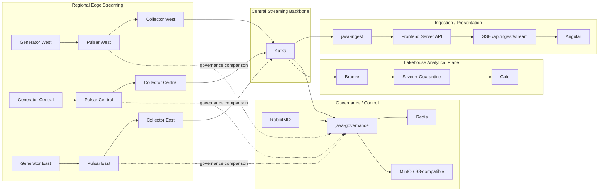

# Cosmic Horizon Architecture (Current + Target)

Alignment anchors

- Frontend UX source of truth: [FRONTEND_UI.md](../frontend/FRONTEND_UI.md)
- Topology repair contract: [TOPOLOGY_DATA_PATH_REPAIR.md](./TOPOLOGY_DATA_PATH_REPAIR.md)
- Architecture decisions: [DECISIONS.md](./DECISIONS.md)
- Delivery plan: [ROADMAP.md](../../ROADMAP.md)

This document defines the architecture as it exists today and the intended direction. It is the canonical bridge between conceptual design and implementation reality.

## 1. Architectural intent

Cosmic Horizon is a hybrid control and analytical platform composed of four planes.

### Operational Streaming Plane (Go-centric)

- Generates or admits low-latency operational events.
- Uses geographically independent Pulsar clusters as regional edge ingestion.
- Uses one `pulsar-collector` per region to bridge source-faithful payloads into Kafka.
- Uses Kafka as the central durable streaming backbone and replay boundary.

### Governance & Orchestration Control Plane (Java-centric)

- Owns authoritative metadata, job lifecycle, policy, audit, and governance semantics.
- May consume Kafka, Pulsar, and RabbitMQ where broker-comparison/governance behavior is explicitly required.
- RabbitMQ remains a parallel control/governance path; it is **not** an inline hop between Pulsar and Kafka.

### Frontend Operations Console (Angular + Nest SSR)

- `java-ingest` projects Kafka events into the frontend server API.
- The Nest server republishes accepted events over `/api/ingest/stream` as SSE.
- Angular consumes that dedicated ingest stream separately from the older broker-events/telemetry feeds.

### Lakehouse Analytical Data Plane

- Kafka is the transport boundary into analytical ingestion.
- Bronze preserves source fidelity and identity required for replay/forensics.
- Silver performs canonicalization, quality validation, deduplication, and quarantine.
- Gold serves explicit analytical consumers/questions.
- MinIO/S3 remains authoritative for large scientific objects; lakehouse tables are structured analytical representations, not replacements for object storage.

## 2. Canonical data paths

### 2.1 Transport repair path

```text
data-generator
  -> regional Pulsar
    -> regional pulsar-collector
      -> central Kafka
```

Three regional Pulsar clusters and collectors are available through the opt-in geo compose profile. Each collector preserves the Pulsar payload byte-for-byte and adds transport attribution in Kafka headers.

### 2.2 Ingestion and presentation path

```text
Kafka
  -> java-ingest
    -> frontend server API (/api/ingest/events)
      -> SSE (/api/ingest/stream)
        -> Angular IngestEventStreamService
```

This path is a projection of the durable Kafka record for operator visibility. It does not move durability ownership into the frontend.

### 2.3 Lakehouse path

```text
Kafka
  -> Bronze
    -> Silver / quarantine
      -> Gold
        -> query / diagnostics / analytical consumers
```

Kafka is the stable boundary between the operational transport repair and the lakehouse initiative. Pulsar and RabbitMQ concerns should not be duplicated throughout lakehouse transformation code unless a later ADR explicitly changes that boundary.

### 2.4 Parallel paths

These are intentionally separate and must not be drawn as one chain:

- `Kafka | Pulsar | RabbitMQ -> java-governance` for governance/broker comparison and applicable DLQ/control behavior.
- `RabbitMQ -> control consumers` for low-latency control commands.
- `data-generator -> file sink -> SSR telemetry` for disk-derived stress telemetry.
- `Kafka -> lakehouse` for analytical ingestion.

## 3. Current runtime topology

> Local development is intentionally hybrid. Docker Compose runs infrastructure and Java services while the Nest SSR shim and Angular dev server may run on the host.



The geo profile is opt-in; the architectural role assignment is still canonical even when a smaller local profile runs fewer regional services.

## 4. Event identity, provenance, and delivery semantics

### Event identity

- The generator creates one immutable UUID-v4 `event-id` when publishing a record to the regional Pulsar edge.
- The collector copies `event-id` unchanged into Kafka headers.
- Collector attribution also carries region, Pulsar message ID, collector-forwarded timestamp, and canonical Kafka topic.
- `java-ingest` projects `eventId` and collector attribution into the frontend envelope; structured JSON payloads also receive `eventId` so the SSE/Angular boundary does not depend on Kafka headers.

### Delivery semantics

- Generator -> Pulsar: acknowledged publish.
- Pulsar -> collector -> Kafka: **at-least-once**. The collector ACKs Pulsar only after Kafka accepts the record; failed forwards are negative-acked for redelivery.
- Kafka -> java-ingest -> frontend API: Kafka remains durable. Failed API forwarding uses non-blocking Kafka retry topics and terminates in a dedicated `.forward-dlt` after retry exhaustion.
- `java-ingest` performs bounded process-local duplicate suppression keyed by `eventId` after a successful frontend projection.
- Angular also suppresses replay duplicates by `eventId` within its bounded presentation history.

These protections are deliberately described as at-least-once plus idempotency/deduplication. They do **not** claim global exactly-once behavior across service restarts. Durable consumers must continue to treat `eventId` as the idempotency key.

## 5. Evidence and acceptance contract

Architecture claims must be backed by runnable evidence or labeled planned.

For the repaired transport/presentation path, the acceptance event must prove one event with the same identity and attribution reaches the Angular-facing SSE contract:

```text
generator eventId X
  -> Pulsar
    -> collector(region R)
      -> Kafka(event-id X, collector-region R)
        -> java-ingest
          -> API
            -> SSE
              -> Angular eventId X, region R, source S
```

Run the runtime probe while the repaired stack is active:

```bash
node scripts/verify-ingest-e2e.mjs
```

The probe passes only for an actual SSE event that contains:

- `broker = kafka`
- non-empty `collectorRegion`
- non-empty `source`
- non-empty `payload.eventId`

Component tests additionally assert UUID creation, collector propagation, Java retry/deduplication/provenance projection, frontend SSE preservation, and Angular replay deduplication.

## 6. Frontend architecture implications

Near-term operator surfaces remain:

- `Overview`
- `Jobs`
- `Datasets`
- `Topology`
- `Telemetry`
- `Diagnostics`
- `Viewer`
- `Settings`

All data surfaces must represent `loading`, `empty`, `stale`, `error`, and `recovered` states.

The ingest SSE stream is intentionally separate from disk-derived telemetry and the older broker-events feed. UI binding can evolve independently without changing the repaired transport contract.

Gold analytical products should only be surfaced when a concrete operator/scientist question exists and the underlying data path has runnable evidence.

## 7. Architectural constraints

- No architecture claims without runnable evidence or explicit planned status.
- Pulsar is regional/edge ingestion; Kafka is the central durable streaming backbone.
- RabbitMQ is a parallel control/governance path, never an undocumented inline Pulsar-to-Kafka hop.
- Kafka is the boundary into the lakehouse unless an accepted ADR changes it.
- APIs and UI must stay contract-synchronized through tests and documented envelopes.
- Local development and production assumptions must be explicitly separated.
- MinIO/S3 remains authoritative for large scientific objects unless an explicit architecture decision changes ownership.
- The Java Governance Plane remains authoritative for jobs, dataset registration, policy, provenance, and audit semantics.
- Bronze preserves source fidelity and event identity sufficient for replay and forensic analysis.
- Gold tables name a concrete consumer/question rather than becoming ungoverned duplicate stores.
- At-least-once flows require immutable identity and replay-safe consumers.

## 8. Decision checkpoints

Use these checkpoints when changing architecture:

1. Does this reduce docs/runtime drift?
2. Does this preserve the Pulsar-edge / Kafka-backbone / RabbitMQ-parallel role split?
3. Is event identity preserved across every asynchronous hop?
4. Is a failure recoverable through retry, DLT/DLQ, replay, or an explicitly documented alternative?
5. Is duplicate behavior explicit and tested?
6. Does this improve operator decision speed without moving durability into the UI?
7. Does the lakehouse addition preserve authoritative object-storage and Governance Plane boundaries?
8. Is every topology edge backed by runnable evidence or clearly labeled planned?

## 9. Related docs

- [TOPOLOGY_DATA_PATH_REPAIR.md](./TOPOLOGY_DATA_PATH_REPAIR.md)
- [DECISIONS.md](./DECISIONS.md)
- [BROKER_SAFETY_RUNBOOK.md](../BROKER_SAFETY_RUNBOOK.md)
- [07-messaging.md](../development/coding-standards/07-messaging.md)
- [DATA_ARCHITECTURE.md](../data/DATA_ARCHITECTURE.md)
- [FRONTEND_UI.md](../frontend/FRONTEND_UI.md)
- [Lakehouse Initiative README](../lakehouse/README.md)
- [PR41 MVP](../lakehouse/docs/PR41_MVP_LAKEHOUSE.md)
