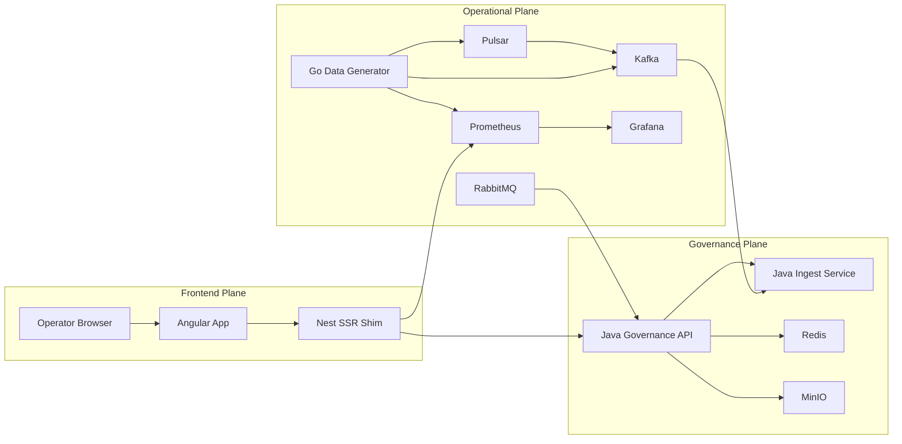
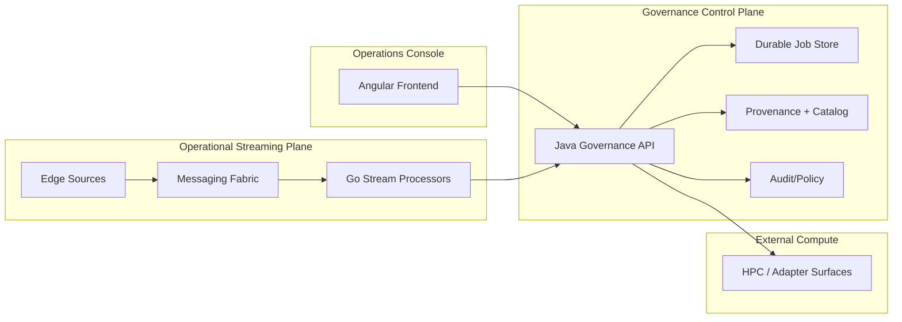

# Cosmic Horizon Architecture (Current + Target)

Alignment anchors

- Frontend UX source of truth: [FRONTEND_UI.md](/docuentation/frontend/FRONTEND_UI.md)
- Execution backlog: [../TODO.md](/docuentation/planning/TODO.md)
- Delivery plan: [../ROADMAP.md](/ROADMAP.md)

This document defines the architecture as it exists today and the intended direction.  
It is the canonical bridge between conceptual design and implementation reality.

## 1. Architectural intent _(implemented)_

Cosmic Horizon is a hybrid control platform composed of:

1. Operational Streaming Plane (Go-centric)

- low-latency telemetry ingestion, aggregation, and resilience controls

1. Governance & Orchestration Control Plane (Java-centric)

- authoritative metadata, job lifecycle, policy, and audit semantics

1. Frontend Operations Console (Angular)

- operator-facing control-room UX for awareness, orchestration, and diagnostics

## 2. Status model _(implemented documentation of current/in-progress/planned)_

### Implemented (baseline)

- Angular frontend shell with telemetry/topology/diagnostics/viewer surfaces
- Nest SSR shim for frontend APIs and proxy behavior
- Go data generator and local observability stack
- Java governance API baseline:
  - `GET /api/v1/health`
  - `POST /api/v1/ingest`
  - `POST /api/v1/jobs`
  - `GET /api/v1/jobs/{id}`
- OpenAPI contract and fixture validation in CI

### In progress

- Durable governance job storage and full lifecycle semantics
- Frontend transition from telemetry-first demo to orchestration console
- Execution-layer contract shape for schedule blocks, execution plans, and downstream backend startup

### Planned

- End-to-end streaming-to-governance contract hardening
  (Kafka/RabbitMQ/Pulsar implementation now available; parity tests running)
- External compute adapter integration (HPC/TACC/CosmicAI)
- Trident-inspired routing, FSP allocation, and backend fan-out simulation
- Production security and policy enforcement layers

## 3. Current runtime topology _(implemented)_

> **Service naming note:** The Docker compose stacks use container names `java-governance` and `java-ingest` to reflect their filesystem locations; documentation and API references generally call them "governance service" and "ingest bridge" for readability. These names are now aligned in this document.
>
> **Runtime model note:** local development is intentionally hybrid, not fully containerized. Docker Compose runs infrastructure and Java services, while the Nest SSR shim and Angular dev server run on the host for faster iteration.

## 4. Target reference topology _(planned)_

## 5. Frontend architecture implications _(in progress)_

The frontend must evolve to match control-plane maturity:

1. Near-term pages:

- `Overview`, `Jobs`, `Datasets`, `Topology`, `Telemetry`, `Diagnostics`, `Viewer`, `Settings`

## 6. Execution-layer evolution _(in progress)_

The next architectural step is an explicit execution layer between scheduling intent and downstream processing. In this repo that means:

- typed execution plans instead of generic job submission
- validated subarray and spectral configuration payloads
- finite-capacity allocation against Trident-like execution targets
- downstream backend product planning and provenance capture

This is currently a documentation-first design track and not yet a complete runtime implementation.

## 7. Related docs

- [EXECUTION_LAYER_API_SKETCH.md](/docuentation/architecture/EXECUTION_LAYER_API_SKETCH.md)
- [EVENT_ENVELOPE_AND_BROKER_ROLES.md](/docuentation/messaging/EVENT_ENVELOPE_AND_BROKER_ROLES.md)
- [TRIDENT_INTEGRATION_RESEARCH_2026-03-06.md](/docuentation/trident/TRIDENT_INTEGRATION_RESEARCH_2026-03-06.md)
- [TRIDENT_EXECUTION_TEST_MATRIX.md](/docuentation/testing/TRIDENT_EXECUTION_TEST_MATRIX.md)
- [EXECUTION_LAYER_THREAT_MODEL.md](/docuentation/security/EXECUTION_LAYER_THREAT_MODEL.md)

1. Critical missing surfaces:

- `Jobs` and `Datasets` as first-class routes and workflows

1. Data-state contract:

- every page must represent `loading`, `empty`, `stale`, `error`, and `recovered` states

## 6. Architectural constraints _(implemented)_

- No architecture claims without runnable baseline or explicit planned status.
- APIs and UI must stay contract-synchronized through OpenAPI + fixture validation.
- Local dev and production assumptions must be explicitly separated.

## 7. Decision checkpoints _(implemented)_

Use these checkpoints when changing architecture:

1. Does this reduce docs/runtime drift?
2. Does this strengthen control-plane reliability?
3. Does this improve operator decision speed in the frontend?
4. Does this preserve HPC adapter pathway without overcommitting current scope?

## 8. Related docs _(implemented)_

- [OPERATIONAL_STREAMING_PLANE.md](/docuentation/infra/OPERATIONAL_STREAMING_PLANE.md)
- [GOVERNANCE_CONTROL_PLANE.md](/docuentation/governance/GOVERNANCE_CONTROL_PLANE.md)
- [JAVA_GOVERNANCE_SPEC.md](/docuentation/governance/JAVA_GOVERNANCE_SPEC.md)
- [FRONTEND_UI.md](/docuentation/frontend/FRONTEND_UI.md)
- [ALIGNMENT.md](/docuentation/overview/ALIGNMENT.md)
