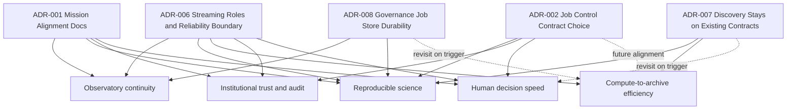

# Decisions Log (Mission-Critical ADRs)

Alignment anchors

- Frontend UX source of truth: [FRONTEND_UI.md](../frontend/FRONTEND_UI.md)
- Topology repair contract: [TOPOLOGY_DATA_PATH_REPAIR.md](./TOPOLOGY_DATA_PATH_REPAIR.md)
- Delivery plan: [ROADMAP.md](../../ROADMAP.md)

Use this file to record architecture and scope decisions that materially affect ngVLA mission outcomes.

## ADR format

- `Date`:
- `Decision ID`:
- `Status`: proposed | accepted | deprecated | superseded
- `Context`:
- `Decision`:
- `Mission outcome impact`:
- `Tradeoffs`:
- `Validation plan`:
- `Links`:

## ADR impact map

---

## 2026-03-01 | ADR-001 | accepted

- Date: 2026-03-01
- Decision ID: ADR-001
- Status: accepted
- Context:
  Phase 2 had strong technical direction but limited explicit mission-level gating.
- Decision:
  Add mission-alignment documents:
  - `NGVLA_MISSION_ALIGNMENT.md`
  - `MISSION_TO_CAPABILITY_TRACE.md`
  - `MISSION_GATES.md`
  - `DECISIONS.md`
- Mission outcome impact:
  Improves focus on observatory continuity, reproducibility, and trust by requiring traceability from backlog and implementation to mission value.
- Tradeoffs:
  Additional documentation maintenance overhead.
- Validation plan:
  Require updates to mission trace/gates for major capability PRs.
- Links:
  - [NGVLA_MISSION_ALIGNMENT.md](../ngvla/NGVLA_MISSION_ALIGNMENT.md)
  - [MISSION_TO_CAPABILITY_TRACE.md](../ngvla/MISSION_TO_CAPABILITY_TRACE.md)
  - [MISSION_GATES.md](../ngvla/MISSION_GATES.md)

## 2026-03-01 | ADR-002 | proposed

- Date: 2026-03-01
- Decision ID: ADR-002
- Status: proposed
- Context:
  Job control API currently uses `/jobs/{id}/transition`; roadmap also references explicit cancel semantics.
- Decision:
  Choose one canonical control contract:
  1. keep generic transition endpoint with strict state machine rules, or
  2. expose explicit action endpoints (`cancel`, `retry`, `pause`) and retain transition internally.
- Mission outcome impact:
  Directly affects operator clarity, automation safety, and audit semantics.
- Tradeoffs:
  Generic endpoint is flexible but can become ambiguous; explicit endpoints improve clarity but increase surface area.
- Validation plan:
  Contract tests + UI action mapping + error taxonomy consistency.
- Links:
  - [API_CONTRACT_STATUS.md](../data/API_CONTRACT_STATUS.md)
  - [ROADMAP.md](../../ROADMAP.md)

## 2026-03-03 | ADR-003 | accepted

- Date: 2026-03-03
- Decision ID: ADR-003
- Status: accepted
- Context:
  Messaging-fabric scope needed explicit implementation defaults for local deployment, control-plane routing, and stress-profile behavior to match ngVLA-scale planning.
- Decision:
  1. Run Pulsar in normal local Docker deployment using a full profile (broker + bookkeeper + required support services), not standalone-only.
  2. Use dynamic per-workflow RabbitMQ queues/exchanges for control-plane command paths.
  3. Apply global footer load profile control (`10%`, `25%`, `50%`, `100%`) to all enabled broker paths (Pulsar, Kafka, RabbitMQ), not Kafka-only behavior.
- Mission outcome impact:
  Improves observatory continuity and operator decision speed by making broker behavior explicit, scalable, and testable under realistic stress modes.
- Tradeoffs:
  Heavier local infrastructure footprint and more complex orchestration/configuration management.
- Validation plan:
  - Compose boot test with Pulsar full profile enabled by default.
  - Integration tests for per-workflow RabbitMQ queue provisioning and command execution.
  - End-to-end stress test proving broker-wide profile scaling and safe auto-revert from `100%`.
- Links:
  - [ROADMAP.md](../../ROADMAP.md)

## 2026-03-03 | ADR-004 | accepted

- Date: 2026-03-03
- Decision ID: ADR-004
- Status: accepted
- Context:
  Stress-profile behavior and broker scaling details needed concrete defaults to support reproducible local testing and ngVLA-scale simulation.
- Decision:
  1. RabbitMQ dynamic queue naming pattern: `workflow.<workflowId>.commands` with dynamic provisioning.
  2. `100%` global stress profile runs as a bounded burst for 3 minutes, then auto-reverts to `10%`.
  3. Stress scaling applies to message rate, message size, and partition/queue fanout (not rate-only).
  4. Add dedicated generator profiles to emulate very large ngVLA-like payloads and flow mixes.
  5. Pulsar runtime default: Apache Pulsar official distribution for local baseline; StreamNative remains an evaluation path.
- Mission outcome impact:
  Improves continuity and scale-confidence by making stress tests deterministic, bounded, and representative of production-class traffic shapes.
- Tradeoffs:
  Larger payload simulation increases local resource pressure and may require guardrails to avoid workstation instability.
- Validation plan:
  - Automated test verifies `100%` burst duration is capped at 180 seconds and reverts to `10%`.
  - Broker metrics confirm synchronized scaling across Pulsar/Kafka/RabbitMQ paths.
  - Generator profile tests validate payload-size tiers and fanout behavior.
- Links:
  - [PERF_TESTING.md](../testing/PERF_TESTING.md)

## 2026-03-03 | ADR-005 | accepted

- Date: 2026-03-03
- Decision ID: ADR-005
- Status: accepted
- Context:
  Viewer requirements call for progressive high-resolution behavior based on zoom/object context while remaining practical with current Aladin integration.
- Decision:
  1. Implement Mode B as progressive survey-tier switching in the existing Viewer first.
  2. Add lower-left control modes: `Auto`, `High Resolution`, `Preview`.
  3. Use SSR only for prefetch/config hints; do not assume server-side final image rendering for Aladin.
  4. Add explicit capability gate to decide whether to keep Aladin-only Mode B or start a new viewer engine track.
- Mission outcome impact:
  Improves operator/scientist decision speed and scientific inspection fidelity without immediate high-risk frontend rewrite.
- Tradeoffs:
  Progressive behavior may still be limited by Aladin APIs and public survey availability; a later engine migration may be required.
- Validation plan:
  - unit/integration/e2e tests for mode switching and fallback correctness
  - viewer performance metrics (switch latency, tile errors, fallback frequency)
  - decision memo with go/no-go recommendation for new viewer engine
- Links:
  - [VIEWER_MODEB.md](../viewer/VIEWER_MODEB.md)
  - [VIEWER.md](../frontend/features/VIEWER.md)
  - [ROADMAP.md](../../ROADMAP.md)

## 2026-08-09 | ADR-006 | accepted

- Date: 2026-08-09
- Decision ID: ADR-006
- Status: accepted
- Context:
  PR41 exposed documentation/runtime drift in the platform topology. The visualization implied a direct Pulsar-to-Kafka link, `java-ingest` terminated at metrics, broker roles were ambiguous, and frontend forwarding had no durable retry, poison-message, or duplicate contract. The Lakehouse Initiative also needed one stable ingestion boundary rather than inheriting every operational broker.
- Decision:
  1. **Pulsar is the regional/edge ingestion tier.** Each geographic region owns an independent Pulsar cluster and a colocated `pulsar-collector`.
  2. **Kafka is the central durable streaming backbone.** Regional collectors forward source-faithful payloads to Kafka only after successful Kafka acknowledgement.
  3. **RabbitMQ is a parallel control/governance/comparison path.** It is not placed inline between Pulsar and Kafka and must not be drawn as part of the primary event delivery chain.
  4. **Kafka is the boundary into the lakehouse.** The analytical path is `Kafka -> Bronze -> Silver/quarantine -> Gold -> query/consumer`.
  5. **The presentation projection is `Kafka -> java-ingest -> frontend API -> SSE -> Angular`.** Kafka remains durable; the frontend is a projection, not a system of record.
  6. **Every repaired-path event has immutable identity.** The data generator creates one UUID-v4 `event-id`; collectors preserve it in Kafka headers together with region and Pulsar attribution; `java-ingest` projects it into the frontend envelope.
  7. **Delivery is at-least-once plus explicit idempotency.** Collector failures are negative-acked in Pulsar. `java-ingest`, the frontend ingest API, and Angular suppress duplicate projection by immutable `eventId`. No component may describe this as global exactly-once delivery.
  8. **Transient delivery failure and invalid-data failure are different domains.** Frontend/API network failures use Spring Kafka non-blocking retry topics and terminate in `.forward-dlt`. Contract-invalid records such as missing payload or missing `event-id` bypass HTTP retries and are copied to `phase2-events.validation-dlt` with a validation reason.
  9. **Forwarding configuration fails closed.** `ingest.forward.enabled=true` requires a non-empty `ingest.forward.url` at application startup. Kafka-only/metrics operation must be selected explicitly with `ingest.forward.enabled=false`.
  10. **Retry infrastructure must be executable evidence, not annotation-only intent.** `java-ingest` explicitly enables Kafka retry-topic infrastructure; container-backed integration coverage must prove an unreachable frontend traverses retry listeners and arrives in `.forward-dlt`.
- Mission outcome impact:
  Establishes a traceable, replayable and diagnosable event path from geographically distributed acquisition through operator presentation and analytical ingestion. It reduces topology ambiguity, preserves regional provenance, separates poison data from transient outages, and makes failure/replay behavior testable.
- Tradeoffs:
  - Additional Kafka retry/DLT and validation-DLT topics require monitoring and replay procedures.
  - Bounded duplicate suppression does not create global exactly-once delivery; durable downstream stores must remain idempotent by `eventId`.
  - The live frontend projection remains secondary to Kafka durability and may replay after process recovery.
  - The geo profile is heavier than the minimal local stack.
  - RabbitMQ remains deliberately separate, so broker-comparison/governance views must represent fan-in rather than a single linear chain.
- Validation plan:
  - Generator unit test validates UUID-v4 event identity creation.
  - Collector integration test validates payload fidelity plus unchanged `event-id`, region, Pulsar message ID, and Kafka-topic attribution.
  - Java unit tests validate provenance projection, duplicate suppression, fail-closed forwarding configuration, poison-message routing, retry-triggering failure behavior, and DLT accounting.
  - Kafka/Testcontainers validation-DLT test proves invalid records are quarantined without HTTP forwarding.
  - Kafka/Testcontainers retry-DLT test proves the Spring retry listener topology is bootstrapped and an unreachable frontend ends in `.forward-dlt` after bounded retries.
  - Frontend server tests prove repeated `eventId` submissions produce one SSE side effect and expose duplicate-suppression metrics.
  - Angular stream-service tests validate consumption and replay deduplication.
  - Runtime acceptance: `node scripts/verify-ingest-e2e.mjs` must observe one real repaired-path event in the hydrated Angular application with non-empty `eventId`, region and source and `broker=kafka`.
- Links:
  - [ARCHITECTURE.md](./ARCHITECTURE.md)
  - [TOPOLOGY_DATA_PATH_REPAIR.md](./TOPOLOGY_DATA_PATH_REPAIR.md)
  - [BROKER_SAFETY_RUNBOOK.md](../BROKER_SAFETY_RUNBOOK.md)
  - [07-messaging.md](../development/coding-standards/07-messaging.md)
  - [Lakehouse README](../lakehouse/README.md)

---

## 2026-08-10 | ADR-007 | accepted

- Date: 2026-08-10
- Decision ID: ADR-007
- Status: accepted
- Context:
  Discovery and search across petabyte-scale holdings was evaluated, prompted by the repository-platform pattern common in this space: a DSpace-style repository fronted by Solr or OpenSearch as the indexed, faceted discovery layer. The question is recurrent and the tooling is the obvious reach, so the reasoning for declining it is recorded here rather than left to be re-derived.
- Decision:
  1. **No Solr, OpenSearch or DSpace is adopted.** Discovery remains on the contracts the platform already owns.
  2. **`vo-tap-obscore.v1` is the discovery schema.** Its canonical fields — `sourceIdentifier`, `collection`, `dataProductType`, `ra`, `dec`, `accessUri` — already carry stable identity, two natural facets, sky position, and the pointer to the bytes. Any proposal for a new "artifact" or "item" model starts by explaining what this schema cannot express. DSpace would replace a domain-native IVOA standard with a generic one and lose the positional fields in the process.
  3. **`accessUri` is the index boundary.** What gets indexed is the metadata projection; archived bytes are never indexed. Index size therefore scales with record count, not byte volume, which is why the `tiny`/`10gb`/`100gb`/`1tb` scale profiles do not constrain discovery.
  4. **TAP is the federated remote query protocol.** Multi-archive and remote discovery extend the existing adapter contract and source registry; they do not require a new search tier.
  5. **A search backend, if one is ever added, is contract-shaped.** It follows the source-registry pattern already in use — a declared contract with one implementation and inactive alternatives named — rather than a direct dependency reaching out of UI or API code.
  6. **A result cache, when built, expires at write.** Any cached result set carries a TTL set at write time and a bounded stored size, and is never the system of record. Recorded because the governance service was taken down by ~896k unexpiring Redis keys on a hot path; a 24-hour result cache is the same shape of object.
- Mission outcome impact:
  Keeps entity modelling aligned to an instrument-domain standard instead of a document-repository one, avoids operating a second stateful search tier alongside an already large local stack, and preserves the option to add one later without re-modelling entities or re-mapping providers.
- Tradeoffs:
  - No full-text relevance ranking and no semantic similarity. Retrieval is exact-match and range over canonical fields.
  - Facet counts are computed in the relational store; cost grows with cardinality and will need measuring, not assuming.
  - Cone search over `ra`/`dec` needs astronomy-aware indexing such as q3c or pgSphere. Generic geospatial types are not a substitute: sky coordinates are not latitude/longitude, and RA wraparound and pole behaviour are wrong under a naive mapping.
  - Deferring means an eventual migration if a trigger below fires. That is accepted as cheaper than running a search cluster whose capabilities are currently unused.
- Validation plan:
  - This decision is falsifiable, not permanent. It is revisited when either trigger fires, and an adoption proposal must state which one and cite the measurement.
  - **Trigger 1 — a prose corpus exists.** Abstracts, notebooks, discovery notes or analysis summaries in volume. Semantic and full-text retrieval over six structured metadata fields does not repay a search tier; over prose it does.
  - **Trigger 2 — measured latency exceeds the interactive budget.** Facet or cone-search latency at the active scale profile, measured against real record counts. Measure before adopting, not after.
  - Until then, discovery work is validated by the existing source-registry and lakehouse gates rather than by search-engine benchmarks.
- Links:
  - [source-registry.example.json](../../tools/lakehouse-mvp/source-registry.example.json)
  - [PR41_MVP_LAKEHOUSE.md](../lakehouse/docs/PR41_MVP_LAKEHOUSE.md)
  - [ARCHITECTURE.md](./ARCHITECTURE.md)

---

## 2026-08-11 | ADR-008 | accepted

- Date: 2026-08-11
- Decision ID: ADR-008
- Status: accepted
- Context:
  Governance is described throughout this repository as authoritative for job, policy, provenance and audit records. Its only
  persistence dependency is `spring-boot-starter-data-redis`; there is no relational store behind it. Neither compose file mounted a
  volume for Redis, so that record survived only as long as a container did, while `postgres` and `minio` in the forge stack were
  both given volumes. The gap surfaced while diagnosing a job store that had grown to 2,044,218 keys and 767 MB: the backlog
  disappeared without any purge, because removing the container removed the data.
- Decision:
  1. **Redis is the governance system of record for now, and is persisted.** The dev Redis gets a named volume and append-only
     persistence with `appendfsync everysec`. The RDB defaults can leave an hour between saves on a quiet stack, which would
     silently discard audit history on an unclean stop.
  2. **Durability is bounded, not unlimited.** `maxmemory` with `volatile-lru` stays. That policy may only evict keys carrying a
     TTL -- broker-derived jobs and the artifact cache -- so operator-submitted records cannot be silently evicted. When only
     unexpiring keys remain, writes fail loudly rather than discarding the record of what the platform was asked to do.
  3. **Access to the store goes through the governance API.** Store statistics and destructive purges are endpoints under
     `/api/v1/admin/job-store`, subject to the same auth filter and audit trail as every other mutation. `scripts/redis-purge-jobs.sh`
     calls those endpoints; it no longer shells into `redis-cli`, which bypassed auth, audit, and any record of who ran it.
  4. **This is explicitly an interim position.** A store that evicts under pressure is not a system of record in the full sense,
     however well it is persisted. The decision is to make the current arrangement honest and bounded, not to claim it is the end
     state.
- Mission outcome impact:
  Job history, provenance and audit records now survive a stack restart, which they previously did not. Growth is bounded and
  visible from the platform rather than only from a shell. Destructive operations against the record are audited.
- Tradeoffs:
  - `appendfsync everysec` bounds loss to roughly a second of writes rather than eliminating it. Per-write fsync was not chosen:
    the ingest path is high frequency and the cost would land on it.
  - Persistence means accumulation now survives restarts. Before this, an oversized store cleared itself when the container was
    recreated; that accidental safety valve is gone, which is why retention and the memory ceiling had to land first.
  - Redis remains a single store for both hot working state and durable record. The two have different requirements and are being
    served by one engine.
  - The forge stack's Redis is left ephemeral and unpersisted. `FORGE_REDIS_URL` appears only in compose and has no consumer
    anywhere in the codebase, so persisting it would persist nothing.
- Validation plan:
  - Revisited when either trigger fires, and a migration proposal must state which one.
  - **Trigger 1 -- eviction reaches operator-submitted records.** Any occurrence of the memory ceiling being hit with only
    unexpiring keys remaining. That is the point at which the store is refusing writes to protect a record it cannot guarantee,
    and a durable relational home is required rather than preferred.
  - **Trigger 2 -- provenance is queried as history rather than as status.** Joins across jobs, datasets and source attribution, or
    retention measured in months. Key-value lookup serves current status well and answers historical questions poorly.
  - The relational target already exists and is already persisted: the `postgres` service in the forge stack, with
    `forge-postgres-data`. Governance would gain a relational dependency it does not currently have, which is the bulk of that work
    and why it is not being done here.
- Links:
  - [dev-compose.yml](../../docker/dev-compose.yml)
  - [redis-purge-jobs.sh](../../scripts/redis-purge-jobs.sh)
  - [ARCHITECTURE.md](./ARCHITECTURE.md)
