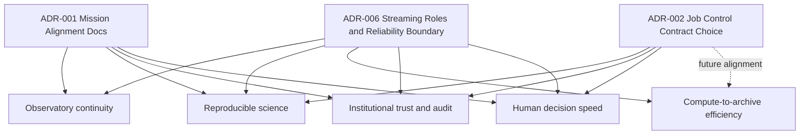

# Decisions Log (Mission-Critical ADRs)

Alignment anchors

- Frontend UX source of truth: [FRONTEND_UI.md](../frontend/FRONTEND_UI.md)
- Topology repair contract: [TOPOLOGY_DATA_PATH_REPAIR.md](./TOPOLOGY_DATA_PATH_REPAIR.md)
- Delivery plan: [ROADMAP.md](../../ROADMAP.md)

Use this file to record architecture and scope decisions that materially affect ngVLA mission outcomes.

## ADR format

- `Date`:
- `Decision ID`:
- `Status`: proposed | accepted | deprecated | superseded
- `Context`:
- `Decision`:
- `Mission outcome impact`:
- `Tradeoffs`:
- `Validation plan`:
- `Links`:

## ADR impact map

---

## 2026-03-01 | ADR-001 | accepted

- Date: 2026-03-01
- Decision ID: ADR-001
- Status: accepted
- Context:
  Phase 2 had strong technical direction but limited explicit mission-level gating.
- Decision:
  Add mission-alignment documents:
  - `NGVLA_MISSION_ALIGNMENT.md`
  - `MISSION_TO_CAPABILITY_TRACE.md`
  - `MISSION_GATES.md`
  - `DECISIONS.md`
- Mission outcome impact:
  Improves focus on observatory continuity, reproducibility, and trust by requiring traceability from backlog and implementation to mission value.
- Tradeoffs:
  Additional documentation maintenance overhead.
- Validation plan:
  Require updates to mission trace/gates for major capability PRs.
- Links:
  - [NGVLA_MISSION_ALIGNMENT.md](../ngvla/NGVLA_MISSION_ALIGNMENT.md)
  - [MISSION_TO_CAPABILITY_TRACE.md](../ngvla/MISSION_TO_CAPABILITY_TRACE.md)
  - [MISSION_GATES.md](../ngvla/MISSION_GATES.md)

## 2026-03-01 | ADR-002 | proposed

- Date: 2026-03-01
- Decision ID: ADR-002
- Status: proposed
- Context:
  Job control API currently uses `/jobs/{id}/transition`; roadmap also references explicit cancel semantics.
- Decision:
  Choose one canonical control contract:
  1. keep generic transition endpoint with strict state machine rules, or
  2. expose explicit action endpoints (`cancel`, `retry`, `pause`) and retain transition internally.
- Mission outcome impact:
  Directly affects operator clarity, automation safety, and audit semantics.
- Tradeoffs:
  Generic endpoint is flexible but can become ambiguous; explicit endpoints improve clarity but increase surface area.
- Validation plan:
  Contract tests + UI action mapping + error taxonomy consistency.
- Links:
  - [API_CONTRACT_STATUS.md](../data/API_CONTRACT_STATUS.md)
  - [ROADMAP.md](../../ROADMAP.md)

## 2026-03-03 | ADR-003 | accepted

- Date: 2026-03-03
- Decision ID: ADR-003
- Status: accepted
- Context:
  Messaging-fabric scope needed explicit implementation defaults for local deployment, control-plane routing, and stress-profile behavior to match ngVLA-scale planning.
- Decision:
  1. Run Pulsar in normal local Docker deployment using a full profile (broker + bookkeeper + required support services), not standalone-only.
  2. Use dynamic per-workflow RabbitMQ queues/exchanges for control-plane command paths.
  3. Apply global footer load profile control (`10%`, `25%`, `50%`, `100%`) to all enabled broker paths (Pulsar, Kafka, RabbitMQ), not Kafka-only behavior.
- Mission outcome impact:
  Improves observatory continuity and operator decision speed by making broker behavior explicit, scalable, and testable under realistic stress modes.
- Tradeoffs:
  Heavier local infrastructure footprint and more complex orchestration/configuration management.
- Validation plan:
  - Compose boot test with Pulsar full profile enabled by default.
  - Integration tests for per-workflow RabbitMQ queue provisioning and command execution.
  - End-to-end stress test proving broker-wide profile scaling and safe auto-revert from `100%`.
- Links:
  - [ROADMAP.md](../../ROADMAP.md)

## 2026-03-03 | ADR-004 | accepted

- Date: 2026-03-03
- Decision ID: ADR-004
- Status: accepted
- Context:
  Stress-profile behavior and broker scaling details needed concrete defaults to support reproducible local testing and ngVLA-scale simulation.
- Decision:
  1. RabbitMQ dynamic queue naming pattern: `workflow.<workflowId>.commands` with dynamic provisioning.
  2. `100%` global stress profile runs as a bounded burst for 3 minutes, then auto-reverts to `10%`.
  3. Stress scaling applies to message rate, message size, and partition/queue fanout (not rate-only).
  4. Add dedicated generator profiles to emulate very large ngVLA-like payloads and flow mixes.
  5. Pulsar runtime default: Apache Pulsar official distribution for local baseline; StreamNative remains an evaluation path.
- Mission outcome impact:
  Improves continuity and scale-confidence by making stress tests deterministic, bounded, and representative of production-class traffic shapes.
- Tradeoffs:
  Larger payload simulation increases local resource pressure and may require guardrails to avoid workstation instability.
- Validation plan:
  - Automated test verifies `100%` burst duration is capped at 180 seconds and reverts to `10%`.
  - Broker metrics confirm synchronized scaling across Pulsar/Kafka/RabbitMQ paths.
  - Generator profile tests validate payload-size tiers and fanout behavior.
- Links:
  - [PERF_TESTING.md](../testing/PERF_TESTING.md)

## 2026-03-03 | ADR-005 | accepted

- Date: 2026-03-03
- Decision ID: ADR-005
- Status: accepted
- Context:
  Viewer requirements call for progressive high-resolution behavior based on zoom/object context while remaining practical with current Aladin integration.
- Decision:
  1. Implement Mode B as progressive survey-tier switching in the existing Viewer first.
  2. Add lower-left control modes: `Auto`, `High Resolution`, `Preview`.
  3. Use SSR only for prefetch/config hints; do not assume server-side final image rendering for Aladin.
  4. Add explicit capability gate to decide whether to keep Aladin-only Mode B or start a new viewer engine track.
- Mission outcome impact:
  Improves operator/scientist decision speed and scientific inspection fidelity without immediate high-risk frontend rewrite.
- Tradeoffs:
  Progressive behavior may still be limited by Aladin APIs and public survey availability; a later engine migration may be required.
- Validation plan:
  - unit/integration/e2e tests for mode switching and fallback correctness
  - viewer performance metrics (switch latency, tile errors, fallback frequency)
  - decision memo with go/no-go recommendation for new viewer engine
- Links:
  - [VIEWER_MODEB.md](../viewer/VIEWER_MODEB.md)
  - [VIEWER.md](../frontend/features/VIEWER.md)
  - [ROADMAP.md](../../ROADMAP.md)

## 2026-08-09 | ADR-006 | accepted

- Date: 2026-08-09
- Decision ID: ADR-006
- Status: accepted
- Context:
  PR41 exposed documentation/runtime drift in the platform topology. The visualization implied a direct Pulsar-to-Kafka link, `java-ingest` terminated at metrics, broker roles were ambiguous, and frontend forwarding had no durable retry or duplicate contract. The Lakehouse Initiative also needed one stable ingestion boundary rather than inheriting every operational broker.
- Decision:
  1. **Pulsar is the regional/edge ingestion tier.** Each geographic region owns an independent Pulsar cluster and a colocated `pulsar-collector`.
  2. **Kafka is the central durable streaming backbone.** Regional collectors forward source-faithful payloads to Kafka only after successful Kafka acknowledgement.
  3. **RabbitMQ is a parallel control/governance/comparison path.** It is not placed inline between Pulsar and Kafka and must not be drawn as part of the primary event delivery chain.
  4. **Kafka is the boundary into the lakehouse.** The analytical path is `Kafka -> Bronze -> Silver/quarantine -> Gold -> query/consumer`.
  5. **The presentation projection is `Kafka -> java-ingest -> frontend API -> SSE -> Angular`.** Kafka remains durable; the frontend is a projection, not a system of record.
  6. **Every repaired-path event has immutable identity.** The data generator creates one UUID-v4 `event-id`; collectors preserve it in Kafka headers together with region and Pulsar attribution; `java-ingest` projects it into the frontend envelope.
  7. **Delivery is at-least-once plus explicit idempotency.** Collector failures are negative-acked in Pulsar. Java-to-frontend failures use Kafka retry topics and a forward DLT. `java-ingest` and Angular use bounded duplicate suppression keyed by `eventId`. No component may describe this as global exactly-once delivery.
- Mission outcome impact:
  Establishes a traceable, replayable and diagnosable event path from geographically distributed acquisition through operator presentation and analytical ingestion. It reduces topology ambiguity, preserves regional provenance, and makes failure/replay behavior testable.
- Tradeoffs:
  - Additional Kafka retry/DLT topics and operational monitoring are required.
  - Process-local deduplication does not survive service restart; durable downstream stores must remain idempotent by `eventId`.
  - The geo profile is heavier than the minimal local stack.
  - RabbitMQ remains deliberately separate, so broker-comparison/governance views must represent fan-in rather than a single linear chain.
- Validation plan:
  - Generator unit test validates UUID-v4 event identity creation.
  - Collector integration test validates payload fidelity plus unchanged `event-id`, region, Pulsar message ID, and Kafka-topic attribution.
  - Java tests validate provenance projection, duplicate suppression, retry-triggering failure behavior, and DLT accounting.
  - Frontend server tests validate `eventId`, region and source preservation through the SSE boundary.
  - Angular stream-service tests validate consumption and replay deduplication.
  - Runtime acceptance: `node scripts/verify-ingest-e2e.mjs` must observe one real repaired-path SSE event with non-empty `eventId`, region and source and `broker=kafka`.
- Links:
  - [ARCHITECTURE.md](./ARCHITECTURE.md)
  - [TOPOLOGY_DATA_PATH_REPAIR.md](./TOPOLOGY_DATA_PATH_REPAIR.md)
  - [BROKER_SAFETY_RUNBOOK.md](../BROKER_SAFETY_RUNBOOK.md)
  - [07-messaging.md](../development/coding-standards/07-messaging.md)
  - [Lakehouse README](../lakehouse/README.md)
