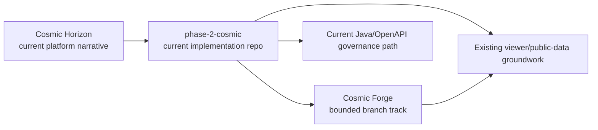
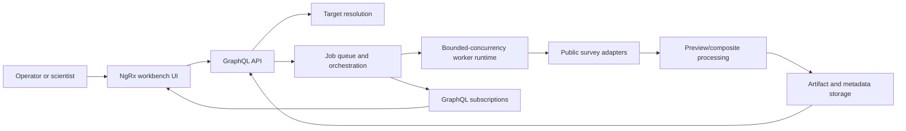
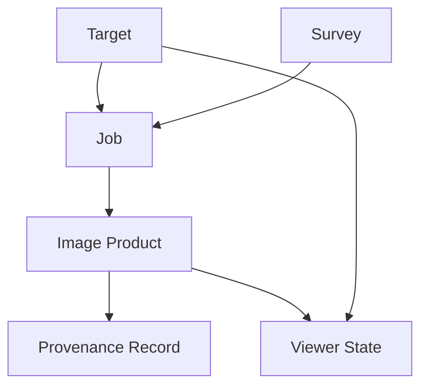
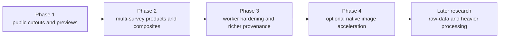

# Architecture

Alignment anchors

- Current repo architecture: [../architecture/ARCHITECTURE.md](../architecture/ARCHITECTURE.md)
- Existing viewer groundwork: [../viewer/VIEWER_MODEB.md](../viewer/VIEWER_MODEB.md)
- Public-source inventory: [../public-data/PUBLIC_DATA_RESOURCES.md](../public-data/PUBLIC_DATA_RESOURCES.md)
- Docker/local-dev context: [../infra/INFRA_TOPOLOGY.md](../infra/INFRA_TOPOLOGY.md)

Status: `planned`

## Architecture stance

Cosmic Forge is a bounded branch architecture, not current repo-wide truth.

It should be understood as an operator-facing image-job orchestration platform.

This is not just "an image viewer with a form".
It is a queue-driven system with:

- explicit job submission
- explicit queue and lifecycle state
- asynchronous worker execution
- provenance-bearing results
- a frontend state model built around queue visibility and result inspection

Current repo truth remains:

- Angular frontend
- Nest SSR shim for dev/API proxying
- Java governance/control-plane services
- broker-heavy dev compose environment

Cosmic Forge adds a branch-scoped app family beside that baseline:

- `cosmic-forge-ui`
- `cosmic-forge-api`
- optional `cosmic-forge-worker`

## Operating model

The intended operating model is:

1. a user submits an image-oriented task
2. the frontend records and renders that task as queue state
3. the API validates and persists the task contract
4. a worker executes the task with bounded concurrency
5. progress and result state flow back to the UI
6. result artifacts and provenance remain inspectable after completion

That puts Cosmic Forge closer to a compute-task queue and orchestration console than to a simple CRUD application.

## Context diagram

## Runtime flow

## Domain model

## Frontend state model

The frontend should follow an NgRx-first queue-management model.

That means:

- jobs are stored as normalized entity state
- selectors derive queue views such as my jobs, global jobs, active jobs, failed jobs, and selected result context
- effects own API orchestration, polling, and later subscription wiring
- presentational components render queue state rather than hiding it in local component state

This preserves the spirit of the product:

- the queue is visible
- the lifecycle is explicit
- retries and cancellations are inspectable
- image products remain linked to their originating jobs

## Queue semantics

Forge queue semantics should remain explicit in both docs and implementation:

- `QUEUED`
- `RUNNING`
- `COMPLETED`
- `FAILED`
- `CANCELLED`

The frontend does not need to simulate concurrency itself.

Its job is to model:

- intent
- queue state
- progress
- errors
- operator actions

The backend worker owns bounded concurrency and actual execution scheduling.

The current implementation uses an explicit internal worker seam:

- `claim-next`
- `execute claimed job`
- persisted queue state transitions
- coarse progress phases instead of timer-only increments
- worker health with concurrency and execution diagnostics

## Subscription posture

GraphQL subscriptions remain the intended long-term model for progress and result updates.

For the first PI, polling is acceptable if it helps complete the first end-to-end vertical slice faster.

But the architecture should preserve a subscription-ready shape:

- queue state should not assume polling-only updates
- effects should remain the integration boundary for either polling or subscriptions
- API and reducer semantics should stay compatible with eventual `jobUpdated`, `jobProgressed`, and `imageProductReady` events

## Phased evolution

## Docker environment fit

Cosmic Forge should not be added directly to the default hot path of `docker/dev-compose.yml`.

Recommended local-dev shape:

- keep current compose environment intact
- add a Forge-specific compose file or overlay that runs alongside it
- reuse shared infra where helpful:
  - `minio`
  - `redis`
  - `prometheus`
  - `grafana`
- keep Kafka/Pulsar/RabbitMQ optional for Forge v1
- use the repository root `.env` for local secret loading

## API boundary decision

The current dev workflow routes frontend `/api` traffic through the host-side SSR shim. Forge should respect that local-dev reality instead of inventing a conflicting pattern immediately.

Recommended branch-first approach:

- `cosmic-forge-ui` remains frontend-led
- SSR or a dedicated proxy path forwards Forge requests to `cosmic-forge-api`
- GraphQL is branch-scoped and does not replace the current governance API

## Design implication

If a design choice makes Forge feel like hidden background fetch logic instead of an explicit queue/orchestration product, it is probably the wrong choice.

The system should continue to read as:

- queue-oriented
- operator-visible
- provenance-conscious
- adapter-driven
- bounded in scope
