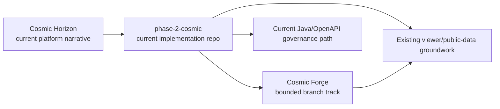
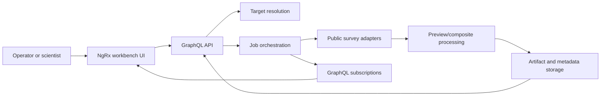
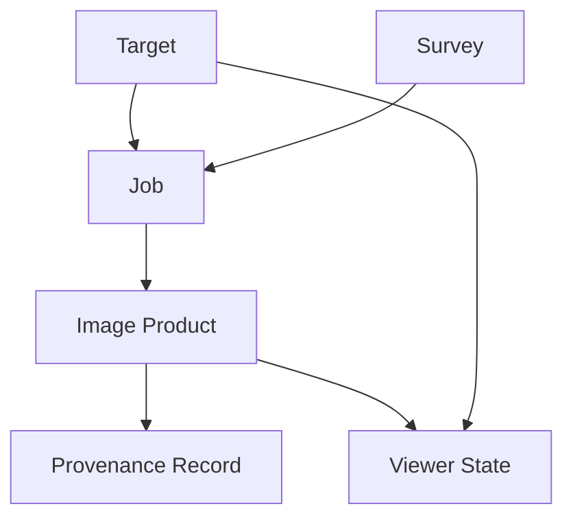
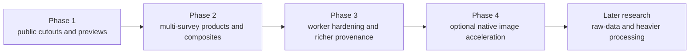

# Architecture

Alignment anchors

- Current repo architecture: [../architecture/ARCHITECTURE.md](../architecture/ARCHITECTURE.md)
- Existing viewer groundwork: [../viewer/VIEWER_MODEB.md](../viewer/VIEWER_MODEB.md)
- Public-source inventory: [../public-data/PUBLIC_DATA_RESOURCES.md](../public-data/PUBLIC_DATA_RESOURCES.md)
- Docker/local-dev context: [../infra/INFRA_TOPOLOGY.md](../infra/INFRA_TOPOLOGY.md)

Status: `planned`

## Architecture stance

Cosmic Forge is a bounded branch architecture, not current repo-wide truth.

Current repo truth remains:

- Angular frontend
- Nest SSR shim for dev/API proxying
- Java governance/control-plane services
- broker-heavy dev compose environment

Cosmic Forge adds a branch-scoped app family beside that baseline:

- `cosmic-forge-ui`
- `cosmic-forge-api`
- optional `cosmic-forge-worker`

## Context diagram

## Runtime flow

## Domain model

## Phased evolution

## Docker environment fit

Cosmic Forge should not be added directly to the default hot path of `docker/dev-compose.yml`.

Recommended local-dev shape:

- keep current compose environment intact
- add a Forge-specific compose file or overlay that runs alongside it
- reuse shared infra where helpful:
  - `minio`
  - `redis`
  - `prometheus`
  - `grafana`
- keep Kafka/Pulsar/RabbitMQ optional for Forge v1
- use the repository root `.env` for local secret loading

## API boundary decision

The current dev workflow routes frontend `/api` traffic through the host-side SSR shim. Forge should respect that local-dev reality instead of inventing a conflicting pattern immediately.

Recommended branch-first approach:

- `cosmic-forge-ui` remains frontend-led
- SSR or a dedicated proxy path forwards Forge requests to `cosmic-forge-api`
- GraphQL is branch-scoped and does not replace the current governance API
