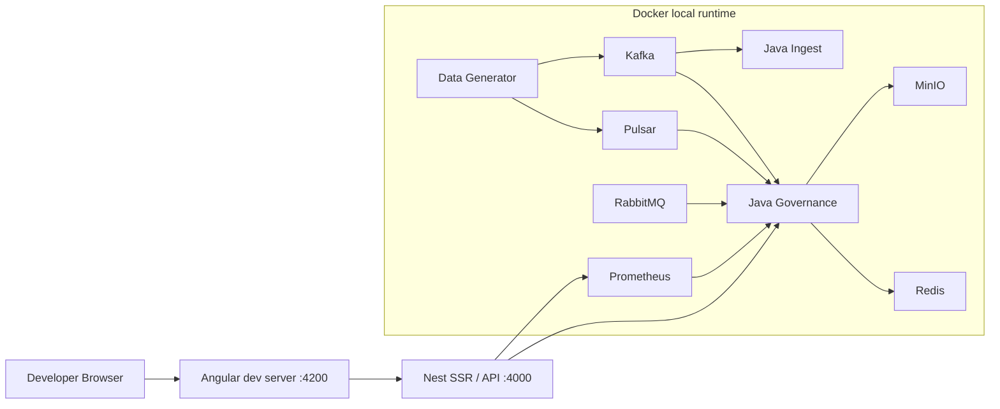

# Topology — Phase 2 Cosmic

The Topology page visualizes the current system and network topology: services, messaging/storage relationships, and link-level operational evidence. It is an operator view of the existing runtime architecture; Lakehouse context may be overlaid as evidence, but it does not replace the topology metrics contract.

## Purpose

- Show an interactive map of services and their relationships.
- Keep Kafka, RabbitMQ, and Pulsar visible when the corresponding runtime services are enabled.
- Surface link throughput, latency/error context, provenance/source labels, and node activity without blocking the UI on expensive metrics collection.
- Distinguish temporary startup/warming state from unavailable or stale measurements.

## Current local architecture

The local runtime is hybrid:

- Docker hosts infrastructure and Java services.
- Nest SSR/API runs on the developer host at `http://127.0.0.1:4000`.
- Angular development UI runs at `http://127.0.0.1:4200`.
- Prometheus and service/admin APIs provide operational evidence.

High-level flow:



## Frontend topology UI

The frontend route is:

```text
/topology
```

The current component:

- renders the topology graph with D3,
- fetches topology structure from `GET /api/topology`,
- fetches live link metrics from `GET /api/metrics/topology`,
- polls link metrics according to the selected runtime profile,
- uses explicit mock topology/metrics only when the application is intentionally in mock mode.

## Topology metrics cache contract

`GET /api/metrics/topology` no longer requires an HTTP request to synchronously execute the full Java Governance metrics fan-out.

Java Governance maintains a background-refreshed topology snapshot. HTTP reads return the last completed snapshot immediately and expose cache state so startup and stale-data conditions are visible rather than becoming proxy timeouts.

Expected cache states:

| State     | Meaning                                                                                                          |
| --------- | ---------------------------------------------------------------------------------------------------------------- |
| `warming` | The service is available but no complete topology refresh has finished yet.                                      |
| `ready`   | A completed topology snapshot is available and current.                                                          |
| `stale`   | A previous completed snapshot is being served because a newer refresh failed or exceeded freshness expectations. |

A startup response can therefore legitimately look like:

```json
{
  "links": {},
  "source": "warming",
  "cache": {
    "state": "warming"
  }
}
```

After background collection completes, a normal response includes the canonical links and a timestamped cache record, for example:

```json
{
  "source": "governance-registry",
  "diagnostics": {
    "canonicalLinkCount": 26,
    "linksMissingFromSnapshot": []
  },
  "cache": {
    "state": "ready",
    "refreshedAt": "2026-08-08T19:24:25.620Z"
  }
}
```

During a Java Governance restart, the host-side governance upstream layer treats temporary topology unavailability as a startup/warming condition instead of logging the old long-running topology proxy timeout.

## Evidence and provenance semantics

Topology is an operational evidence surface, not a capacity claim generator.

- `currentMBps` should represent observed/current behavior when a trustworthy measurement exists.
- `maxMBps` is capacity/configuration context and is not itself measured throughput.
- Link `source` and `measurementPath` identify where the link record was assembled (for example Prometheus and/or an infrastructure snapshot).
- `diagnostics.measuredLinks`, `adminLinks`, `fallbackDerivedLinks`, and related counts expose the snapshot's evidence composition.
- A zero measurement must not automatically be interpreted as a missing measurement.
- The current topology contract still has field-level provenance refinement to do: a link-level `source` can describe the dominant record source while individual latency/error fields may still be derived or fallback values. Do not treat every field in a `source: "prometheus"` link as independently measured until field-level provenance is implemented.

Lakehouse Bronze/Silver/Gold implementation state is separate from topology operational metrics. Topology may display Lakehouse boundary/context, but it must not convert public-source proof or illustrative values into claims that Delta stages exist.

## Required broker evidence

Where available, the topology/diagnostics system should surface:

- Kafka: broker availability, consumer lag, throughput.
- RabbitMQ: queue depth, publish/delivery/ack context.
- Pulsar: broker/topic status, backlog, publish/dispatch context.

Unavailable values should remain unavailable or stale; explicit test/mock values are allowed only in intentional mock/test mode.

## Local usage

Use the supported stack entrypoint:

```bash
pnpm start:all
```

Then open:

```text
http://127.0.0.1:4200/topology
```

Useful direct checks:

```powershell
Invoke-RestMethod http://127.0.0.1:4000/api/metrics/topology |
  ConvertTo-Json -Depth 8
```

A newly started stack may return `warming` first. A healthy background refresh should subsequently transition the cache to `ready` without requiring the HTTP request itself to wait for the expensive collection.

## Security boundary

The topology page is a developer/operator surface. Local infrastructure endpoints should be exposed only as required for development. In particular, the Cosmic Forge PostgreSQL sidecar is bound to loopback only and is not intended to be a LAN-facing service.

## UX and performance

- Keep expensive collection work off interactive request paths.
- Preserve the last completed trustworthy snapshot when refresh work is slow or fails.
- Use progressive loading/clustering for significantly larger topologies.
- Consider canvas/WebGL or summarized cluster views when SVG/D3 node counts become too large for responsive interaction.
