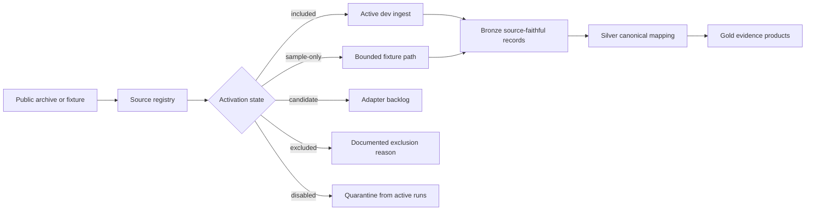
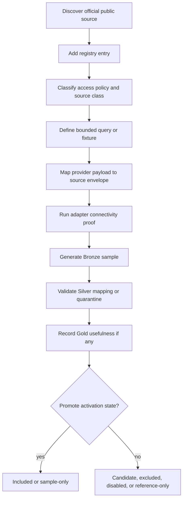

# PR40 active dataset selection plan

> Status: **PR40 planning slice**
> Purpose: define how Lakehouse development can include, exclude, and add public datasets without confusing source availability with implemented Bronze/Silver/Gold evidence.

## Decision

The Lakehouse should separate three concerns:

1. **Source registry** - the list of public archives, catalogs, fixtures, and future providers known to the project.
2. **Activation state** - whether a source is included in active development records, excluded, sample-only, candidate, disabled, or reference-only.
3. **Lakehouse records** - Bronze/Silver/Gold artifacts produced from the active source set.

This lets PR40 capture more public data options while keeping the active evidence surface small, honest, and repeatable.

## Why this matters

The project cannot currently depend on academic-only live records. Public archives can still provide realistic metadata and bounded products for development, but the Lakehouse needs a control surface so development can answer:

- Which datasets are active for this run?
- Which datasets are known but intentionally excluded?
- Why was a dataset excluded?
- Which datasets are safe for CI fixtures?
- Which datasets are public but too large, unstable, rate-limited, or access-sensitive for default runs?
- How does a future dataset get added without changing the domain model?

## Target model



The standalone source is [`../diagrams/active-dataset-selection.mmd`](../diagrams/active-dataset-selection.mmd).

## Activation states

| State            | Use                                                                                     | Evidence expectation                                         |
| ---------------- | --------------------------------------------------------------------------------------- | ------------------------------------------------------------ |
| `included`       | Active by default for a selected development bundle.                                    | Runnable source or fixture evidence exists.                  |
| `sample-only`    | Only a small bounded sample or fixture is allowed.                                      | Source citation and fixture-generation context exist.        |
| `candidate`      | Worth adding, but no verified adapter yet.                                              | Official source citation and proposed profile exist.         |
| `excluded`       | Known source intentionally outside active records.                                      | Exclusion reason is required.                                |
| `disabled`       | Temporarily unsuitable because of access, uptime, rate limits, schema drift, or policy. | Disable reason and last attempted verification are recorded. |
| `reference-only` | Useful for documentation, planning, or comparison, but not an ingestion target.         | Citation exists; no ingest evidence required.                |

## Dataset registry contract

The registry can start as a checked-in JSON or YAML file and later move behind an API/admin UI. A minimal entry should include:

| Field              | Required             | Purpose                                                                                                            |
| ------------------ | -------------------- | ------------------------------------------------------------------------------------------------------------------ |
| `providerId`       | Yes                  | Stable provider key, such as `eso`, `nrao`, `mast`, `heasarc`, or `irsa`.                                          |
| `datasetId`        | Yes                  | Stable dataset/profile key inside the provider.                                                                    |
| `label`            | Yes                  | Human-readable name for UI and docs.                                                                               |
| `sourceClass`      | Yes                  | `archive-metadata`, `catalog`, `image-metadata`, `time-series`, `simulation`, `replay`, `fixture`, or `reference`. |
| `accessUrl`        | Yes                  | Official source or API URL.                                                                                        |
| `queryMode`        | Yes                  | `tap-sync`, `tap-async`, `api`, `download-manifest`, `static-fixture`, or `replay`.                                |
| `accessPolicy`     | Yes                  | Public, public-subset, preview, proprietary-period, credentialed, or reference-only.                               |
| `activationState`  | Yes                  | Current state from the activation-state table.                                                                     |
| `activationReason` | Yes                  | Why the state was selected.                                                                                        |
| `maxRows`          | For active/candidate | Development row budget.                                                                                            |
| `maxBytes`         | For active/candidate | Development byte budget.                                                                                           |
| `cadence`          | Yes                  | Manual, CI fixture, daily smoke, weekly smoke, or disabled.                                                        |
| `tags`             | Yes                  | Searchable tags such as `radio`, `multiwavelength`, `time-domain`, `preview-only`, or `large-object`.              |
| `citationUrl`      | Yes                  | URL to cite in evidence and documentation.                                                                         |
| `adapterVersion`   | When implemented     | Source adapter version or planned marker.                                                                          |
| `schemaVersion`    | When implemented     | Canonical envelope/schema version.                                                                                 |
| `lastVerifiedAt`   | Yes                  | Date the official source was checked.                                                                              |

## Configuration surface

Recommended first implementation:

```text
config/lakehouse-source-registry.example.json
config/lakehouse-source-overrides.local.json
```

Recommended environment controls:

| Variable                             | Purpose                                                                             |
| ------------------------------------ | ----------------------------------------------------------------------------------- |
| `LAKEHOUSE_SOURCE_BUNDLE`            | Selects a bundle such as `core-proof`, `offline-fixture`, or `multiwavelength-dev`. |
| `LAKEHOUSE_INCLUDE_SOURCES`          | Comma-separated provider/dataset keys added to the bundle.                          |
| `LAKEHOUSE_EXCLUDE_SOURCES`          | Comma-separated provider/dataset keys removed from the bundle.                      |
| `LAKEHOUSE_MAX_ROWS`                 | Hard row cap for live source queries.                                               |
| `LAKEHOUSE_MAX_BYTES`                | Hard byte cap for live source/product metadata fetches.                             |
| `LAKEHOUSE_ALLOW_LIVE_ARCHIVE_CALLS` | Explicit opt-in for live archive calls outside local smoke/manual runs.             |

The first implementation can be file and environment based. A later admin API can expose:

```text
GET /api/v1/lakehouse/source-registry
GET /api/v1/lakehouse/source-registry/active
PATCH /api/v1/lakehouse/source-registry/{providerId}/{datasetId}/activation
```

The `PATCH` route should be development/admin only until policy, audit, and governance integration are defined.

## Active records policy

Active records are not the same thing as retained records.

- **Retained Bronze truth** should preserve source-faithful payloads and source attribution for records already ingested, subject to local retention and storage policy.
- **Active records** are the subset used by the current development evidence bundle, Silver/Gold projection, and operator-facing proof view.
- Excluding a dataset from active records should stop future inclusion in active dev projections, but it should not silently delete historical lineage.
- If removal is required for local cleanup, write a tombstone or manifest note that records dataset key, reason, timestamp, and affected artifact root.

Recommended activation projection:

| Field                             | Purpose                                            |
| --------------------------------- | -------------------------------------------------- |
| `provider_id`                     | Registry provider key.                             |
| `dataset_id`                      | Registry dataset key.                              |
| `state`                           | Active state for this environment/run.             |
| `reason`                          | Human-readable activation or exclusion reason.     |
| `changed_by`                      | Operator, config source, or automation identifier. |
| `changed_at`                      | Timestamp of the change.                           |
| `effective_from` / `effective_to` | Optional window for scheduled source changes.      |
| `run_id`                          | Evidence run affected by the decision.             |

## PR40/PR41 implementation slices

### Slice 1 - documentation and examples

- Add the public dataset scan.
- Add this active dataset selection plan.
- Add source-registry and activation-flow diagrams.
- Add a small example registry file in a later implementation commit.

### Slice 2 - local registry reader

- Add a typed source-registry loader.
- Validate required fields and activation states.
- Reject active entries without source URL, citation URL, activation reason, and bounded row/byte budgets.
- Add unit tests for include/exclude precedence.

### Slice 3 - evidence-service integration

- Add active-source summary to the Lakehouse metrics response.
- Keep Bronze/Silver/Gold implementation percentages independent from source activation.
- Show active, excluded, candidate, and disabled source counts as evidence metadata only.

### Slice 4 - PR41 runner integration

- Let the PR41 MVP runner select fixtures/source profiles by bundle.
- Default CI to `offline-fixture`.
- Default local smoke to `core-proof`.
- Require explicit opt-in for larger live-source bundles.

### Slice 5 - first non-ESO provider

- Implement one additional provider profile after the provider-neutral envelope is stable.
- Recommended order: NRAO/VLASS for domain alignment, or HEASARC/IRSA if API ergonomics make a bounded sample faster.
- Prove that canonical Silver mapping is not ESO-specific.

## Source onboarding workflow



The standalone source is [`../diagrams/public-dataset-onboarding.mmd`](../diagrams/public-dataset-onboarding.mmd).

## Acceptance criteria

The dataset-selection feature is ready when:

- the registry can list known public sources separately from active sources,
- include/exclude overrides are deterministic and tested,
- every excluded or disabled source has a reason,
- live archive calls are bounded and opt-in outside smoke/manual runs,
- active source decisions appear as evidence metadata without implying medallion completion,
- Gold evidence can be traced back to the exact registry entries and activation state used for a run.
