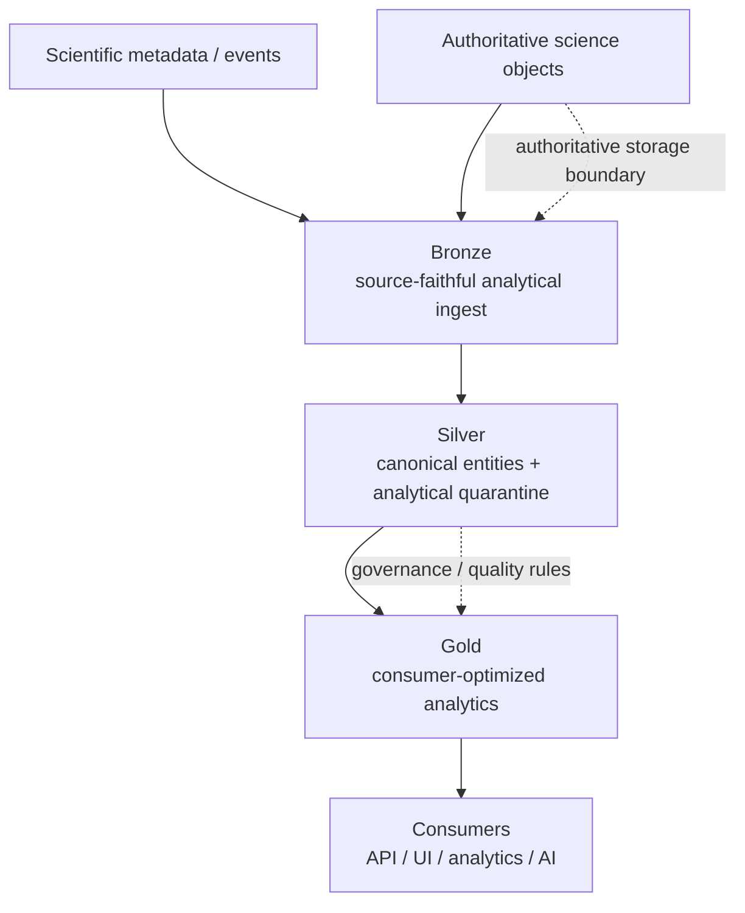
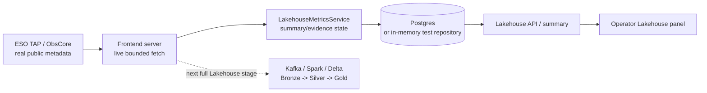
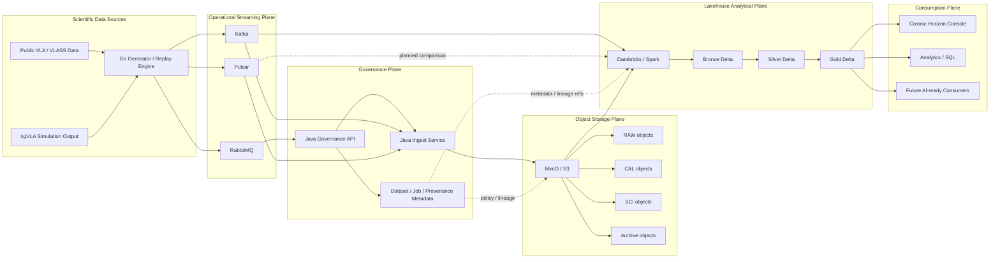
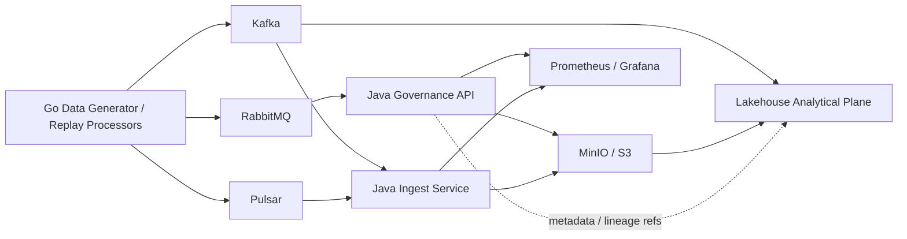
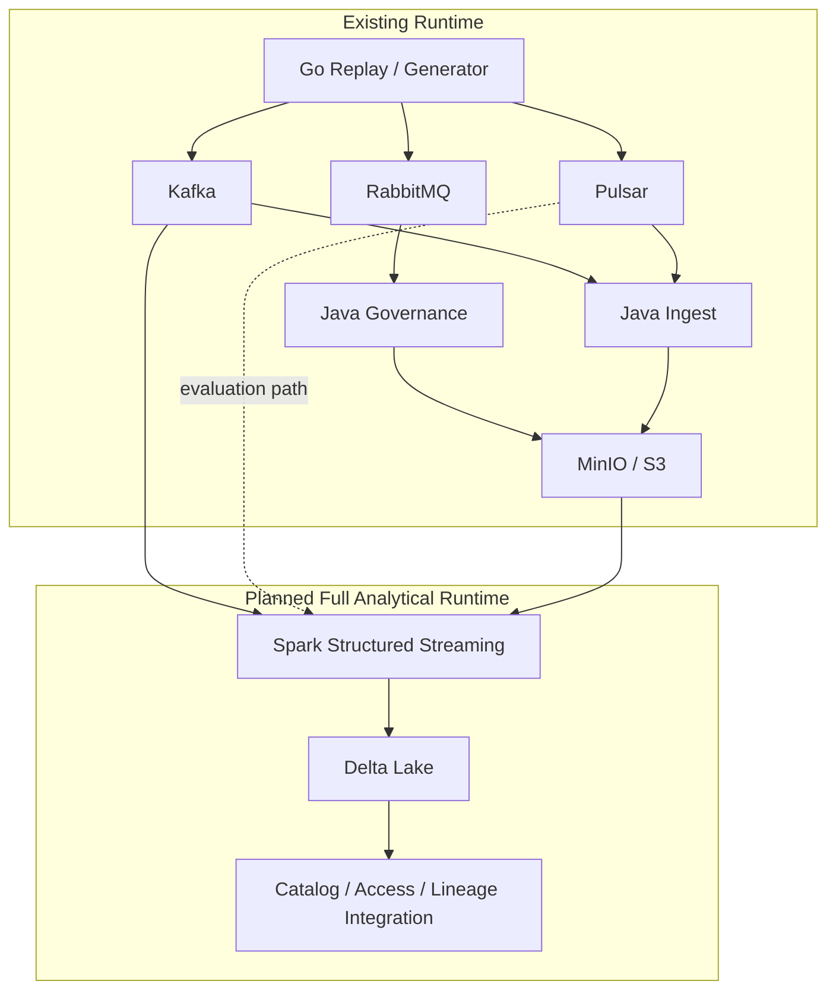
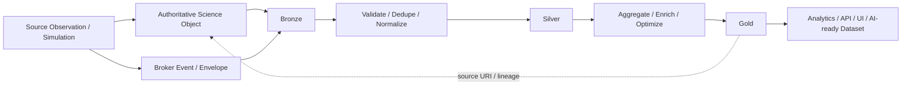
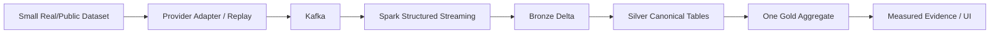
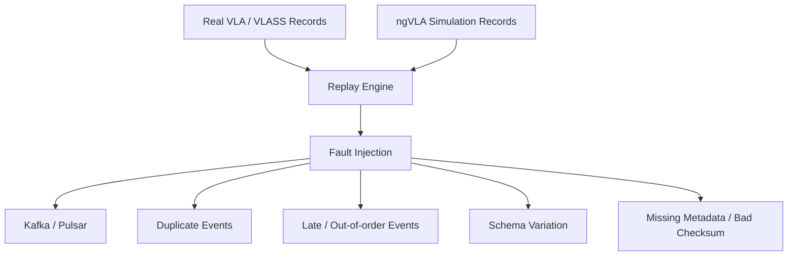

# Lakehouse Topology

> Status: **mixed implemented proof scaffold + planned full Lakehouse topology**
> PR scope: **all stages remain under PR #40**.
> This document preserves the current runtime architecture while making a clear distinction between what the branch already proves and what still requires Kafka/Spark/Delta evidence.

Standalone Mermaid sources are maintained in [`../diagrams/`](../diagrams/README.md).

## 1. Concept overview

The Lakehouse adds a governed analytical plane around structured events, metadata, quality, lineage, and derived tabular products. Authoritative science objects remain in object storage.



Mermaid source: [`concept-overview.mmd`](../diagrams/concept-overview.mmd)

## 2. Current PR #40 proof scaffold — implemented

PR #40 now contains a runnable real-public-data precursor to the Lakehouse pipeline:



Mermaid source: [`current-proof-scaffold.mmd`](../diagrams/current-proof-scaffold.mmd)

This path proves:

- live public astronomy metadata connectivity,
- server-side integration,
- persisted/fallback proof-state handling,
- tested API/UI evidence presentation.

It does **not** yet prove:

- Kafka-to-Spark ingestion,
- persisted Bronze Delta source tables,
- Silver canonicalization/deduplication/quarantine tables,
- persisted Gold aggregates with table lineage.

The current evidence panel is therefore an implemented **proof scaffold**, not a claim that the full Lakehouse Analytical Plane already exists.

The standalone HTML visualization under `../visualizations/` remains an illustrative artifact; sample JSON values are explicitly labeled as non-measured fixtures.

## 3. Integrated target topology — planned where noted

The target Lakehouse is an **Analytical Data Plane** connected to the existing streaming, governance, storage, and consumption responsibilities.



Mermaid source: [`integrated-target-topology.mmd`](../diagrams/integrated-target-topology.mmd)

### Interpretation

- Existing Phase 2 services/brokers/object storage remain authoritative for their documented responsibilities.
- Spark/Delta medallion nodes are target components until runnable table evidence exists.
- Pulsar-to-Lakehouse edges remain comparison paths until the Kafka baseline is stable and measured.
- The Lakehouse does not replace astronomy-specific calibration/imaging or the RAW/CAL/SCI/DRV scientific lifecycle.

## 4. Provider-neutral public-source entry

The current live source happens to be ESO ObsCore, but provider identity should stop at the adapter/source-attribution boundary.

```text
ESO / NRAO / CADC / future archive
              |
              v
      provider profile / adapter
              |
              v
canonical event + source attribution
              |
              v
             Kafka
              |
              v
        Lakehouse pipeline
```

Provider-specific fields remain source payload/mapping concerns. Silver should normalize into existing Cosmic observation/dataset/provenance semantics.

## 5. Repository-anchored runtime responsibility view



Mermaid source: [`repository-anchors.mmd`](../diagrams/repository-anchors.mmd)

The Go generator/broker fabric remains an operational producer layer; Java Governance and Java Ingest retain their existing authority; MinIO/S3 remains the authoritative object tier; the Lakehouse is an analytical projection/processing plane around structured data.

## 6. Physical/runtime responsibility view



Mermaid source: [`runtime-responsibility.mmd`](../diagrams/runtime-responsibility.mmd)

Platform-native catalog/permission/lineage features must integrate with existing application governance rather than silently redefining system-of-record ownership.

## 7. Logical data-flow view



Mermaid source: [`logical-data-flow.mmd`](../diagrams/logical-data-flow.mmd)

Bronze must preserve enough source/event/object context to trace derived table rows back to authoritative inputs.

## 8. First complete Lakehouse vertical slice

The first full Lakehouse proof remains intentionally small:



Mermaid source: [`first-vertical-slice.mmd`](../diagrams/first-vertical-slice.mmd)

### Why Kafka first

Kafka already participates in the current ingest architecture and gives the initiative one stable baseline to prove before broker comparison. Pulsar remains important, but direct/bridged Pulsar ingestion should be measured after the Kafka path is repeatable.

## 9. Real science + synthetic operational failure



Mermaid source: [`real-science-fault-injection.mmd`](../diagrams/real-science-fault-injection.mmd)

Authentic scientific content can remain intact while engineering failures are introduced deterministically for validation.

## 10. Topology ownership rules

| Plane/domain          | Owns                                                                              | Does not own                                      |
| --------------------- | --------------------------------------------------------------------------------- | ------------------------------------------------- |
| Operational Streaming | transport, buffering, replay, broker-specific delivery                            | canonical science catalog                         |
| Governance            | jobs, application policy, dataset registration, provenance/audit semantics        | bulk analytical table execution                   |
| Scientific Processing | RAW/CAL/SCI/DRV scientific workflows/products                                     | Bronze/Silver/Gold analytical trust semantics     |
| Object Storage        | authoritative large science objects and lifecycle tiers                           | analytical table semantics                        |
| Lakehouse Analytical  | structured ingestion, medallion transforms, analytical tables, query optimization | raw science-object replacement or CASA processing |
| Consumption           | operator/scientist interaction and downstream use                                 | authoritative storage/transformation ownership    |

Failure routing is documented separately in [`MEDALLION_ARCHITECTURE.md`](./MEDALLION_ARCHITECTURE.md): broker DLQ, object quarantine, and Silver analytical quarantine are distinct mechanisms.

## 11. Evidence expectations

A topology edge moves from **planned** to **implemented** only when there is evidence such as:

- source/configuration for the integration,
- repeatable local or CI execution,
- observable input/output artifacts,
- failure-path behavior,
- tests or validation results,
- explicit environment/dataset limitations for performance claims.

The live ESO evidence path meets that bar for public-source connectivity and UI/evidence integration. The Kafka/Spark/Delta Bronze/Silver/Gold path does not meet it yet and remains the next major implementation gate.
