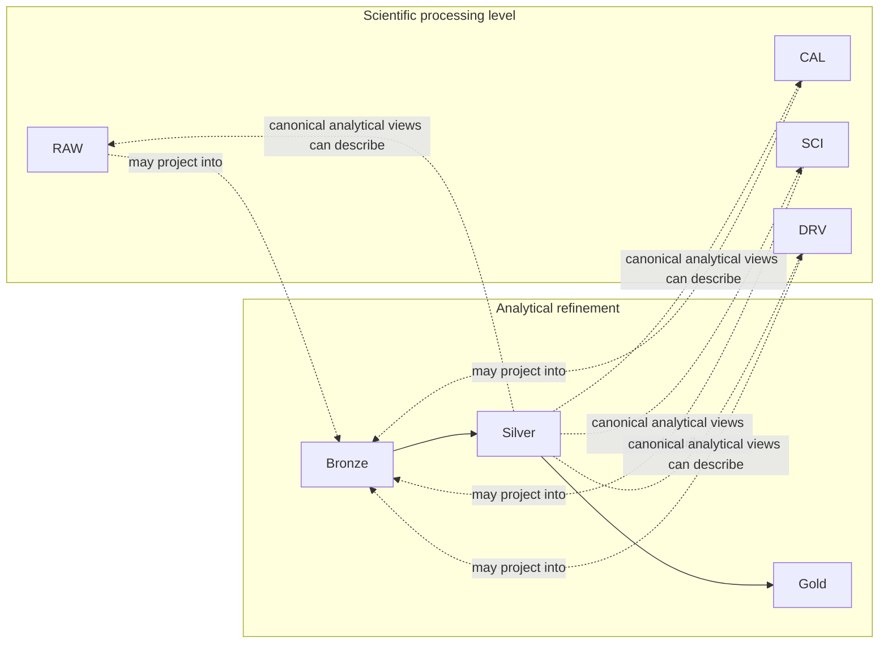
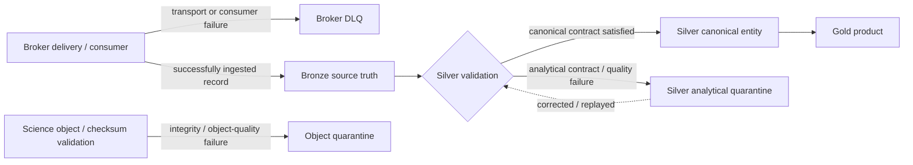
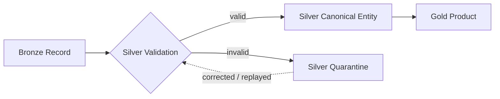

# Medallion Architecture

> Status: **planned Lakehouse tables with an active proof/evidence scaffold**
> Scope: logical analytical-table responsibilities for the Lakehouse Initiative.

Standalone Mermaid sources are maintained in [`../diagrams/`](../diagrams/README.md).

## 1. Purpose

The medallion model defines how **structured analytical data** progresses from source-faithful ingest to canonical, consumer-ready products.

```mermaid
flowchart LR
  SRC[Kafka / Pulsar / VO-TAP / Object Metadata]

  subgraph BRONZE[Bronze - Source Fidelity]
    B1[Raw broker/source events]
    B2[Event envelopes]
    B3[Object URIs + checksums]
    B4[Raw manifests / metadata]
  end

  subgraph SILVER[Silver - Canonical + Trusted]
    S1[Validated observations]
    S2[Deduplicated datasets]
    S3[Canonical jobs / manifests]
    S4[Quality + quarantine results]
    S5[Lineage references]
  end

  subgraph GOLD[Gold - Consumer Optimized]
    G1[Observation summaries]
    G2[Ingest health]
    G3[Dataset quality rollups]
    G4[Processing metrics]
    G5[AI-ready / query-ready products]
  end

  SRC --> BRONZE --> SILVER --> GOLD
```



Mermaid source: [`medallion-overview.mmd`](../diagrams/medallion-overview.mmd)

The current PR #40 dashboard/evidence scaffold uses Bronze/Silver/Gold language to communicate the intended progression, but the corresponding Delta tables and transformations remain **planned until runnable table evidence exists**.

## 2. Scientific processing level and analytical refinement are different axes

Phase 2 already defines the scientific processing lifecycle:

- **RAW** — uncalibrated scientific observations/visibilities,
- **CAL** — calibrated/flagged scientific data,
- **SCI** — science products such as images, cubes, and catalogs,
- **DRV** — higher-order derived scientific products.

The Lakehouse adds a second, independent classification:

- **Bronze** — source-faithful analytical representation,
- **Silver** — canonical/trusted analytical representation,
- **Gold** — consumer-optimized analytical representation.

These taxonomies must never be treated as aliases. A RAW, CAL, SCI, or DRV product may have Bronze, Silver, and Gold analytical representations around its metadata/events/quality/provenance.



Mermaid source: [`processing-vs-medallion.mmd`](../diagrams/processing-vs-medallion.mmd)

Example: a calibrated Measurement Set remains a **CAL** science object in MinIO/S3. Its source event may be retained in **Bronze**, its canonical dataset/quality metadata in **Silver**, and its quality/processing summary in **Gold**.

## 3. Failure domains and quarantine semantics

Phase 2 already has transport and science-object failure concepts. The Lakehouse adds analytical quarantine; it does not replace the existing mechanisms.



Mermaid source: [`failure-routing.mmd`](../diagrams/failure-routing.mmd)

| Mechanism                 | Failure domain                      | Meaning                                                                                           |
| ------------------------- | ----------------------------------- | ------------------------------------------------------------------------------------------------- |
| Broker DLQ                | Transport/consumer                  | A message could not be delivered or processed according to the broker/consumer contract.          |
| Science-object quarantine | Object integrity/scientific quality | A persisted science object failed checksum, integrity, or object-level quality rules.             |
| `silver.quarantine`       | Analytical contract/quality         | Source truth was retained, but the record cannot currently satisfy the canonical Silver contract. |

A record reaching `silver.quarantine` is therefore not evidence of a broker failure, and a broker DLQ is not a substitute for analytical-quality history.

## 4. Bronze responsibilities

Bronze preserves source fidelity and supports replay, forensic analysis, and reprocessing.

### Candidate Bronze tables

| Table                       | Purpose                                                   |
| --------------------------- | --------------------------------------------------------- |
| `bronze.observation_events` | raw normalized broker/source envelope plus source payload |
| `bronze.dataset_events`     | raw dataset/manifest events                               |
| `bronze.provenance_events`  | raw provenance/audit events                               |
| `bronze.quality_events`     | raw validation and quality-gate results                   |
| `bronze.telemetry_events`   | operational ingest/broker telemetry                       |

### Minimum Bronze metadata

A Bronze event should retain, where available:

- `event_id`
- `correlation_id`
- `source_type`
- `source_name`
- `provider_name`
- `source_endpoint`
- `broker`
- `topic_or_subscription`
- `partition`
- `offset_or_message_id`
- `event_time`
- `ingest_time`
- `schema_version`
- `observation_id`
- `dataset_id`
- `job_id`
- `object_uri`
- `checksum`
- `payload`

Bronze is intentionally tolerant of incomplete or inconsistent payloads. If bytes/JSON can be retained safely, failure to satisfy a Silver contract should not cause source truth to disappear. Parse/quality state may be attached to the Bronze record while canonical acceptance is decided later.

## 5. Silver responsibilities

Silver converts raw source records into canonical entities suitable for trusted downstream use.

### Candidate Silver tables

| Table                    | Purpose                                                       |
| ------------------------ | ------------------------------------------------------------- |
| `silver.observations`    | canonical observation metadata                                |
| `silver.datasets`        | canonical dataset/manifests with object references            |
| `silver.jobs`            | normalized processing/job lifecycle records                   |
| `silver.provenance`      | normalized lineage graph edges and process metadata           |
| `silver.quality_results` | validation outcomes and science/operational quality measures  |
| `silver.quarantine`      | analytically rejected records with deterministic reason codes |

### Silver transformations

Silver is responsible for:

- schema validation and version normalization,
- type coercion under explicit rules,
- duplicate suppression using stable identifiers,
- late/out-of-order event handling,
- canonical timestamp treatment,
- source-attribution normalization,
- checksum status propagation,
- analytical quarantine of invalid records,
- entity resolution where multiple broker/provider records refer to the same observation or dataset,
- lineage/reference validation against available identifiers.

### Example deduplication key

Prefer an upstream producer/source identifier when available. A documented compatibility fallback may use a combination such as:

```text
source + observation_id + schema_version + event_time + payload_checksum
```

Derived keys are compatibility fallbacks, not substitutes for producer-assigned identifiers.

## 6. Gold responsibilities

Gold tables are shaped around concrete consumers and questions rather than source-system structure.

### Candidate Gold tables

| Table                      | Consumer/question                                                               |
| -------------------------- | ------------------------------------------------------------------------------- |
| `gold.ingest_health`       | Are brokers and ingest paths keeping up?                                        |
| `gold.observation_summary` | What observations exist and what is their current processing state?             |
| `gold.dataset_quality`     | Which datasets meet quality expectations and why?                               |
| `gold.processing_metrics`  | How long do processing stages take and where are failures concentrated?         |
| `gold.source_coverage`     | Which public/simulated sources, bands, and observation windows are represented? |
| `gold.ai_dataset_index`    | Which governed datasets are suitable for downstream model/agent workflows?      |

Gold should not become a dumping ground for arbitrary copies. Every Gold table should name its consumer, refresh semantics, source Silver tables, and validation expectations.

## 7. Mapping existing Cosmic concepts

| Existing concept                   | Bronze                       | Silver                                            | Gold                               |
| ---------------------------------- | ---------------------------- | ------------------------------------------------- | ---------------------------------- |
| `ExecutionEvent` / broker envelope | raw event                    | canonical event linkage                           | operational rollups                |
| Observation                        | raw provider/source metadata | canonical observation                             | observation summaries              |
| Dataset Manifest                   | raw manifest                 | canonical dataset                                 | dataset catalog/quality views      |
| JobRecord                          | raw lifecycle event          | canonical job                                     | workflow duration/failure metrics  |
| ProvenanceRecord                   | raw lineage/audit event      | lineage edges + process metadata                  | reproducibility/completeness views |
| ETL quality result                 | raw result                   | normalized quality record / analytical quarantine | quality scorecards                 |
| MinIO/S3 object                    | URI/checksum reference       | verified object reference                         | aggregate/index reference only     |

Lakehouse representations of JobRecord, ProvenanceRecord, Dataset Manifest, and related governance concepts remain analytical projections unless an explicit future architecture decision changes system-of-record ownership.

## 8. Silver quality and quarantine flow



Mermaid source: [`quality-quarantine-flow.mmd`](../diagrams/quality-quarantine-flow.mmd)

Quarantine records should retain:

- original Bronze identifier,
- validation rule identifier,
- human-readable reason,
- detected timestamp,
- source schema version,
- correction/replay status,
- any replacement canonical identifier after successful remediation.

## 9. Late data and event-time rules

Scientific and distributed ingest workloads can deliver records after their logical observation time. Distinguish:

- **event time** — when the source event/observation occurred,
- **ingest time** — when the Lakehouse received the record,
- **processing time** — when a transformation evaluated the record.

Watermark/late-data rules must be defined per stream. A global arbitrary lateness threshold should not be assumed for all astronomy and operational event types.

## 10. Schema evolution rules

The first full Lakehouse implementation should demonstrate at least one controlled evolution such as:

```text
v1: observationId, frequencyBandGHz, timestamp
v2: observationId, frequencyBandGHz, timestamp, arraySegment
```

Expected behavior:

1. Bronze preserves both versions.
2. Silver normalizes both into the current canonical shape.
3. Missing fields receive explicit `unknown`/null semantics only when the domain contract permits it.
4. Unsupported/incompatible changes go to Silver quarantine rather than being silently coerced.
5. Gold consumers remain isolated from raw source-version differences.

## 11. First full implementation target

The current ESO evidence scaffold is a useful precursor, but the first complete Lakehouse proof remains:

```text
real public astronomy source
  -> Kafka
  -> bronze.observation_events
  -> silver.observations
  -> gold.observation_summary
```

That slice should include:

- a provider-neutral source contract with an ESO or NRAO profile,
- duplicate input records,
- one schema-version variation,
- one invalid/analytically quarantined record,
- replay/reprocessing evidence,
- a persisted Gold result with traceability to Silver/Bronze and the authoritative source/object reference.

Only after this path works should the initiative broaden to Pulsar comparisons, larger performance experiments, or AI-ready products.
