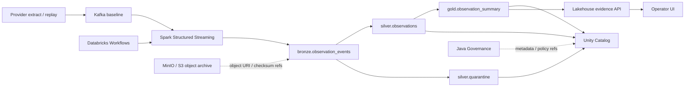

# Lakehouse Initiative PR42 Databricks Sprint Plan

> Status: **new PR42 planning target**
> Scope: Databricks production-runtime design, integration gates, and sprint plan.
> Label: **Lakehouse Initiative / PR42**

PR42 turns the PR41 local medallion MVP into an implementation plan for a managed Databricks Lakehouse runtime. It does not replace the PR41 local reference runner. PR41 remains the local contract proof; PR42 defines how that contract graduates into Databricks jobs, Delta tables, Unity Catalog, and verified evidence.

## Role of Databricks

Databricks is the managed analytical runtime for the Lakehouse Analytical Plane:

- Spark Structured Streaming or batch jobs execute ingestion and medallion transforms.
- Delta Lake stores Bronze, Silver, quarantine, and Gold analytical tables.
- Unity Catalog owns table namespaces, permissions, lineage metadata, and discoverability.
- Databricks Workflows schedule and observe Lakehouse jobs.
- Databricks SQL can serve operator/scientific analytical reads where appropriate.

Databricks does **not** become the authoritative application-governance system, and it does **not** replace the object/archive tier for large science objects.

## Target Runtime Topology



Mermaid source: [`pr42-databricks-sprint-plan.mmd`](../diagrams/pr42-databricks-sprint-plan.mmd)

## PR42 Outcome

PR42 should leave the repository with:

- a documented Databricks target architecture,
- environment and secret boundaries,
- catalog/schema/table naming conventions,
- job/workflow breakdown,
- acceptance criteria for moving PR41 tables into Databricks,
- validation commands that fail closed when Databricks is not configured,
- a clear backlog for PR43+ implementation work.

PR42 should not claim Databricks is implemented unless a real workspace, table, job, or query is verified by repeatable code and captured evidence.

## Sprint Plan

### Sprint 1: Architecture and Ownership

Goal: make the Databricks role explicit without changing existing system-of-record boundaries.

Deliverables:

- Add PR42 architecture documentation.
- Add Databricks topology diagram.
- Define ownership boundaries:
  - Java Governance remains authoritative for application policy, jobs, provenance semantics, audit, and dataset registration.
  - MinIO/S3 remains authoritative for large science objects.
  - Databricks owns analytical projections, medallion transforms, table optimization, and catalog-level analytical access.
- Define table promotion from PR41 local MVP to Databricks.

Done when:

- Docs clearly distinguish PR41 local reference runtime from PR42 Databricks target runtime.
- Every Databricks component is marked planned unless verified.
- Table and ownership boundaries match `STORAGE_RESPONSIBILITIES.md`.

### Sprint 2: Workspace and Catalog Contract

Goal: define the minimum Databricks workspace contract without committing secrets.

Deliverables:

- Define environment variables:

```text
DATABRICKS_HOST
DATABRICKS_TOKEN
DATABRICKS_WAREHOUSE_ID
DATABRICKS_CATALOG
DATABRICKS_SCHEMA_BRONZE
DATABRICKS_SCHEMA_SILVER
DATABRICKS_SCHEMA_GOLD
DATABRICKS_SCHEMA_QUARANTINE
DATABRICKS_VOLUME_ROOT
```

- Define default logical namespace:

```text
catalog: phase2_cosmic
bronze schema: bronze
silver schema: silver
quarantine schema: silver
gold schema: gold
```

- Define table names:

```text
bronze.observation_events
silver.observations
silver.quarantine
gold.observation_summary
```

- Document secret handling:
  - `.env` remains private and gitignored.
  - `.env.sample` may contain variable names only, not real Databricks values.
  - Databricks tokens must never appear in logs, URLs, screenshots, or generated docs.

Done when:

- A developer can determine exactly which Databricks values are required.
- Missing Databricks config is reported as `not_configured`, not as success.
- The naming contract preserves PR41 table semantics.

### Sprint 3: Validation Scaffold

Goal: add a lightweight validation step before implementing jobs.

Deliverables:

- Add a future `databricks:validate-config` target or script.
- Validate required environment variable presence.
- Optionally validate REST/SQL connectivity when all required values exist.
- Return explicit states:
  - `not_configured`
  - `configured_unverified`
  - `connected`
  - `failed`

Done when:

- CI/local runs can skip Databricks safely when secrets are absent.
- A configured developer machine can prove the workspace is reachable.
- Validation output avoids leaking token values.

### Sprint 4: PR41 Contract Mapping

Goal: map the PR41 local MVP data contract to Databricks tables and jobs.

Deliverables:

- Map each PR41 generated artifact to a Databricks table:

| PR41 artifact               | Databricks target           | Notes                                                                                    |
| --------------------------- | --------------------------- | ---------------------------------------------------------------------------------------- |
| `bronze/observation_events` | `bronze.observation_events` | Source-faithful payload, event hash, source provider, source identifier, schema version. |
| `silver/observations`       | `silver.observations`       | Canonical observation entity with source lineage.                                        |
| `silver/quarantine`         | `silver.quarantine`         | Analytical quality failures after Bronze retention.                                      |
| `gold/observation_summary`  | `gold.observation_summary`  | First consumer aggregate and evidence source.                                            |

- Define job boundaries:
  - ingest/replay to Bronze,
  - Bronze to Silver validation,
  - Silver quarantine handling,
  - Silver to Gold aggregate refresh,
  - evidence extraction.

Done when:

- A PR43 implementation can create the first Databricks Bronze table without re-litigating schema names.
- Gold evidence expectations are traceable to PR41.

### Sprint 5: Evidence and UI Contract

Goal: define how Databricks evidence enters the existing operator surface.

Deliverables:

- Extend the Lakehouse evidence source taxonomy with a planned Databricks source state.
- Define evidence fields:
  - table freshness,
  - Bronze row count,
  - Silver accepted count,
  - Silver quarantine count,
  - Gold aggregate count,
  - latest job run status,
  - lineage pointer.
- Define fallback order:

```text
verified Databricks evidence
  -> verified PR41 local manifest evidence
  -> PR40 public-source proof
  -> explicit unavailable fallback
```

Done when:

- The UI contract can show Databricks evidence without pretending local PR41 output is production.
- Stale/unavailable Databricks evidence does not hide a valid lower-tier proof.

### Sprint 6: Implementation Backlog for PR43+

Goal: break Databricks implementation into small follow-on PRs.

Recommended sequence:

- **PR43:** Databricks config validator and first workspace connectivity proof.
- **PR44:** Bronze table creation and bounded source write.
- **PR45:** Silver canonicalization and Silver quarantine job.
- **PR46:** Gold aggregate job and evidence API integration.
- **PR47:** Kafka-to-Databricks streaming baseline.
- **PR48:** Unity Catalog permissions, lineage, and governance integration review.

Done when:

- Each future PR has one reviewable implementation concern.
- PR42 remains planning/scaffold, not a broad production migration.

## Acceptance Criteria for PR42

PR42 is done when:

- Databricks is documented as the planned managed Spark/Delta/Unity Catalog runtime.
- Databricks does not replace Java Governance or MinIO/S3 in the docs.
- The PR41-to-Databricks table mapping is explicit.
- Required environment variables and secret boundaries are documented.
- Validation states are defined before implementation.
- Follow-on PRs are sequenced with concrete deliverables.

## Non-Goals

- Creating real Databricks tables.
- Running a Databricks job.
- Streaming Kafka into Databricks.
- Replacing PR41 local MVP artifacts.
- Moving large science objects into Delta tables.
- Making Unity Catalog the application governance authority.
