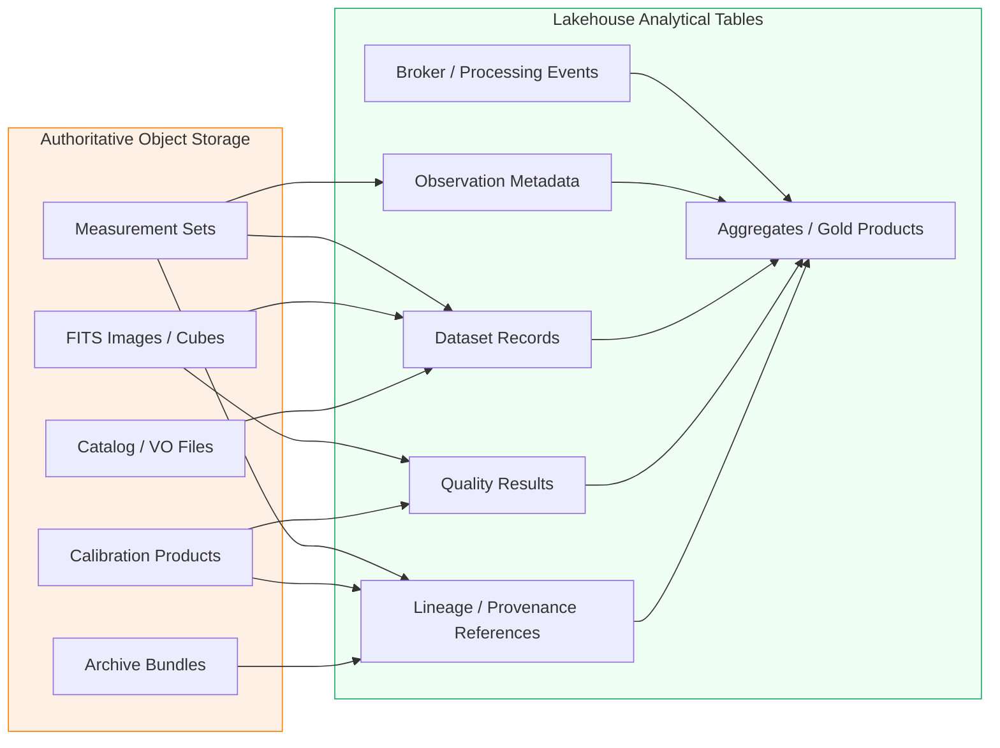
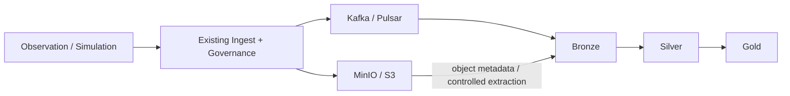

# Storage Responsibilities

> Status: **planned lakehouse integration**
> This document clarifies ownership between scientific object storage and the analytical lakehouse.

Standalone Mermaid sources are maintained in [`../diagrams/`](../diagrams/README.md).

## 1. Core rule

**The lakehouse does not replace MinIO/S3 as the authoritative store for large scientific objects.**

CASA Measurement Sets, FITS images, calibration products, archive packages, and other large binary science products remain in object/archive storage. The lakehouse stores structured records that describe, index, validate, relate, and summarize those objects.

## 2. Responsibility topology



Mermaid source: [`storage-responsibility-topology.mmd`](../diagrams/storage-responsibility-topology.mmd)

## 3. Ownership matrix

| Data/product               | Authoritative location                                  | Lakehouse representation                                                |
| -------------------------- | ------------------------------------------------------- | ----------------------------------------------------------------------- |
| Raw visibility binary      | MinIO/S3 / ingest/archive tier                          | URI, checksum, size, source metadata, ingest status                     |
| CASA Measurement Set       | MinIO/S3 / warm archive                                 | dataset/observation references and selected extracted structured fields |
| FITS image/cube            | MinIO/S3 / science-product tier                         | URI, header-derived metadata as appropriate, quality/index fields       |
| Calibration product        | MinIO/S3                                                | URI, algorithm/version metadata, quality/provenance references          |
| Dataset manifest           | Governance/object store                                 | Bronze raw copy/reference; Silver canonical dataset representation      |
| Broker event               | Broker at transport time; Bronze for analytical history | complete normalized Bronze event record                                 |
| Job lifecycle              | Java Governance Plane                                   | Silver analytical representation/reference                              |
| Provenance/audit semantics | Governance Plane                                        | Silver lineage/reference tables and Gold completeness views             |
| Operational metrics        | Monitoring/broker sources                               | Bronze telemetry + Gold aggregates                                      |
| Consumer analytical table  | Lakehouse                                               | Gold authoritative analytical representation                            |

## 4. Object-reference contract

Lakehouse records that refer to external science objects should preserve, where available:

```text
object_uri
object_type
checksum
checksum_algorithm
size_bytes
observation_id
dataset_id
processing_level
source_name
provider_name
created_at
registered_at
schema_version
```

The object URI alone is not sufficient provenance. A stable identifier and integrity information should travel with it.

## 5. Write-path boundary

The intended target write path is:



Mermaid source: [`write-path-boundary.mmd`](../diagrams/write-path-boundary.mmd)

The lakehouse may read object metadata or controlled structured extracts, but it should not become an accidental second uncontrolled writer of authoritative astronomy objects.

## 6. Read-path boundary

Different consumers should use the tier suited to their workload:

| Consumer                               | Preferred source                                     |
| -------------------------------------- | ---------------------------------------------------- |
| CASA/science processing pipeline       | authoritative object store                           |
| Bulk science-product download          | authoritative object/distribution tier               |
| Dataset discovery/catalog UI           | Governance API and/or curated Gold view              |
| Operational trend dashboard            | Gold analytical tables                               |
| Data-quality analysis                  | Silver quality + Gold rollups                        |
| Reprocessing/replay investigation      | Bronze + authoritative object source                 |
| AI/ML feature or retrieval preparation | governed Silver/Gold datasets with source references |

## 7. Avoiding duplicated truth

Adding Delta tables creates a risk that both application services and analytical tables appear authoritative for the same entity. To avoid this:

1. Document the system of record for every entity.
2. Treat lakehouse copies of Governance Plane entities as analytical projections unless ownership is explicitly changed by an architecture decision.
3. Preserve source identifiers rather than creating unrelated lakehouse-only IDs where possible.
4. Record transformation version and ingestion timestamp for every projection.
5. Do not allow a Gold table to silently become the mutation API for job or dataset lifecycle state.

## 8. Small-file learning experiment

One useful implementation experiment is to compare many small metadata/event objects with a structured Delta representation.

Example:

```text
Current/prototype pattern
  many record.json / manifest.json objects
          vs
Lakehouse pattern
  Parquet/Delta analytical rows
  + transaction metadata
  + compaction/optimization
  + data skipping/clustering where appropriate
```

The experiment should measure rather than assume improvement:

- file/object count,
- ingest throughput,
- query latency,
- bytes scanned,
- compaction effects,
- restart/recovery behavior,
- and operational complexity.

The result may justify a lakehouse analytical representation without changing the authoritative object-storage strategy.

## 9. Decision gate

A new data type belongs in Delta only when at least one of these is true:

- it benefits from structured analytical queries,
- it participates in joins/aggregations across observations or datasets,
- it requires incremental/streaming transformation,
- it requires durable analytical history,
- it supports quality, lineage, operational, or AI-ready use cases.

A data type should remain only in object storage when its dominant use is large-object retrieval or domain-specific scientific processing and an analytical table copy provides no measurable benefit.
