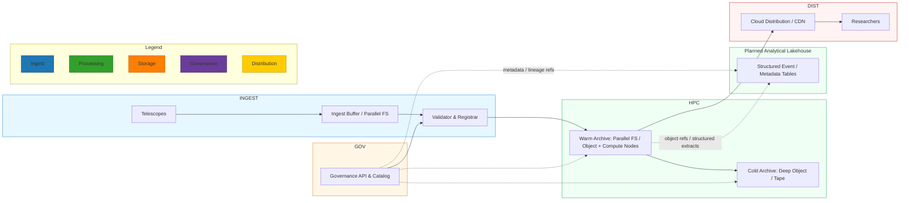

# Storage Architecture Overview

Alignment anchors

- Frontend UX source of truth: [../FRONTEND_UI.md](/docuentation/frontend/FRONTEND_UI.md)
- Execution backlog: [../../TODO.md](/docuentation/planning/TODO.md)
- Delivery plan: [../../ROADMAP.md](/ROADMAP.md)

This document describes the hybrid tiered storage topology and its interactions with the Governance Plane and compute fabric.

Architecture diagram

Key interfaces

- Ingest -> Governance: dataset registration API call assigns persistent identifiers and initial metadata.

- Governance -> Archive: cataloged locations and retention policies drive lifecycle transitions.

- Archive -> Distribution: derived products are exported or mirrored to distribution tier under governance rules.

- Archive/Governance -> Planned Lakehouse: structured metadata, event history, quality results, provenance references, and controlled object metadata/extracts feed analytical tables without changing authoritative science-object ownership.

Data placement and federation

- Localized ingest buffers accept raw visibilities and provide short-term fault-tolerant storage to absorb bursts and network disruptions.

- The HPC Archive is the authoritative store; it may be federated across multiple national centers for redundancy and geolocation.

- The Distribution Tier holds derived products and indexed subsets optimized for global retrieval.

- The planned Lakehouse Analytical Data Plane is **not** an additional authoritative binary archive. Large Measurement Sets, FITS products, calibration artifacts, and archive bundles remain in object/archive storage. The lakehouse stores structured event/metadata records, quality outcomes, lineage references, and query-optimized derived tables.

- Lakehouse copies of governance entities are analytical projections unless an explicit architecture decision changes the system of record.

Observability and operational controls

- Each transition emits events consumed by the Operational Streaming Plane for monitoring and SLO enforcement.

- The Governance Plane supports audits, retention enforcement, and provenance validation hooks triggered during transitions.

- The planned lakehouse should preserve source event identifiers, object URIs, checksums, and transformation lineage so analytical products can be traced back to authoritative inputs.

Related Lakehouse Initiative documents

- [../lakehouse/README.md](../lakehouse/README.md)
- [../lakehouse/docs/LAKEHOUSE_TOPOLOGY.md](../lakehouse/docs/LAKEHOUSE_TOPOLOGY.md)
- [../lakehouse/docs/MEDALLION_ARCHITECTURE.md](../lakehouse/docs/MEDALLION_ARCHITECTURE.md)
- [../lakehouse/docs/STORAGE_RESPONSIBILITIES.md](../lakehouse/docs/STORAGE_RESPONSIBILITIES.md)
- [../lakehouse/docs/REAL_DATA_SOURCES.md](../lakehouse/docs/REAL_DATA_SOURCES.md)
- [../lakehouse/docs/ESO_PROOF_SLICE_BRIEF.md](../lakehouse/docs/ESO_PROOF_SLICE_BRIEF.md)
- [../lakehouse/diagrams/README.md](../lakehouse/diagrams/README.md)
