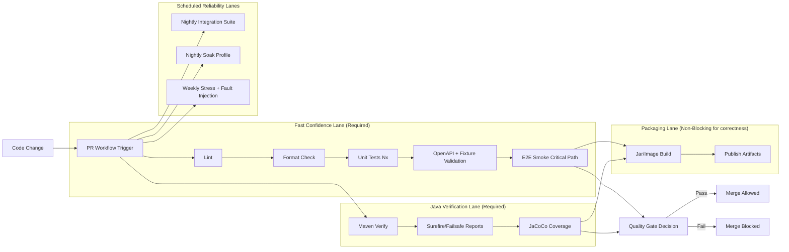
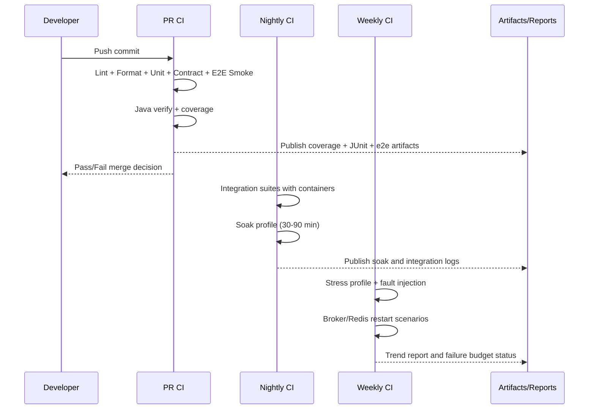
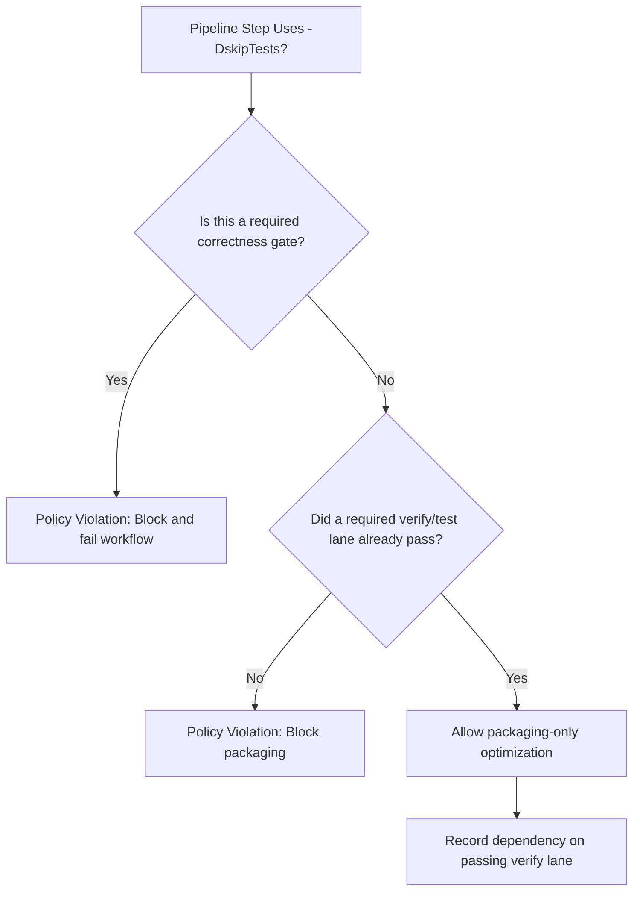
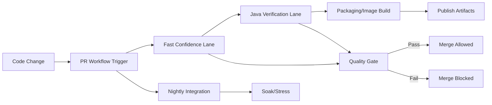
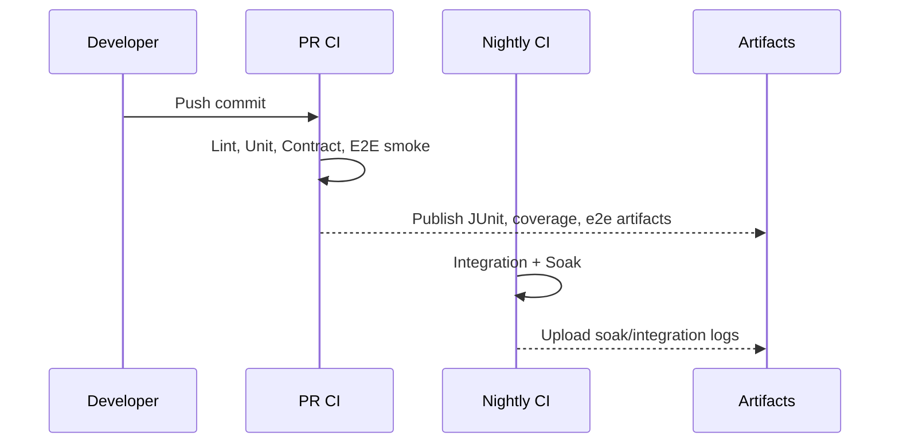
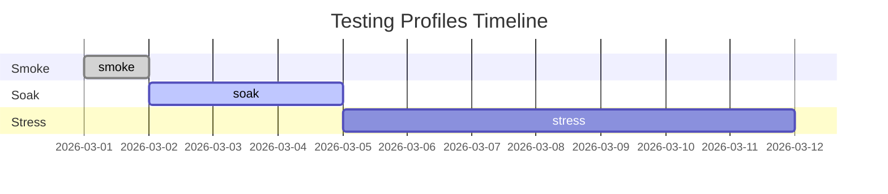

# Testing Framework Architecture

Alignment anchors

- Frontend UX source of truth: [FRONTEND_UI.md](/docuentation/frontend/FRONTEND_UI.md)
- Execution backlog: [../TODO.md](/docuentation/planning/TODO.md)
- Delivery plan: [../ROADMAP.md](/ROADMAP.md)
- Policy baseline: [TESTING_REQUIREMENTS.md](/docuentation/testing/TESTING_REQUIREMENTS.md)

This document defines the architecture of testing in Cosmic Horizon as a system, not just a checklist. It explains how unit, integration, e2e, and stress testing fit together across services and CI lanes, and why skip-flags in merge-critical paths are prohibited.

## 1. Why this architecture exists

The platform is intentionally hybrid:

- Angular operator console
- Java governance control plane
- Go generator/streaming plane
- Dockerized dependencies (Kafka, Redis, observability stack)

That means defects appear at different layers:

- Unit-level logic regressions
- Cross-service contract drift
- Async lifecycle race conditions
- Long-run stability and backpressure failures

A single testing style cannot cover all of this. The framework architecture provides a layered model where each lane has a clear purpose and failure semantics.

## 2. Testing planes and trust model

The testing framework is divided into four planes:

1. Fast correctness plane (unit + static checks) for PR confidence.
2. Contract plane (OpenAPI + fixtures + DTO mapping) for drift prevention.
3. Integration plane (container-backed) for real dependency behavior.
4. Operational plane (smoke/soak/stress) for reliability under realistic load patterns.

If one plane is weak, trust is weak. For large-scale smoke goals, the operational plane is required, not optional.

## 3. End-to-end CI test matrix flow



## 4. Service-by-service testing ownership

| Service                      | Type         | Unit Tests                                                | Container Integration                                                      | Status           |
| ---------------------------- | ------------ | --------------------------------------------------------- | -------------------------------------------------------------------------- | ---------------- |
| `apps/frontend`              | Angular SPA  | ✅ 39 suites / 224 tests                                  | n/a                                                                        | **Green**        |
| `apps/frontend-e2e`          | Cypress e2e  | ✅ 11 topology specs                                      | n/a                                                                        | **Green**        |
| `apps/java-governance`       | Spring Boot  | ✅ 17 test classes                                        | ✅ Testcontainers (Kafka, Redis, RabbitMQ, Pulsar) via `-Pwith-containers` | **Green**        |
| `tools/java-ingest`          | Spring Boot  | ✅ `BasicTest`, `IngestMetricsServiceTest`                | ✅ `KafkaIngestListenerContainerIntegrationTest` via `-Pwith-containers`   | **Green**        |
| `tools/data-generator`       | Go binary    | ✅ `main_test.go` (parseSegmentWeights, allocateSegments) | n/a (no external deps)                                                     | **Green**        |
| `tools/maven-test-image`     | Docker image | via CI build only                                         | n/a                                                                        | Build-only       |
| Third-party compose services | Stock images | n/a                                                       | healthchecks in `dev-compose.yml`                                          | Config-validated |

Configuration-only containers (nginx, Grafana, Loki, Alertmanager, Prometheus) have their YAML/config files automatically picked up by `pnpm run lint:yaml` via `git ls-files`.

## 5. Execution cadence and runtime strategy



## 6. Build-flag policy (`-DskipTests`) decision model



## 7. Scale-profile architecture for reliability confidence

The framework defines three explicit load profiles:

1. `profile-smoke`

- Intent: fast PR-safe confidence.
- Runtime: minutes.
- Checks: critical API flow + basic UI flow + no fatal errors.

1. `profile-soak`

- Intent: detect memory leaks, queue growth, retry storms.
- Runtime: 30 to 90 minutes.
- Checks: bounded resource growth, stable throughput, recoverable failures.

1. `profile-stress`

- Intent: validate degradation and recovery controls.
- Runtime: scheduled (nightly/weekly).
- Checks: fault injection, backpressure behavior, recovery time objectives.

For very large-scale goals, these profiles act as equivalence testing on synthetic workloads. They are not replacements for production-scale infrastructure tests, but they are required gates for local and CI confidence.

## 8. Required outputs and observability hooks

Every test lane must emit machine-parseable artifacts:

- JUnit XML/Surefire XML for Java lanes.
- Coverage reports for Nx, Java, and Go components.
- E2E screenshots/videos and command logs.
- Integration and stress run logs with profile metadata (seed, rate, duration).

Minimum metadata for stress artifacts:

- profile name
- run start/end timestamp
- synthetic seed/config id
- error counts by class
- retry counts
- queue depth maxima
- memory and disk high-water marks

## 9. Gating policy and non-negotiables

Required PR gates:

1. Fast confidence lane.
2. Java verification lane.
3. Contract validation lane.

Allowed to be scheduled:

1. Long soak runs.
2. Stress/fault-injection runs.

Not allowed:

1. Merge-critical workflows that never execute tests.
2. Silent skip-flags that bypass required test intent.

## 10. Implementation alignment checklist

Use this checklist during each roadmap pass:

- CI workflows: required verify lanes present and blocking.
- Docker test-runner: runs unit + integration + e2e smoke and exports artifacts.
- Service gaps: explicit tests exist for `tools/java-ingest` and `tools/data-generator`.
- Coverage gate: aggregated threshold is enforced and visible in CI status.
- Docs: this file, [TESTING_REQUIREMENTS.md](/docuentation/testing/TESTING_REQUIREMENTS.md), [../TODO.md](/docuentation/planning/TODO.md), and [../ROADMAP.md](/ROADMAP.md) stay synchronized.

## 11. Related documents

- [TESTING_REQUIREMENTS.md](/docuentation/testing/TESTING_REQUIREMENTS.md)
- [JAVA_GOVERNANCE_SPEC.md](/docuentation/governance/JAVA_GOVERNANCE_SPEC.md)
- [GO_GENERATOR_SPEC.md](/docuentation/generators/GO_GENERATOR_SPEC.md)
- [INFRA_TOPOLOGY.md](/docuentation/infra/INFRA_TOPOLOGY.md)
- [../TODO.md](/docuentation/planning/TODO.md)
- [../ROADMAP.md](/ROADMAP.md)

## 12. E2E Tooling: Cypress vs Playwright (practical guidance)

The repository intentionally uses a hybrid approach for end-to-end tooling. Below is a concise, opinionated guide explaining why both live here, and how to choose which to use for a particular task.

- **Cypress — Developer diagnostic & UI troubleshooting**

  - Best for: rapid, interactive debugging of single-page UI flows during development; time-travel debugging; easy request/response interception and stubbing.
  - Strengths: fast local runs, tight dev feedback loop, rich test runner UI, simple network interception (useful to capture `/api` traffic and write diagnostic artifacts).
  - Typical uses in this repo: ad-hoc diagnostics (jobs view capture), reproduction of UI issues reported by browser, and developer-focused optimistic smoke tests.
  - How we use it here: short diagnostic specs are added under `apps/frontend-e2e/src/` that visit the app (via `baseUrl`) and intercept `**/api/v1/...` calls. Tests write verbose artifacts into the repository `logs/` folder for forensic inspection.

- **Playwright — CI continuity and cross-browser coverage**
  - Best for: deterministic CI suites that must validate behavior across Chromium/Firefox/WebKit, and scenarios requiring multiple browser contexts or lower-level browser control.
  - Strengths: multi‑browser support, headful/headless parity, and support for parallelized workers in CI at scale.
  - Typical uses in this repo: scheduled cross-browser E2E, continuity flows that must run in CI (nightly or PR gates when configured), and tests that require broader environment fidelity.

Decision guidance:

- Use Cypress when you need to intercept, stub, or dump request/response details quickly while developing locally.
- Use Playwright for the canonical CI E2E suite and for broad cross-browser regression checks.

Operational notes (applies to both):

- Artifacts: both frameworks should write human- and machine-readable artifacts to `logs/` and the CI artifacts directory. For Cypress diagnostic runs we write `logs/jobs-diagnostic-<timestamp>.log` and HTML snapshots `logs/jobs-page-<timestamp>.html` to capture what the browser rendered.
- Start prerequisites: ensure the frontend dev server is reachable at the `baseUrl` provided to the test runner (commonly `http://localhost:3000` in developer flows). Use `pnpm run start:all:reset` to start the full local stack, or `pnpm exec nx run frontend:serve -- --port=<port>` if you only need the frontend.
- Auth and token handling: diagnostic tests assume an unauthenticated or dev-token-enabled environment. If the backend returns `401 Unauthorized`, supply a dev bearer token (or set a test cookie/localStorage entry) before visiting the UI. Cypress tests can inject tokens via `cy.setCookie` or `cy.window().then(w => w.localStorage.setItem(...))` before `cy.visit()`.

## 13. How the Jobs diagnostic test works (Cypress)

Location

- `apps/frontend-e2e/src/specs/jobs-diagnostic.spec.ts` — non-invasive diagnostic that:
- `apps/frontend-e2e/src/specs/jobs-lineage.spec.ts` — verifies job submission with lineage and UI display
  - Intercepts `**/api/v1/jobs**` network requests (works whether the frontend proxies `/api` to a backend or calls a backend host directly).
  - Visits the Jobs route (`/jobs`) and writes a snapshot of the rendered HTML to `logs/jobs-page-<timestamp>.html` so maintainers can quickly see redirect/login pages or client-side errors.
  - If a jobs API call occurs, the test records request/response details to `logs/jobs-diagnostic-<timestamp>.log` (URL, headers, status, body, durations) and fails the test when the API returns non-2xx responses.

How to run locally (developer flow)

1. Start the dev stack (recommended full orchestration):

```bash
pnpm run start:all:reset
```

This creates timestamped logs under `logs/` while orchestrating the stack.

1. Run the Cypress diagnostic (headless):

```bash
npx cypress run --config-file apps/frontend-e2e/cypress.config.ts --spec "apps/frontend-e2e/src/e2e/jobs-diagnostic.cy.ts" --config baseUrl=http://localhost:3000
```

1. Inspect artifacts (latest files):

```bash
ls -t logs/jobs-diagnostic-* | head -n1
ls -t logs/jobs-page-* | head -n1
cat "$(ls -t logs/jobs-diagnostic-* | head -n1)"
```

Troubleshooting tips

- If Cypress times out waiting for a `jobs` network request:
  - Confirm the frontend rendered the Jobs UI by opening `logs/jobs-page-<timestamp>.html` (it may show a login page or an error banner).
  - If you see a login page, inject a dev token or set `localStorage`/cookie before `cy.visit()`.
  - Check the frontend proxy (`apps/frontend/proxy.conf.json`) to ensure `/api` is forwarded to the running backend (default `http://localhost:4000`). If the backend is inside Docker, ensure ports are published and reachable from your host.

Next steps and automation

- Playwright variant: add a Playwright diagnostic that launches the app at `baseUrl`, navigates to `/jobs`, and records network traffic to a JSON artifact. This is useful when you want the same diagnostic in a cross-browser CI lane.
- CI integration: add a short pipeline step that runs the Cypress diagnostic in `profile-smoke` and uploads `logs/` artifacts to the CI job for quicker triage.

## 14. Iterative CI debugging with gh CLI

The `gh` CLI is authenticated in this repo (`gh auth status` confirms `JeffreySanford`). Two scripts wrap common debugging tasks so you can fetch, read, and fix failures without leaving the terminal.

### Available pnpm scripts

| Script                       | What it does                                                            |
| ---------------------------- | ----------------------------------------------------------------------- |
| `pnpm run ci:logs`           | Fetch failed-step logs from the most recent failed run; save to `logs/` |
| `pnpm run ci:logs:list`      | Print last 15 runs with pass/fail status and run IDs                    |
| `pnpm run ci:logs:watch`     | Live-tail the currently running workflow; offer to pull logs on finish  |
| `pnpm run ci:codeql`         | Download CodeQL SARIF from the latest CodeQL run; print findings report |
| `pnpm run ci:codeql:list`    | List recent CodeQL workflow runs                                        |
| `pnpm run ci:codeql:trigger` | Manually dispatch the CodeQL workflow (`codeql.yml`)                    |

### Output files

All diagnostic output lands in `logs/` (gitignored):

```text
logs/
  ci-<run-id>-<ts>.log          # raw GitHub Actions log with timestamps
  ci-<run-id>-<ts>-clean.log    # timestamps stripped, markers humanised
  ci-<run-id>-<ts>-summary.md   # errors + warnings extracted as Markdown
  codeql/
    run-<run-id>/               # downloaded SARIF artifact(s)
    codeql-<ts>.md              # parsed findings report
```

### Iterative fix loop

```text
git push
        |
        v
pnpm run ci:logs:watch     <-- live tail; pulls logs when run finishes
        |
        v
pnpm run ci:logs           <-- generates logs/ci-<id>-summary.md
        |                      (errors highlighted, clean log stripped)
        v
  fix source files
        |
        v
pnpm run quality:ci        <-- reproduce the gate locally before pushing
        |
        v
git push  -->  repeat until green
```

### CodeQL iterative loop

```bash
pnpm run ci:codeql:trigger      # dispatch workflow (or wait for next push)
pnpm run ci:logs:watch          # watch it run
pnpm run ci:codeql              # download SARIF + parse findings to logs/codeql/
  -> fix the reported file:line
pnpm run quality:ci             # verify locally
git push                        # triggers fresh CodeQL scan
```

### CodeQL — free vs paid

- **Public repo**: CodeQL results appear in the GitHub Security tab automatically at no cost.
- **Private repo without GHAS**: CodeQL still runs on every push/PR and weekly. This script downloads and parses the SARIF artifacts locally so you see all findings. The GitHub Security tab integration is the only thing that requires GitHub Advanced Security.

### Fetching logs for a specific run

```bash
# List runs with IDs
pnpm run ci:logs:list

# Fetch full logs for any run (not just failed steps)
sh ./scripts/ci-logs.sh --all <run-id>

# Fetch from a specific run by ID
sh ./scripts/ci-logs.sh <run-id>
```

### Prerequisites

- `gh` CLI — already installed and authenticated (`gh auth status`)
- `jq` — needed for SARIF parsing (`brew install jq` / `winget install jqlang.jq`)
- All scripts gracefully skip or explain what is missing if dependencies are not met.

## 15. Visual diagrams

Below are compact mermaid diagrams that make the testing flows easier to scan. They are intentionally small and focused — use them as visual anchors in PRs and runbooks.

Pipeline flowchart (PR → fast lane → Java verify → packaging / scheduled lanes):



Execution sequence (Dev push → PR CI → Nightly → artifacts):



Jobs diagnostic flow (what the Cypress diagnostic does):

```mermaid
flowchart TD
  Start[Start dev stack or frontend]
  Start --> Visit[Visit /jobs (Cypress)]
  Visit --> Intercept[Intercept **/api/v1/jobs**]
  Intercept --> Capture[Write logs/jobs-page-<ts>.html]
  Intercept --> Capture2[Write logs/jobs-diagnostic-<ts>.log]
  Capture2 --> Analyze[Fail on non-2xx or attach artifacts]
```

Profiles timeline (smoke / soak / stress schedule):



---
