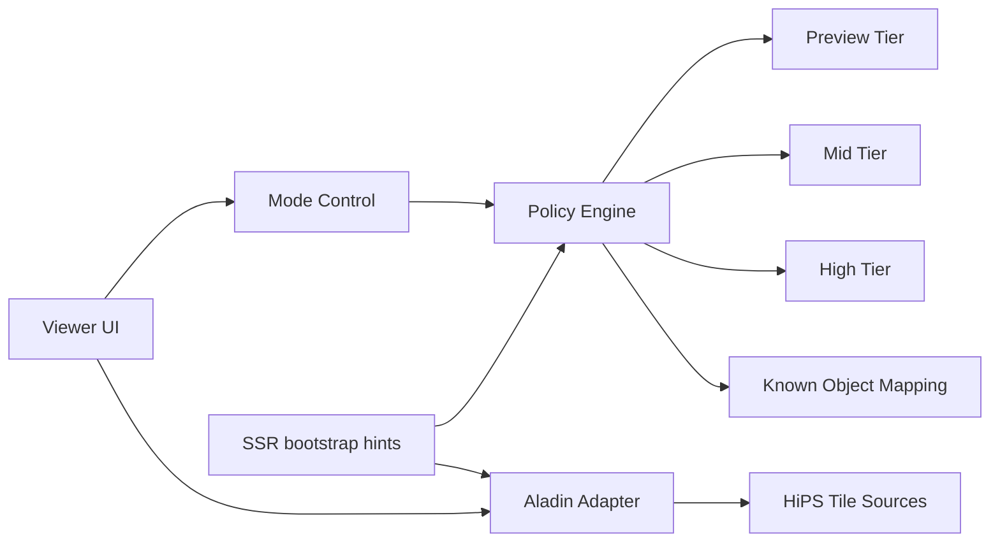
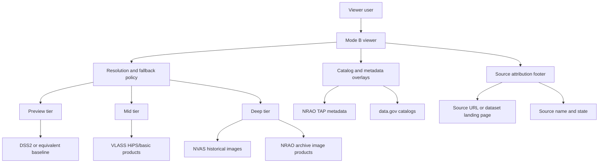

# Viewer (Mode B) — Progressive High-Resolution Strategy

Alignment anchors

- Frontend UX source of truth: [FRONTEND_UI.md](/docuentation/frontend/FRONTEND_UI.md)
- Feature detail: [../frontend/features/VIEWER.md](/docuentation/frontend/features/VIEWER.md)
- Source contract: [VIEWER_SOURCE_CONTRACT.md](/docuentation/viewer/VIEWER_SOURCE_CONTRACT.md)
- Public data inventory: [../../documentation/public-data/PUBLIC_DATA_RESOURCES.md](/documentation/public-data/PUBLIC_DATA_RESOURCES.md)
- Execution backlog: [../../TODO.md](/TODO.md)
- Delivery plan: [../../ROADMAP.md](/ROADMAP.md)

## Objective

Mode B introduces progressive high-resolution imagery behavior in the Viewer:

- Keep a fast wide-field survey for initial navigation.
- Switch to higher-resolution surveys as zoom increases.
- Use known-object hints to prefer better public surveys when available.
- Provide a manual lower-left control so operators can force high-resolution mode.
- Prefer public NRAO/VLA viewer-ready assets first so the UI can ship real sky content before deeper archive ETL is complete.

## Why this is needed

- Wide-field browsing and deep zoom have different performance and fidelity needs.
- A single fixed survey is not optimal across all zoom levels.
- Operators/scientists need predictable control over quality vs latency behavior.

## Scope for current implementation

- Current app path: `apps/frontend` Viewer (Aladin Lite integration).
- Mode A: default fast preview survey.
- Mode B: progressive survey switching plus manual high-resolution control.
- Out of scope for first iteration: full custom renderer replacement.

## Why public data helps Mode B now

The public-data inventory materially improves the near-term Mode B plan:

- `VLASS` HiPS/basic products provide public, tiled, sky-navigation-friendly imagery that works with Aladin Lite.
- `NVAS` provides historical public image content for fallback, demos, and regression fixtures.
- NRAO TAP metadata can seed target/context metadata before deep archive download paths exist.
- `data.gov` catalogs such as `NVSS`, `VLSSr`, and `QORG` can support source overlays and search-backed annotations.
- NSF/NIST sources are secondary for Mode B itself, but useful for provenance, context, and timing/trust workflows around viewer-linked datasets.

This means Mode B can progress in three layers instead of waiting for a single full archive pipeline:

1. Public viewer imagery
2. Public metadata and catalog overlays
3. Deeper archive-connected ingest

## SSR realities

Aladin does client-side rendering and tile fetching. SSR cannot render final imagery.

SSR can still help by:

- preloading likely tile/catalog URLs
- delivering initial viewer config (target, fov, survey priority list)
- reducing first-interaction latency through cache warming

SSR cannot:

- execute full Aladin render pipeline on server
- replace client-side tile composition behavior

## UX behavior

Required controls:

- Lower-left toggle group:
  - `Auto` (default)
  - `High Resolution`
  - `Preview`
- Survey/source badge showing current active survey and source-state (`live`, `fallback`, `mock`, `stale`).

Required switching behavior:

- `Auto` mode:
  - use FOV thresholds to switch survey tiers
  - apply known-object survey preference map when object is recognized
  - fall back gracefully when target survey is unavailable
- `High Resolution` mode:
  - prefer highest configured survey tier at current sky location
  - continue fallback cascade if tiles fail
- `Preview` mode:
  - keep fast baseline survey regardless of zoom

## Survey-tier strategy (initial)

| Tier | Mode B role | Preferred source class | Near-term candidate sources |
| --- | --- | --- | --- |
| 0 | Preview / wide field | Stable wide-field baseline | Current `DSS2` baseline, with future registry-based fallback |
| 1 | Mid zoom | Public HiPS with better detail | `VLASS` HiPS/basic public products |
| 2 | Deep zoom | Highest-quality public image products available before archive-only paths | `VLASS` enhanced/basic products, `NVAS` historical images, later NRAO archive image products |

Selection inputs:

- FOV/zoom
- target/object identifier
- survey availability and tile load error rate
- manual override mode
- source citation metadata availability

## Integration architecture

## Public-data-backed Mode B flow

## Public-source integration notes

- Use public HiPS sources with stable terms and availability.
- Keep survey registry configurable.
- Track CORS and outage behavior per source.
- Log source switches and tile failures for diagnostics.
- Preserve source URL, dataset/survey identifier, and access date with each externally sourced viewer asset.
- Prefer rendering source attribution as subdued small text in the viewer chrome or detail drawer.
- If the active view is space-constrained, preserve citation metadata in the selected-object or layer detail panel instead of dropping it.

Contract note:

- The proposed registry and attribution payload shapes are defined in `VIEWER_SOURCE_CONTRACT.md`.

## Source attribution pattern

When the viewer renders externally sourced imagery or overlays, expose:

- source name, for example `VLASS`, `NVAS`, `NRAO Archive`, `NVSS`
- source state, for example `live`, `fallback`, `cached`, `stale`
- authoritative source link when available
- optional access date or dataset identifier in expanded detail

Recommended compact presentation:

`Source: VLASS | live | science.nrao.edu/vlass`

Recommended expanded presentation:

- Source: `VLASS`
- State: `live`
- Citation URL: authoritative landing page or product URL
- Dataset/survey id: if known
- Accessed: UI-rendered timestamp or ingest-captured retrieval date

## Decision gate: remain on Aladin vs new viewer engine

Stay on Aladin if:

- progressive switching and controls work reliably
- deep zoom meets latency and visual quality targets
- required interactions are achievable without fragile hacks

Evaluate new viewer engine if:

- Aladin API limits block required operations
- high-resolution mode is unstable across key objects
- required interactions (advanced blending/cube slicing/etc.) cannot be delivered

Possible next-engine paths (evaluation only in this phase):

- OpenLayers/Cesium/WebGL custom tile stack
- FITS/WebGL specialized renderer path
- hybrid adapter model (Aladin for sky navigation, custom renderer for deep analysis)

## Implementation phases

Phase 1:

- add lower-left mode control
- implement FOV-tier survey switching in `Auto`
- add survey/source badge
- add object-aware survey mapping scaffold
- integrate at least one public `VLASS` path and one fallback historical image path
- surface compact source attribution for active imagery

Phase 2:

- add robust fallback cascade and source health tracking
- add metrics: switch counts, tile load latency, error rates
- add e2e coverage for zoom-driven switching and manual overrides
- add NRAO TAP-backed metadata/context overlays
- add `data.gov` catalog overlays where payload size and density are acceptable

Phase 3:

- run capability benchmark against requirements
- decide whether to continue with Aladin-only Mode B or begin new viewer engine track
- determine when direct NRAO archive image/data integration should replace or augment public seed sources

## Testing requirements

Unit:

- policy engine threshold logic
- manual override precedence
- known-object mapping selection

Integration:

- survey switching under tile failure
- source fallback and recovery behavior

E2E:

- zoom in/out transitions trigger expected tier changes in `Auto`
- `High Resolution` and `Preview` overrides work as expected
- UI displays active survey/source-state correctly
- UI displays source attribution when external imagery or overlays are active
- fallback path retains citation metadata after source switch

## Acceptance criteria

- Deep zoom switches to higher-resolution surveys when available.
- Manual lower-left control overrides automatic behavior.
- Viewer remains responsive during switching and fallback.
- Metrics and tests provide reproducible evidence of behavior.
- Public viewer sources can be integrated without hiding origin; source attribution is visible in compact or expanded form.
