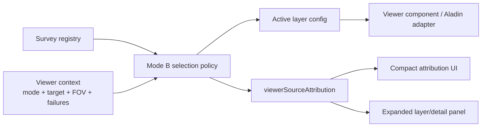

# Viewer Source Contract

Alignment anchors

- Mode B strategy: [VIEWER_MODEB.md](/docuentation/viewer/VIEWER_MODEB.md)
- Frontend UX source of truth: [../frontend/FRONTEND_UI.md](/docuentation/frontend/FRONTEND_UI.md)
- Public data inventory: [../../documentation/public-data/PUBLIC_DATA_RESOURCES.md](/documentation/public-data/PUBLIC_DATA_RESOURCES.md)
- Execution backlog: [../../TODO.md](/TODO.md)
- Delivery plan: [../../ROADMAP.md](/ROADMAP.md)

## Purpose

Define a concrete UI/API contract for:

- `viewerSourceAttribution`: how the UI cites the active imagery, catalog, or metadata source
- survey registry entries: how Mode B knows which public or internal source to select at a given zoom, mode, or fallback condition

This is a proposed contract for implementation planning. It aligns with current Mode B documentation and the existing `Aladin Lite` viewer component.

## Design goals

- Keep source attribution explicit instead of assembling it ad hoc in templates.
- Keep survey/source selection configurable instead of hardcoded inside viewer logic.
- Make fallback transitions observable and testable.
- Preserve authoritative source links for trust, provenance, and drill-down behavior.

## Contract overview



## TypeScript interfaces

These interfaces are intended as the frontend-facing baseline. Backend APIs may return the same shape directly or provide a source registry payload that the frontend resolves into these models.

```ts
export type ViewerSourceType =
  | "imagery"
  | "catalog"
  | "metadata"
  | "calibration";

export type ViewerSourceState =
  | "live"
  | "fallback"
  | "cached"
  | "stale"
  | "mock";

export type ViewerMode =
  | "auto"
  | "preview"
  | "high-resolution";

export type ViewerLayerKind =
  | "hips"
  | "image"
  | "fits"
  | "catalog"
  | "tap-overlay"
  | "metadata-overlay";

export interface ViewerSourceAttribution {
  sourceType: ViewerSourceType;
  sourceName: string;
  providerName: string;
  sourceState: ViewerSourceState;
  citationUrl?: string;
  accessUrl?: string;
  datasetId?: string;
  datasetVersion?: string;
  attributionText?: string;
  licenseNote?: string;
  accessedAt?: string; // ISO-8601 timestamp
}

export interface ViewerSurveyRegistryEntry {
  id: string;
  label: string;
  providerName: string;
  kind: ViewerLayerKind;
  tier: 0 | 1 | 2;
  enabled: boolean;
  modeSupport: ViewerMode[];
  priority: number;
  minFovDeg?: number;
  maxFovDeg?: number;
  targetAllowList?: string[];
  objectClassAllowList?: string[];
  waveband?: "radio" | "optical" | "infrared" | "mixed";
  hipsUrl?: string;
  imageUrlTemplate?: string;
  metadataQueryUrl?: string;
  citationUrl: string;
  datasetId?: string;
  datasetVersion?: string;
  fallbackOrder?: string[];
  tags?: string[];
}

export interface ViewerSelectionContext {
  mode: ViewerMode;
  target?: string;
  objectClass?: string;
  fovDeg: number;
  failedSourceIds?: string[];
}

export interface ViewerResolvedLayer {
  registryEntryId: string;
  kind: ViewerLayerKind;
  label: string;
  providerName: string;
  sourceState: ViewerSourceState;
  renderUrl?: string;
  queryUrl?: string;
  tier: 0 | 1 | 2;
  attribution: ViewerSourceAttribution;
}
```

## Minimal UI expectations

Every externally sourced viewer layer should be able to provide:

- a compact citation line for the viewer chrome/footer
- an expanded citation/detail view for the selected layer or object
- a stable internal id so fallback and telemetry events can refer to the same source consistently

Recommended compact rendering:

```text
Source: VLASS | live | science.nrao.edu/vlass
```

Recommended expanded rendering:

- Source name
- Provider name
- Source state
- Citation URL
- Dataset/survey identifier
- Accessed timestamp

## Sample registry JSON

This example is intentionally small and grounded in the current Mode B strategy.

```json
{
  "version": "2026-03-06",
  "defaultMode": "auto",
  "sources": [
    {
      "id": "dss2-preview",
      "label": "DSS2 Preview",
      "providerName": "CDS",
      "kind": "hips",
      "tier": 0,
      "enabled": true,
      "modeSupport": ["auto", "preview"],
      "priority": 100,
      "minFovDeg": 2.0,
      "maxFovDeg": 180.0,
      "hipsUrl": "https://alasky.cds.unistra.fr/DSS/DSSColor",
      "citationUrl": "https://aladin.cds.unistra.fr/hips/list",
      "datasetId": "CDS_P_DSS2_color",
      "fallbackOrder": ["vlass-hips"]
    },
    {
      "id": "vlass-hips",
      "label": "VLASS HiPS",
      "providerName": "NRAO",
      "kind": "hips",
      "tier": 1,
      "enabled": true,
      "modeSupport": ["auto", "high-resolution"],
      "priority": 200,
      "minFovDeg": 0.15,
      "maxFovDeg": 6.0,
      "waveband": "radio",
      "hipsUrl": "https://vlass-dl.nrao.edu",
      "citationUrl": "https://science.nrao.edu/vlass",
      "datasetId": "VLASS",
      "fallbackOrder": ["nvas-image"],
      "tags": ["public", "viewer-seed", "radio"]
    },
    {
      "id": "nvas-image",
      "label": "NVAS Historical Image",
      "providerName": "VLA",
      "kind": "image",
      "tier": 2,
      "enabled": true,
      "modeSupport": ["auto", "high-resolution"],
      "priority": 150,
      "maxFovDeg": 1.0,
      "waveband": "radio",
      "citationUrl": "https://www.vla.nrao.edu/astro/nvas/",
      "datasetId": "NVAS",
      "fallbackOrder": ["dss2-preview"],
      "tags": ["public", "historical", "fallback"]
    },
    {
      "id": "nrao-tap-overlay",
      "label": "NRAO TAP Metadata Overlay",
      "providerName": "NRAO",
      "kind": "tap-overlay",
      "tier": 1,
      "enabled": true,
      "modeSupport": ["auto", "high-resolution", "preview"],
      "priority": 120,
      "metadataQueryUrl": "https://data-query.nrao.edu/tap",
      "citationUrl": "https://science.nrao.edu/srdp/scripted-access-to-the-nrao-archive",
      "datasetId": "NRAO-TAP",
      "tags": ["metadata", "overlay", "public"]
    },
    {
      "id": "nvss-catalog-overlay",
      "label": "NVSS Catalog Overlay",
      "providerName": "data.gov / NRAO",
      "kind": "catalog",
      "tier": 1,
      "enabled": true,
      "modeSupport": ["auto", "high-resolution", "preview"],
      "priority": 110,
      "citationUrl": "https://catalog.data.gov/dataset/nrao-vla-sky-survey-catalog",
      "datasetId": "NVSS",
      "tags": ["catalog", "overlay", "public"]
    }
  ]
}
```

## Example resolved layer payload

This is the shape the UI should ideally consume after policy selection.

```json
{
  "registryEntryId": "vlass-hips",
  "kind": "hips",
  "label": "VLASS HiPS",
  "providerName": "NRAO",
  "sourceState": "live",
  "renderUrl": "https://vlass-dl.nrao.edu",
  "tier": 1,
  "attribution": {
    "sourceType": "imagery",
    "sourceName": "VLASS HiPS",
    "providerName": "NRAO",
    "sourceState": "live",
    "citationUrl": "https://science.nrao.edu/vlass",
    "accessUrl": "https://vlass-dl.nrao.edu",
    "datasetId": "VLASS",
    "attributionText": "Source: VLASS | live | science.nrao.edu/vlass",
    "accessedAt": "2026-03-06T18:00:00Z"
  }
}
```

## Selection rules

Suggested policy order:

1. Filter registry entries by `enabled`.
2. Filter by current `mode`.
3. Filter by `fovDeg` range.
4. Apply target/object allow-list rules if present.
5. Remove sources already marked failed in `failedSourceIds`.
6. Sort by `tier` and `priority`.
7. Resolve fallback chain if the preferred source cannot load.
8. Emit `ViewerResolvedLayer` plus `ViewerSourceAttribution`.

## Backend/API options

Three reasonable implementation shapes:

### Option A: frontend-owned registry

- Registry JSON lives in frontend assets or app config.
- Frontend policy resolves sources locally.
- Fastest to deliver for Mode B prototyping.

### Option B: backend-served registry

- API serves survey registry JSON.
- Frontend still performs local selection.
- Better if environment-specific sources or policy controls vary by deployment.

### Option C: backend-resolved layer

- API returns already selected viewer layer plus attribution.
- Frontend only renders the resolved source.
- Best when access policy, credentials, or complex source selection must remain server-side.

Recommended near-term path:

- Start with Option A or B.
- Keep `ViewerResolvedLayer` stable so the UI does not care whether selection happened in frontend or backend.

## Suggested API endpoints

If the project wants backend delivery later, these endpoints are a clean fit:

```http
GET /api/v1/viewer/sources
GET /api/v1/viewer/sources/{id}
POST /api/v1/viewer/resolve-layer
```

Example `POST /api/v1/viewer/resolve-layer` request:

```json
{
  "mode": "auto",
  "target": "M42",
  "objectClass": "hii-region",
  "fovDeg": 1.2,
  "failedSourceIds": ["vlass-hips"]
}
```

Example response:

```json
{
  "resolvedLayer": {
    "registryEntryId": "nvas-image",
    "kind": "image",
    "label": "NVAS Historical Image",
    "providerName": "VLA",
    "sourceState": "fallback",
    "tier": 2,
    "attribution": {
      "sourceType": "imagery",
      "sourceName": "NVAS Historical Image",
      "providerName": "VLA",
      "sourceState": "fallback",
      "citationUrl": "https://www.vla.nrao.edu/astro/nvas/",
      "datasetId": "NVAS"
    }
  }
}
```

## Validation and testing

Registry validation should check:

- unique `id`
- valid `modeSupport`
- valid `tier`
- no broken `fallbackOrder` references
- `citationUrl` always present for public/external sources
- exactly one render or query field per source kind where appropriate

UI and integration tests should verify:

- compact attribution renders for active public imagery
- fallback changes both layer and attribution state
- registry selection is deterministic for the same target/mode/FOV inputs
- invalid registry entries fail fast instead of degrading silently

## Recommended next implementation step

If this moves from planning to code, the lowest-risk path is:

1. Add TypeScript interfaces under the frontend viewer feature.
2. Add a small static registry JSON with `DSS2`, `VLASS`, `NVAS`, `NRAO TAP`, and `NVSS`.
3. Add a policy service that resolves one `ViewerResolvedLayer`.
4. Render `ViewerSourceAttribution` in compact form under the viewer.
5. Add tests for tier selection and fallback attribution updates.
